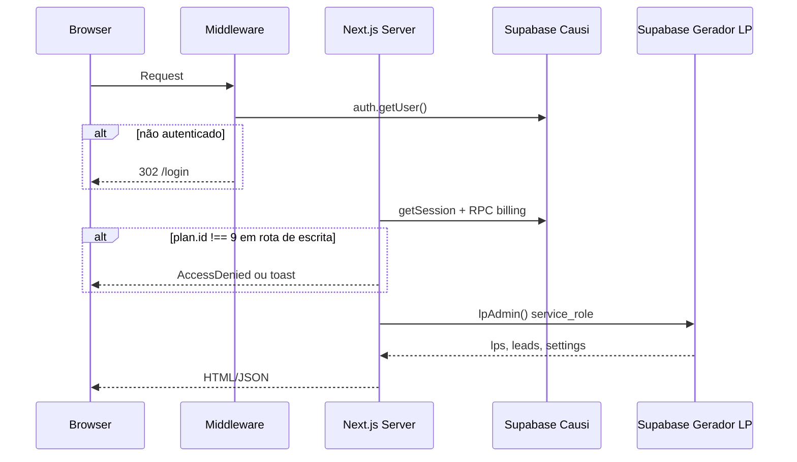
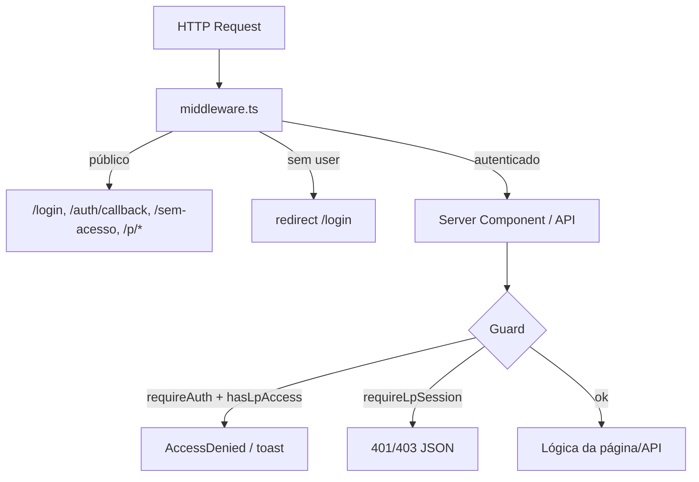
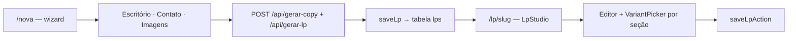

# Arquitetura

Documentação da arquitetura do Gerador de Landing Pages Causi: stack, organização de pastas, fluxos de dados e recomendações de melhoria.

## Stack tecnológica

| Camada | Tecnologia | Versão |
|--------|------------|--------|
| Framework | Next.js (App Router) | 16.x |
| UI | React | 19.x |
| Estilo | Tailwind CSS | 4.x |
| Auth | Supabase Auth + `@supabase/ssr` | — |
| Banco | Supabase (PostgreSQL) — dual project | — |
| IA (copy) | OpenAI GPT-4o | — |
| Imagens | Unsplash API + Sharp (processamento) | — |
| Linguagem | TypeScript | 5.x |

## Princípios

- **UI em português**, código em inglês (identificadores, tipos, funções).
- **Componentes semânticos** auto-descritivos (`NovaLpForm`, `LpStudio`, `DashboardClient`).
- **Dual-database**: Auth/billing no Causi; dados de LP em banco separado.
- **Server-first**: guards e persistência no servidor; `service_role` nunca exposto ao browser.

## Mapa de pastas

```
gerador-site.causi.com.br/
├── app/                    # Rotas Next.js (App Router)
│   ├── page.tsx            # Galeria de LPs (/)
│   ├── nova/               # Wizard de criação
│   ├── lp/[slug]/          # Editor de LP
│   ├── dashboard/          # Contatos/leads
│   ├── login/              # Autenticação
│   ├── auth/callback/      # OAuth PKCE callback
│   ├── sem-acesso/         # Página informativa (órfã)
│   ├── api/                # Route Handlers (IA, imagens)
│   └── actions/            # Server Actions (save, delete, config)
├── components/
│   ├── builder/            # Criação e edição (Editor, NovaLpForm, LpStudio)
│   ├── preview/            # Preview da LP (iframe responsivo)
│   ├── sections/           # Blocos da landing page (Hero, Dor, LeadPopup...)
│   └── ui/                 # Shell, sidebar, botões compartilhados
├── lib/
│   ├── session/            # Sessão, guards de acesso
│   ├── supabase/           # Clientes Supabase (browser, server, admin)
│   ├── schema.ts           # Contrato JSON da LP
│   ├── lpStore.ts          # CRUD de landing pages
│   ├── focos.ts            # Focos jurídicos e buildSchema
│   └── config.ts           # Configuração global do usuário
├── supabase/               # Schemas SQL de referência
└── docs/                   # Documentação (este diretório)
```

### Responsabilidades por pasta

| Pasta | Responsabilidade |
|-------|------------------|
| `app/` | Entrypoints HTTP, composição de páginas, orquestração server/client |
| `components/builder/` | Lógica de criação, edição e persistência da LP no cliente |
| `components/sections/` | Renderização de cada bloco da landing page |
| `components/preview/` | Preview ao vivo com toggle desktop/tablet/mobile |
| `components/ui/` | Layout da aplicação (`AppShell`, `AppSidebar`) |
| `lib/session/` | Autenticação enriquecida e controle de acesso por plano |
| `lib/supabase/` | Três clientes: browser (Auth A), server (Auth A + cookies), admin (Projeto B) |

## Arquitetura dual-database



### Por que `service_role` no Projeto B?

O gerador não propaga o JWT do usuário para o banco de LPs. Em vez disso:

1. Valida identidade e plano no Projeto A (Causi).
2. Usa `lpAdmin()` com `service_role` para ler/escrever dados.
3. Escopa manualmente por `causi_user_id = session.user.id`.

Isso simplifica o modelo (sem RLS complexo cross-project) mas exige disciplina: **toda query deve filtrar por `causi_user_id`**.

## Camadas de controle de acesso



| Camada | Arquivo | Valida |
|--------|---------|--------|
| Middleware | `middleware.ts` | Apenas autenticação Supabase |
| Page guard | `requireAuth()` + `hasLpAccess()` | Auth na página; plano 9 para escrita |
| Action/API guard | `requireLpSession()` | Auth + plano id=9 → throw |

**Lacuna:** APIs `melhorar-texto`, `melhorar-imagem` e `imagem` não possuem guard.

## Fluxos principais

### 1. Autenticação e acesso

```
Advogado → /login → signInWithPassword → cookies Supabase A
         → página protegida → requireAuth()
         → RPC get_current_user_details_v4 → plan.id === 9?
         → sim: edição liberada | não: leitura + toast / AccessDenied
```

Ver [features/authentication.md](features/authentication.md).

### 2. Criação de landing page



1. Wizard 3 passos: Escritório → Contato → Imagens (preset opcional de layout).
2. **Criar e editar** chama `/api/gerar-copy` e `/api/gerar-lp`; persiste `schema` completo.
3. No editor, `VariantPicker` altera variações individuais; preview via `DevicePreview`.

Ver [features/landing-pages.md](features/landing-pages.md) e [features/templates-vs-variants.md](features/templates-vs-variants.md).

### 3. Edição

- `LpStudio` carrega LP via `getLp(userId, slug)`.
- `Editor` oferece modo Simples (bento) e Avançado (todas as seções).
- Cada seção expõe `VariantPicker` para troca de variação de layout e toggle de tom (claro/escuro).
- Preview em iframe com `LandingPreview` + `DevicePreview` reflete a variação ativa em tempo real.
- Salvamento via Server Action `saveLpAction` persiste `schema.layout` completo.

### 4. Leads (parcial)

- Dashboard em `/dashboard` lê `leads_gerador` filtrado por `causi_user_id`.
- `LeadPopup` no preview funciona em modo demo (`demo=true`).
- **Captura real (`POST /api/lead`) não implementada.**

Ver [features/leads.md](features/leads.md).

### 5. Publicação

- App do gerador em `causi.adv.br` (autenticação, galeria, editor).
- Subdomínio fixo por conta: `{office_subdomain}.causi.adv.br` — raiz redireciona para `causi.adv.br`.
- LP publicada em `{office_subdomain}.causi.adv.br/{slug}` — rota `(subdomains)/[escritorio]/[slug]`.
- Proxy (`src/proxy.ts` + `src/lib/supabase/proxy.ts`): detecta host do escritório, reescreve path para a rota pública sem auth; bloqueia `/{slug}` no domínio principal.
- `getLpPublic(office_subdomain, slug)` consulta `landing_pages` com `status = published`.
- Domínio customizado (`schema.office.domain`, `user_settings.custom_domain`): pós-MVP.

## Componentes-chave

| Componente | Arquivo | Papel |
|------------|---------|-------|
| `AppShell` | `components/ui/AppShell.tsx` | Layout com sidebar |
| `AppSidebar` | `components/ui/AppSidebar.tsx` | Navegação lateral (LPs, config, Causi) |
| `LandingPageCreateForm` | `forms/LandingPageCreateForm/` | Wizard de criação (3 passos + preset opcional) |
| `TemplateCard` | `components/Builder/template-card.tsx` | Seleção de preset de layout no wizard |
| `LpStudio` | `components/Builder/lp-studio.tsx` | Ponte LP salva → Editor |
| `Editor` | `components/Builder/` | Editor principal com `VariantPicker` por seção |
| `VariantPicker` | `components/Builder/variant-picker.tsx` | Seleção de variação por seção (com wireframes) |
| `LandingPreview` | `components/Preview/landing-preview.tsx` | Render da LP — despacha para variação correta por seção |
| `LeadPopup` | `components/Sections/lead-popup.tsx` | Popup de captura de leads |

## Convenções de código

| Aspecto | Convenção |
|---------|-----------|
| Rotas/páginas | Português na UI (`/nova`, "Suas páginas") |
| Funções/tipos | Inglês (`getSession`, `requireLpAccess`, `StoredLp`) |
| Server Actions | `"use server"` em `app/actions/` |
| Dados sensíveis | Apenas server-side (`server-only`, `lpAdmin`) |
| Schema LP | JSON serializável em `lib/schema.ts` |

## Melhorias recomendadas

### Arquitetura

| Problema | Recomendação |
|----------|--------------|
| `Editor.tsx` monolítico (~3k linhas) | Extrair submódulos: popup config, section editor, save bar, tour |
| Galeria em `/` vs dashboard unificado | Criar hub `/dashboard` com sub-rotas: `/dashboard/lps`, `/dashboard/leads`, `/dashboard/marketing` |
| Sem camada `services/` | Introduzir `LpService`, `LeadService` entre actions e `lpStore` |
| DDL de `lps` ausente no SQL | Adicionar tabela oficial em `gerador.causi.sql` |

### Sessão

| Problema | Recomendação |
|----------|--------------|
| RPC externa não versionada | Versionar contrato; tratar falha de RPC com mensagem distinta |
| RPC por request | Cache curto do plano (cookie/JWT claim) para reduzir latência |
| `NEXT_PUBLIC_CAUSI_APP_URL` ausente do `.env.local.example` | Documentar variável |

### Permissões

| Problema | Recomendação |
|----------|--------------|
| Middleware não valida plano | Mover checagem de plano para middleware (evita flash) |
| APIs sem guard | Proteger `melhorar-texto`, `melhorar-imagem`, `imagem` com `requireLpSession` |
| `/sem-acesso` órfã | Unificar destino: `/sem-acesso` ou `CAUSI_APP_URL` (decisão de produto) |
| Prefixo `/p/` legado | Publicação usa `(subdomains)/[escritorio]/[slug]` via proxy |

### Funcionalidades

| Problema | Recomendação |
|----------|--------------|
| Trocar template no editor ainda não reaplica layout | Implementar ação que carrega `getTemplate(id).layout` + `.theme` e salva mantendo copy |
| Sem `POST /api/lead` | Implementar captura real no `LeadPopup` |
| Marketing inexistente | Rota placeholder "Em breve" em `/dashboard/marketing` |

## Variáveis de ambiente

| Variável | Obrigatória | Descrição |
|----------|-------------|-----------|
| `NEXT_PUBLIC_SUPABASE_URL` | Sim | URL do Supabase Causi (Auth) |
| `NEXT_PUBLIC_SUPABASE_PUBLISHABLE_KEY` | Sim | Anon key do Causi |
| `LP_SUPABASE_URL` | Sim | URL do Supabase Gerador LP |
| `LP_SUPABASE_SERVICE_ROLE_KEY` | Sim | Service role do Gerador LP |
| `OPENAI_API_KEY` | Sim* | Geração e melhoria de texto |
| `UNSPLASH_ACCESS_KEY` | Não | Imagens de cenário (fallback local) |
| `APP_URL` | Sim | URL do app (`https://causi.adv.br`) — redirect da raiz do subdomínio |
| `NEXT_PUBLIC_APP_DOMAIN` | Sim | Domínio base (`causi.adv.br`) — subdomínios de escritório e URLs públicas |

\* Sem OpenAI, geração de LP e melhoria de texto falham com 503.

## Referências

- [database.md](database.md) — schemas e RPC
- [integrations.md](integrations.md) — banco compartilhado com Lovable, CRM e storage
- [api.md](api.md) — endpoints e Server Actions
- [server-actions.md](server-actions.md) — CRUD no Projeto B via Server Actions
- [prd.md](prd.md) — requisitos de produto
- [features/authentication.md](features/authentication.md) — fluxo de auth detalhado
