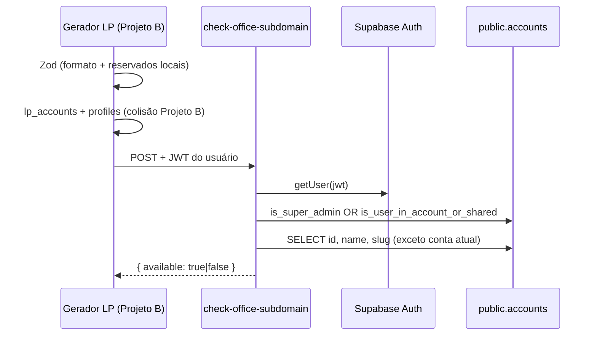

# Edge Function — `check-office-subdomain`

Valida se um subdomínio de landing page pode ser usado por uma conta do Causi. A consulta em `public.accounts` roda **exclusivamente** no Projeto A (Causi). O gerador de landing pages (Projeto B) chama esta API com o JWT do usuário autenticado — **sem** `SERVICE_ROLE_KEY` do Causi no app do gerador.

---

## Motivação

O subdomínio público das LPs segue o formato `{subdominio}.causi.adv.br/{slug}`. Antes de persistir em `lp_accounts.office_subdomain` (Projeto B), é necessário garantir que o valor:

- não conflite com subdomínios já atribuídos no gerador;
- não se aproprie do nome ou `slug` de outro escritório cadastrado no Causi.

A tabela `public.accounts` vive no Projeto A. Para manter isolamento entre bancos, a regra de reserva por nome/slug é exposta como Edge Function autenticada.

---

## Arquitetura



| Camada | Responsabilidade |
|--------|------------------|
| **Gerador LP** | Formato do subdomínio (Zod), nomes reservados para **subdomínio** (`causi`, `login`, … em `RESERVED_SEGMENTS`), unicidade em `lp_accounts` e `profiles` |
| **Causi (esta function)** | Reserva por `accounts.name` (slugificado) e `accounts.slug` de outras contas; bloqueio estrito de `causi` |
| **Postgres Projeto B** | `UNIQUE (office_subdomain)` em `lp_accounts` como garantia final |

---

## Contrato HTTP

**Endpoint**

```
POST {SUPABASE_URL}/functions/v1/check-office-subdomain
```

**Headers obrigatórios**

| Header | Valor |
|--------|-------|
| `Authorization` | `Bearer <jwt_usuario>` |
| `apikey` | `SUPABASE_ANON_KEY` do Projeto A |
| `Content-Type` | `application/json` |

**Body**

```json
{
  "subdomain": "walesam-advogados",
  "account_id": 42
}
```

| Campo | Tipo | Descrição |
|-------|------|-----------|
| `subdomain` | `string` | Subdomínio já normalizado (kebab-case, minúsculas) |
| `account_id` | `number` | `accounts.id` da conta em contexto — excluída da verificação de colisão |

**Respostas**

| Status | Corpo | Significado |
|--------|-------|-------------|
| `200` | `{ "available": true }` | Subdomínio liberado em relação às contas Causi |
| `200` | `{ "available": false }` | Reservado por outro escritório ou proibido (`causi`) |
| `400` | `{ "error": "Invalid input" }` | Payload inválido |
| `401` | `{ "error": "Unauthorized" }` | JWT ausente ou inválido |
| `403` | `{ "error": "Forbidden" }` | Usuário sem acesso à `account_id` e sem role `super_admin` |
| `405` | — | Método diferente de `POST` |
| `500` | `{ "error": "..." }` | Erro interno ou misconfiguration |

A function responde `OPTIONS` com headers CORS para chamadas cross-origin.

---

## Regras de negócio

### Subdomínios proibidos

| Valor | Motivo |
|-------|--------|
| `causi` | Nome da plataforma — uso estritamente proibido |

### Colisão com outras contas

Para cada linha em `public.accounts` com `id != account_id`:

1. **Por nome** — compara `subdomain` com o slug derivado de `accounts.name` (mesma lógica de `slugFromOfficeName` no gerador: NFD → remove acentos → minúsculas → não-alfanumérico vira `-` → trim de hífens nas pontas).
2. **Por slug** — compara `subdomain` com `accounts.slug` (valor canônico gerado por trigger no Causi).

A conta informada em `account_id` é sempre ignorada na verificação — o escritório pode manter o subdomínio derivado do próprio nome.

### Autorização

Antes de consultar `accounts`, a function autoriza se **qualquer** condição for verdadeira:

1. `is_super_admin(p_user_id)` — bypass para role `super_admin` (troca de contexto no SystemBar sem exigência de `users_accounts`);
2. `is_user_in_account_or_shared(target_account_id, p_user_id)` — conta principal (`users.account_id`) ou compartilhada (`users_accounts`).

Sem uma das duas, responde `403 Forbidden`.

---

## Implementação

| Artefato | Local |
|----------|-------|
| Código de referência (deploy no Causi) | [`supabase/reference/causi/functions/check-office-subdomain/index.ts`](../../supabase/reference/causi/functions/check-office-subdomain/index.ts) |
| Client HTTP no gerador LP | [`src/lib/causi/check-office-subdomain.ts`](../../src/lib/causi/check-office-subdomain.ts) |
| Obtenção do JWT | [`src/lib/supabase/causi-access-token.ts`](../../src/lib/supabase/causi-access-token.ts) |
| Orquestração da validação | [`src/lib/landing-pages/account-store.ts`](../../src/lib/landing-pages/account-store.ts) → `isOfficeSubdomainReservedByAccountName` |

### Secrets (pré-populados no Supabase)

A function usa apenas variáveis padrão do runtime:

- `SUPABASE_URL`
- `SUPABASE_ANON_KEY`
- `SUPABASE_SERVICE_ROLE_KEY` (uso interno — nunca exposto ao gerador)

### Deploy

No repositório Causi (Projeto A):

```bash
# Copiar de supabase/reference/causi/functions/check-office-subdomain/ para supabase/functions/
supabase functions deploy check-office-subdomain
```

### Consumo no gerador LP

Server Actions em `/configuracoes` e `resolveOfficeSubdomain` chamam `fetchCausiOfficeSubdomainAvailability` com:

- JWT da sessão Causi (`getCausiAccessToken`);
- `subdomain` normalizado pelo Zod em [`src/lib/landing-pages/subdomain.ts`](../../src/lib/landing-pages/subdomain.ts);
- `account_id` da sessão ativa.

Se a function retornar `401`, o gerador propaga `UNAUTHENTICATED`. Demais erros HTTP impedem a confirmação do subdomínio (fail closed).

---

## Performance

A implementação atual faz scan em todas as contas (`SELECT id, name, slug WHERE id != account_id`) e compara em memória. Com o volume atual de escritórios, o custo é aceitável para validação debounced na UI.

Caminho de otimização futura no Causi:

- coluna derivada `base_slug` em `accounts` mantida por trigger;
- índice em `slug` e `base_slug` para lookup direto por subdomínio candidato.

---

## Dependências SQL

| Função | Uso nesta Edge Function |
|--------|-------------------------|
| `is_super_admin(p_user_id)` | Bypass de autorização para super admin |
| `is_user_in_account_or_shared(target_account_id, p_user_id)` | Valida acesso do usuário à conta antes da consulta global |

Documentação das RPCs: [functions.md](./functions.md#helpers-de-autorização-rls).

---

## Documentos relacionados

| Documento | Descrição |
|-----------|-----------|
| [overview.md](./overview.md) | Visão geral do banco Causi |
| [schema-public.md](./schema-public.md) | Tabela `accounts` |
| [functions.md](./functions.md) | RPCs `is_super_admin` e `is_user_in_account_or_shared` |
| [../database.md](../database.md) | `lp_accounts` e subdomínio canônico no Projeto B |
| [../features/landing-pages.md](../features/landing-pages.md) | URLs públicas e subdomínio por conta |
