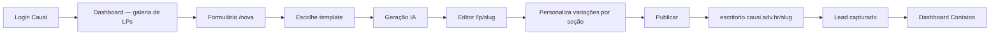

# PRD — Gerador de Landing Pages Causi

Product Requirements Document do Gerador de Landing Pages para advogados com plano Causi.

## Visão do produto

Plataforma self-service que permite ao advogado criar, personalizar e publicar landing pages jurídicas para captação de leads, integrada ao ecossistema Causi. A IA gera a copy a partir de um formulário; na criação o advogado escolhe um **template** (grupo pré-definido de variações + paleta de cores) como ponto de partida; no editor, personaliza a **variação de cada seção** independentemente, altera tons (claro/escuro), reordena seções e ajusta cores.

**Centro do produto:** a LP é composta por **seções com variações**. Cada seção da página (Hero, Dor, Solução, Sobre, etc.) possui múltiplas variantes de layout que o advogado seleciona individualmente no editor. O template é apenas o ponto de partida — um atalho que pré-seleciona as variações para cada seção.

**Princípio de simplicidade (MVP):** não há HTML nem código de template no banco. A LP é um **snapshot JSON** (`LpSchema`) com a variação selecionada para cada seção; o renderer React (`LandingPreview`) interpreta esse JSON tanto no editor quanto no site publicado.

## Persona

**Advogado(a) com plano Landing Pages (id=9)**

- Já é usuário do Causi (autenticado via Supabase Auth).
- Possui assinatura ativa do plano "Landing Pages".
- Quer páginas de captação profissionais sem depender de agência.
- Precisa de conformidade com sobriedade OAB (Provimento 205/2021).

## Regras de acesso

| Condição | Resultado |
|----------|-----------|
| Não autenticado | Redirect `/login` |
| Autenticado, plano ≠ 9 | Permanece na app; ações bloqueadas com toast / `AccessDenied` |
| Autenticado, plano = 9 | Acesso completo à plataforma |
| Limite de LPs | **Sem limite** — N landing pages por escritório |

## Modelo conceitual

### Camadas de composição da LP

```
LP
├── theme          — paleta de cores (brand, accent, cream, ink…)
├── office         — dados do escritório (nome, WhatsApp, logo, advogados…)
└── layout         — variação selecionada para cada seção
    ├── hero        : HeroVariant
    ├── dor         : DorVariant
    ├── solucao     : SolucaoVariant
    ├── sobre       : SobreVariant
    ├── areas       : AreasVariant
    ├── etapas      : EtapasVariant
    ├── equipe?     : EquipeVariant  (auto se omitido)
    ├── tones       : tom claro/escuro por seção
    ├── hidden      : seções opcionais desligadas
    └── order       : ordem das seções do meio
```

### Glossário

| Conceito | Definição | Onde vive |
|----------|-----------|-----------|
| **Seção** | Bloco da página com conteúdo + variação + tom (ex.: `Hero`, `Dor`) | Componentes em `components/Sections/` |
| **Variação** | Alternativa visual de layout de uma seção (ex.: Hero `split` ou `centered`) | Chave string em `schema.layout` |
| **Tom (tone)** | Fundo claro (`light`) ou escuro (`dark`) de uma seção | `schema.layout.tones` |
| **Template** | Grupo pré-definido de variações + paleta de cores; ponto de partida na criação | Código (`lib/templates.ts`) |
| **LP** | Snapshot completo: copy gerada pela IA + office + theme + layout (variações) | `lps.schema` (jsonb) |
| **Renderer** | React que lê `LpSchema` e renderiza cada seção na variação escolhida | `LandingPreview` — nunca no banco |

### Seções e suas variações

| Seção | Variações disponíveis | Padrão |
|-------|-----------------------|--------|
| **Hero** | `centered` · `split` · `video` · `stats` | `centered` |
| **Dor** | `comImagem` · `soCards` | `comImagem` |
| **Solução** | `comImagem` · `soCards` · `destaque` | `soCards` |
| **Sobre** | `fotoLista` · `overlay` · `duasColunas` | `fotoLista` |
| **Áreas** | `grid` · `lista` | `grid` |
| **Etapas** | `numerado` · `timeline` | `numerado` |
| **Equipe** | `splitAlternado` · `retratoElegante` | auto (≤3 → split; ≥4 → retrato) |
| **FAQ** | única (sem variação de layout) | — |
| **CTA Final** | única (sem variação de layout) | oculto por padrão |
| **Footer** | única (sem variação de layout) | sempre visível |

Seções opcionais (podem ser ligadas/desligadas): `areas`, `etapas`, `faq`, `ctaFinal`.

### Templates (grupos pré-definidos)

Templates combinam uma paleta de cores + uma seleção inicial de variações para todas as seções. O advogado escolhe um template na criação; no editor pode alterar cada seção individualmente.

| Template | Paleta | Hero | Dor | Solução | Sobre | Áreas | Etapas |
|----------|--------|------|-----|---------|-------|-------|--------|
| **Clássico** (`classic-light`) | Azul marinho + dourado | `centered` | `comImagem` | `soCards` | `fotoLista` | `grid` | `numerado` |
| **Moderno** (`modern-dark`) | Tons escuros + dourado | `split` | `soCards` | `comImagem` | `overlay` | `lista` | `timeline` |
| **Acolhedor** (`warm-neutral`) | Caramelo + bege | `stats` | `comImagem` | `destaque` | `duasColunas` | `grid` | `numerado` |

## Fluxo principal



### Passo a passo

1. **Login** — E-mail e senha do Causi (Supabase Auth, Projeto A).
2. **Dashboard** — Galeria de LPs do escritório; links para Contatos e Configurações.
3. **Nova LP** — Formulário multi-step com dados obrigatórios do escritório.
4. **Preset (opcional)** — Advogado pode escolher um dos presets de layout na criação; default `classic-light`.
5. **Geração** — IA gera copy jurídica; o preset define variantes iniciais; a logo define cores; LP salva apenas com `schema`.
6. **Editor** — Personalização de textos, variações por seção, tones (claro/escuro), cores, imagens, ordem das seções. Trocar preset no editor reaplica layout (mantém cores da logo).
7. **Publicação** — `status = published`; site em `{office_subdomain}.causi.adv.br/{slug}`; raiz do subdomínio redireciona para `causi.adv.br`.
8. **Leads** — Visitantes preenchem popup; dados em Contatos.

## Escopo por feature

### Implementado hoje

| Feature | Rota | Status |
|---------|------|--------|
| Autenticação Causi + plano 9 | `/login` | Implementado |
| Galeria de LPs | `/` | Implementado |
| Formulário multi-step | `/nova` | Implementado (3 passos) |
| Seleção de template no wizard | `/nova` | Implementado (`TemplatePicker`) |
| Geração IA + variações do template | `POST /api/gerar-lp` | Implementado |
| IA gera `seo.title` e `seo.description` | `POST /api/gerar-lp` | Implementado |
| Editor com `VariantPicker` por seção | `/lp/[slug]` | Implementado |
| Salvamento | `saveLpAction` | Implementado |
| Dashboard de contatos | `/dashboard` | Implementado (leitura) |
| Configurações globais | `GlobalSettings` | Implementado |
| Página pública SSR com metadata + JSON-LD | `(subdomains)/[escritorio]/[slug]` | Implementado |

### MVP restante (prioridade alta)

| Feature | Descrição | Complexidade |
|---------|-----------|--------------|
| Captura de leads | `POST /api/lead` + integração no `LeadPopup` | Média |

### Pós-MVP

| Feature | Prioridade |
|---------|------------|
| Dashboard unificado (3 abas) | Média |
| Domínio customizado | Média |
| Marketing "Em breve" | Baixa |
| Novos templates | Baixa |
| Novas variações de seção | Baixa |

## Requisitos funcionais

### RF-01 — Autenticação

- Autenticação via Supabase Auth do Causi (banco externo).
- Apenas usuários com `billing.plans.id = 9`.
- Sessão enriquecida via RPC `get_current_user_details_v4`.

### RF-02 — Dashboard

| Seção | Descrição | Rota atual | Rota alvo |
|-------|-----------|------------|-----------|
| Landing Pages | Lista, criar, editar | `/` | `/` ou `/dashboard/lps` |
| Contatos/Leads | Leads do escritório | `/dashboard` | `/dashboard/leads` |
| Marketing | Futuro | — | `/dashboard/marketing` |

### RF-03 — Criação de LP

- Formulário multi-step: escritório, contato, imagens.
- Advogado escolhe um template (grupo pré-definido de variações + paleta).
- IA gera copy jurídica a partir dos dados do formulário.
- As variações iniciais de cada seção vêm do template escolhido.
- Slug da LP derivado do **tema**, único por conta (`account_id`).
- `office_subdomain` derivado do **nome da conta**, fixo por escritório, persistido em `landing_pages`.

### RF-04 — Seções com Variações

**Conceito central do produto.** A LP é composta por seções fixas do código; cada seção tem variações de layout selecionáveis independentemente.

- **Seções:** Hero, Dor, Solução, Sobre, Áreas, Etapas, Equipe, FAQ, CTA Final, Footer, LeadPopup, seções customizadas.
- **Variações:** alternativas visuais de layout para cada seção, definidas em componentes React (nunca no banco).
- **Seleção no editor:** `VariantPicker` por seção com miniatura esquemática (wireframe).
- **Tom por seção:** `light` (fundo creme/branco) ou `dark` (fundo cor da marca) configurável por seção.
- **Ordenação:** seções do meio podem ser reordenadas; Hero e Footer são fixos.
- **Visibilidade:** seções opcionais (`areas`, `etapas`, `faq`, `ctaFinal`) podem ser ligadas/desligadas.
- **Seções customizadas:** advogado pode criar seções adicionais no editor (formato `cards` ou `texto`).

#### RF-04.1 — Templates (grupos pré-definidos)

- Templates são presets de `Layout` + `Theme` definidos em código (`lib/templates.ts`), **não no banco**.
- Papel: ponto de partida na criação — pré-seleciona as variações de todas as seções e define a paleta.
- Após a criação, o advogado pode alterar cada seção individualmente sem estar vinculado ao template.
- Trocar o template no editor reaplica o preset em `schema.layout` e `schema.theme`, **mantendo** copy e dados do escritório.
- Implementados: `classic-light`, `modern-dark`, `warm-neutral`.

### RF-05 — Editor

- Edição de textos, variações por seção (`VariantPicker`), tons claro/escuro, cores, imagens e ordem das seções.
- Preview ao vivo via `LandingPreview` (mesmo renderer da publicação).
- Modo Simples e Avançado.
- Popup de lead configurável (perguntas personalizadas + campo nome/telefone).
- Tipografia customizável (`heading` e `body` fonts).
- Cantos dos cards e botões configuráveis.
- Tags de conversão (GTM, Pixel) via painel de configurações.

### RF-06 — Publicação (MVP multi-tenant)

- Uma LP publicada = uma linha em `landing_pages` com `status = published`, `slug` (LP) e `office_subdomain` (escritório).
- URL pública: `https://{office_subdomain}.causi.adv.br/{slug}` — ex.: `darlley-dev.causi.adv.br/previdenciario`.
- Raiz do subdomínio (`{office_subdomain}.causi.adv.br/`) redireciona para `https://causi.adv.br` (app do gerador).
- O proxy (`src/proxy.ts`) detecta o host do escritório, reescreve `/{slug}` para `(subdomains)/[escritorio]/[slug]` e **não exige autenticação**.
- No domínio principal, `/{slug}` retorna 404 — LPs não são servidas em path no app.
- Página pública: Server Component + `getLpPublic(office_subdomain, slug)` + `LandingPreview`.
- Domínio customizado: pós-MVP via `user_settings.custom_domain`.

### RF-07 — Leads

- Leads escopados por `causi_user_id`.
- Captura via popup na LP publicada (`POST /api/lead`).
- Dashboard com filtros, paginação, CSV e link WhatsApp.

### RF-08 — Marketing

- Recurso futuro; página "Em breve".

### RF-09 — Metadados automáticos (tráfego pago)

O único propósito das LPs é ser vinculada em campanhas de anúncios pagos (Google Ads e Meta Ads). Os metadados servem ao **Quality Score** do Google Ads e às **tags Open Graph** do Meta Ads — **não** ao ranqueamento orgânico. O advogado **não configura** título, descrição nem preview: a IA gera na criação e o servidor completa fallbacks.

| Campo | Onde vive | Origem |
|-------|-----------|--------|
| `seo.title` | `lps.schema.seo` | IA na geração; fallbacks em `buildDefaultSeo()` |
| `seo.description` | `lps.schema.seo` | IA na geração; fallbacks em `buildDefaultSeo()` |
| Open Graph | Derivado do `seo` + `sectionImages.hero` | Automático na rota pública |
| Schema.org `LegalService` | JSON-LD inline | Rota pública |
| Tracking (GTM, GA4, Pixel, Ads) | `lp_account_settings.tracking_providers` + `tracking_scripts` | Padrão da conta em Configurações |
| Override por LP | `schema.office.tracking` / `schema.office.tags` | Editor — campo vazio herda o padrão da conta |

**Herança live na página publicada:** `getLpPublic` carrega o padrão da conta; a rota pública aplica `applyGlobalConfigToOffice(..., { marketingOnly: true })` antes de `LandingPageTracking`. Alterar o pixel/scripts na conta reflete em todas as LPs sem re-salvar cada página. Override só ocorre quando o ID (provedor) ou o snippet (tags) da LP está preenchido.

**Regras do `seo.title`:** keyword do tema no início + ` | ` + nome do escritório · 50–60 chars · sem promessa de resultado.

**Regras do `seo.description`:** benefício concreto + CTA suave · 140–155 chars · Provimento OAB 205/2021.

**Robots:** `noindex, follow` por padrão (não indexar organicamente; permitir rastreamento para Quality Score).

**Rota pública:** `(subdomains)/[escritorio]/[slug]` — acessível sem autenticação via rewrite do proxy no subdomínio do escritório. Renderiza o mesmo `LandingPreview` do editor com `generateMetadata` (Next.js Metadata API) e JSON-LD injetado.

## Requisitos não-funcionais

| ID | Requisito |
|----|-----------|
| RNF-01 | Interface em português brasileiro |
| RNF-02 | Código em inglês |
| RNF-03 | Componentes semânticos e auto-descritivos |
| RNF-04 | Copy respeita Provimento OAB 205/2021 |
| RNF-05 | Dados isolados por `causi_user_id` |
| RNF-06 | `service_role` nunca no browser |
| RNF-07 | Sem limite de LPs por usuário |
| RNF-08 | **Um renderer** para preview, editor e site publicado |
| RNF-09 | **Sem HTML** persistido no banco |
| RNF-10 | LP pública acessível sem autenticação via prefixo `/p/` |
| RNF-11 | `seo.title` e `seo.description` gerados pela IA em toda LP nova |
| RNF-12 | Página pública com `robots: noindex, follow` por padrão |
| RNF-13 | Variações e templates definidos em código — nunca no banco |

## Critérios de aceite

### Autenticação

- [x] Login com e-mail/senha do Causi
- [x] Usuário sem plano 9 redirecionado
- [x] Usuário com plano 9 acessa a plataforma
- [ ] OAuth na UI de login
- [x] `/sem-acesso` integrada ao fluxo (componente `AccessDenied`)

### Landing Pages

- [x] Wizard 3 passos com validação
- [x] Advogado escolhe template no wizard (`TemplatePicker`)
- [x] IA gera LP com variações do template escolhido
- [x] IA gera `seo.title` e `seo.description` em toda LP nova
- [x] Editor customiza textos, variações por seção, tones, cores, imagens, ordem
- [x] `VariantPicker` disponível por seção no editor
- [x] Salvamento persiste alterações no `schema`
- [x] LP acessível em `{office_subdomain}.causi.adv.br/{slug}` com metadata e JSON-LD
- [ ] Trocar template no editor reaplica layout sem perder copy
- [x] Botão Publicar define `status = published`
- [x] LP publicada com mesmo visual do preview no subdomínio do escritório

### Leads

- [x] Dashboard lista leads do escritório
- [x] Filtros, paginação, export CSV
- [ ] Popup envia para `POST /api/lead`
- [ ] Dashboard exibe `answers` e `email`

### Marketing

- [ ] Rota "Em breve"

## O que está fora do escopo do MVP

- HTML ou código de componentes no banco de dados.
- Build estático ou deploy separado por advogado.
- Editor de código/HTML.
- Catálogo de templates ou variações editável por não-desenvolvedores (sem deploy).
- CRM completo e campanhas pagas (Causi principal / Marketing futuro).
- RLS no Projeto B (escopo manual via `service_role`).

## Métricas de sucesso (futuro)

- Tempo médio formulário → publicação.
- Taxa de conversão do popup.
- LPs ativas por escritório.
- Retenção do plano 9.
- Variações mais usadas por seção.

## Referências

- [architecture.md](architecture.md)
- [database.md](database.md)
- [server-actions.md](server-actions.md) — CRUD no Projeto B
- [features/landing-pages.md](features/landing-pages.md)
- [features/seo.md](features/seo.md) — metadados automáticos para tráfego pago
- [features/leads.md](features/leads.md)
- [features/marketing.md](features/marketing.md)
- [features/authentication.md](features/authentication.md)
