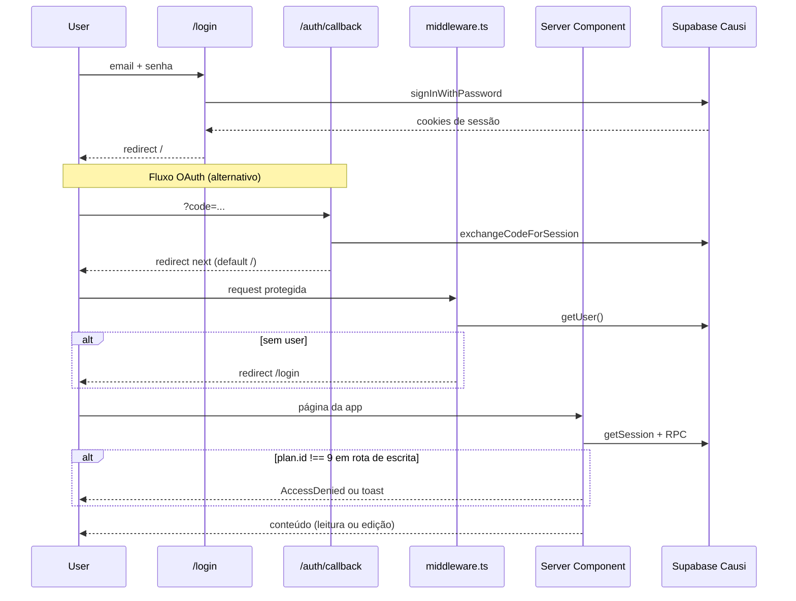

# Autenticação e Controle de Acesso

Documentação do fluxo de autenticação, gerenciamento de sessão, validação de plano e controle de acesso às páginas do Gerador de Landing Pages.

## Requisitos de acesso

Para usar a plataforma, o usuário deve satisfazer **duas condições**:

1. **Autenticado** via Supabase Auth do Causi (Projeto A) — usuário existente no ecossistema Causi.
2. **Plano ativo** com `billing.plans.id = 9` (Landing Pages), resolvido via RPC de billing.

Sem autenticação → redirect para `/login`.  
Autenticado sem plano 9 → permanece na aplicação: galeria visível em modo leitura; ações de criação/edição bloqueadas com toast **"Acesso negado"**; rotas `/nova`, `/lp/[slug]` e `/dashboard` exibem o componente `AccessDenied`.

## Fluxo completo



## Métodos de autenticação

### Login por e-mail e senha

**Arquivo:** `app/login/page.tsx`

```typescript
const { error } = await supabase.auth.signInWithPassword({
  email: email.trim(),
  password: senha,
});
// Sucesso → router.push("/") + router.refresh()
// Erro → "E-mail ou senha inválidos."
```

- Cliente browser: `supabaseBrowser()` → `createBrowserClient` do `@supabase/ssr`
- Credenciais validadas contra `auth.users` do Projeto A (Causi)
- Cookies de sessão gerenciados automaticamente pelo SDK

### Callback OAuth / PKCE

**Arquivo:** `app/auth/callback/route.ts`

```
GET /auth/callback?code=...&next=/
```

1. Extrai `code` da query string.
2. Chama `supabase.auth.exchangeCodeForSession(code)`.
3. Sucesso → redirect para `next` (default `/`).
4. Falha → redirect para `/login?error=auth`.

> **Nota:** A página de login atual não exibe mensagem para `?error=auth`. O fluxo OAuth está preparado mas a UI de login só oferece e-mail/senha.

### Logout

**Arquivo:** `app/dashboard/LogoutButton.tsx`

```typescript
await supabaseBrowser().auth.signOut();
router.push("/login");
router.refresh();
```

## Gerenciamento de sessão

### `getSession()` — núcleo da sessão

**Arquivo:** `lib/session/get-session.ts`

| Etapa | Descrição |
|-------|-----------|
| 1 | `supabaseServer().auth.getUser()` — valida JWT nos cookies |
| 2 | Monta sessão base com `user`, `account` (metadata), `plan: null` |
| 3 | Chama RPC `get_current_user_details_v4` no Projeto A |
| 4 | Enriquece com `account` (id/nome real), `plan`, `features` |

**Cache:** `cache()` do React — uma leitura por request.

**Best-effort:** Se a RPC falhar, retorna sessão autenticada com `plan: null` e `features: {}`. O usuário será bloqueado por `hasLpAccess()` mas sem distinção de erro de provisionamento.

### Tipo `Session`

**Arquivo:** `lib/session/types.ts`

```typescript
type Session = {
  user: { id: string; name: string; email: string };
  account: { id: string; name: string };
  plan: SessionPlan | null;
  features: Record<string, boolean>;
};

type SessionPlan = {
  id: number | null;
  name: string | null;
  slug: string | null;
  tierLevel: number | null;
  status: string | null;
};
```

**Identificador de escopo:** `session.user.id` é o UUID de `auth.users` do Projeto A. Usado como `causi_user_id` em todas as operações do Projeto B.

### Validação de plano

**Arquivo:** `lib/session/access.ts`

```typescript
export const LP_PLAN_ID = 9;

export function hasLpAccess(session: Session | null): boolean {
  return session?.plan?.id === LP_PLAN_ID;
}
```

| O que é verificado | O que NÃO é verificado |
|--------------------|------------------------|
| `plan.id === 9` | `plan.status` (active, cancelled, etc.) |
| | `plan.features` (carregadas mas não usadas para acesso) |
| | `users.plan` do Projeto B |

## Guards de acesso

**Arquivo:** `lib/session/require-session.ts`

### `requireSession()`

- Exige usuário autenticado.
- Lança `Error("UNAUTHENTICATED")` se não houver sessão.
- **Não verifica plano.** Não é usado em nenhum arquivo atualmente.

### `requireAuth()` — para Server Components

```typescript
export async function requireAuth(): Promise<Session> {
  const session = await getSession();
  if (!session) redirect("/login");
  return session;
}
```

- Sem sessão → `redirect("/login")`
- **Não valida plano** — combine com `hasLpAccess(session)` na página ou bloqueie ações no cliente (`LpAccessLink`, `showAccessDeniedToast`).
- Usado em: `/`, `/nova`, `/lp/[slug]`, `/dashboard`

### `requireLpAccess()` (legado)

Alias de `requireAuth()` — mantido por compatibilidade. Não redireciona mais para o app Causi.

### `requireLpSession()` — para Server Actions e Route Handlers

```typescript
export async function requireLpSession(): Promise<Session> {
  const session = await getSession();
  if (!session) throw new Error("UNAUTHENTICATED");
  if (!hasLpAccess(session)) throw new Error("FORBIDDEN");
  return session;
}
```

- Lança erros estáveis para o chamador converter em JSON.
- Usado em: `POST /api/gerar-lp`, `saveLpAction`, `deleteLpAction`, `saveConfigAction`

## Middleware

**Arquivo:** `middleware.ts`

### Rotas públicas (sem autenticação)

| Rota | Motivo |
|------|--------|
| `/login` | Página de login |
| `/auth/callback` | Troca de código OAuth |
| `/sem-acesso` | Página informativa |
| `/p/*` | Landing pages publicadas (futuro) |

### Comportamento

1. Rotas públicas → `NextResponse.next()` imediato.
2. Demais rotas → `supabase.auth.getUser()` via cookies.
3. Sem usuário → `redirect("/login")`.
4. **Não valida plano** — checagem delegada aos guards das páginas.

### Matcher

Exclui assets estáticos: `_next/static`, `_next/image`, `favicon.ico`, imagens.

## Matriz de acesso por rota

| Rota | Middleware | Guard adicional | Plano 9 |
|------|------------|-----------------|---------|
| `/login` | Público | — | — |
| `/auth/callback` | Público | — | — |
| `/sem-acesso` | Público | — | — |
| `/p/*` | Público | — | — |
| `/` | Auth | `requireAuth` | Leitura sim; escrita exige plano 9 |
| `/nova` | Auth | `requireAuth` + `AccessDenied` | Sim |
| `/lp/[slug]` | Auth | `requireAuth` + `AccessDenied` | Sim |
| `/dashboard` | Auth | `requireAuth` + `AccessDenied` | Sim |
| `POST /api/gerar-lp` | Auth | `requireLpSession` | Sim |
| `POST /api/melhorar-texto` | Auth | **Nenhum** | Não verificado |
| `POST /api/melhorar-imagem` | Auth | **Nenhum** | Não verificado |
| `POST /api/imagem` | Auth | **Nenhum** | Não verificado |
| Server Actions (`lps`, `config`) | Auth | `requireLpSession` | Sim |

## Redirects

| Condição | Destino / comportamento | Mecanismo |
|----------|-------------------------|-----------|
| Não autenticado | `/login` | Middleware ou `requireAuth` |
| Autenticado, sem plano 9 | Permanece na app | `AccessDenied`, `LpAccessLink`, toast via `showAccessDeniedToast` |
| OAuth falhou | `/login?error=auth` | `auth/callback/route.ts` |
| Logout | `/login` | `AppSidebar` ou `LogoutButton` |

### Página `/sem-acesso`

**Arquivo:** `app/sem-acesso/page.tsx`

Reutiliza o componente `AccessDenied` — mensagem de plano insuficiente com link opcional para o app Causi (`NEXT_PUBLIC_CAUSI_APP_URL`).

## Clientes Supabase

| Cliente | Arquivo | Uso |
|---------|---------|-----|
| `supabaseBrowser()` | `lib/supabase/client.ts` | Login, logout, sidebar (client) |
| `supabaseServer()` | `lib/supabase/server.ts` | `getSession`, middleware, callback |
| `lpAdmin()` | `lib/supabase/admin.ts` | Projeto B — nunca no browser |

## Lacunas e recomendações

| Lacuna | Risco | Recomendação |
|--------|-------|--------------|
| Middleware não valida plano | Usuário sem plano passa pelo middleware; bloqueio só na página | Mover checagem para middleware |
| APIs sem `requireLpSession` | Consumo de IA por usuário sem plano | Proteger todas as APIs |
| `/sem-acesso` órfã | UX inconsistente | Decidir: usar `/sem-acesso` ou manter redirect externo |
| RPC falha silenciosa | Usuário com plano válido pode ser bloqueado | Log + mensagem de erro distinta |
| `plan.status` ignorado | Assinatura cancelada ainda acessa se `plan_id=9` | Validar status ativo na RPC ou no guard |
| OAuth sem UI | Callback existe mas login não inicia OAuth | Adicionar botão OAuth ou remover callback |

## Variáveis de ambiente

| Variável | Descrição |
|----------|-----------|
| `NEXT_PUBLIC_SUPABASE_URL` | URL do Supabase Causi |
| `NEXT_PUBLIC_SUPABASE_PUBLISHABLE_KEY` | Anon key do Causi |
| `NEXT_PUBLIC_CAUSI_APP_URL` | Destino do redirect sem plano (opcional) |

## Referências

- [database.md](../database.md) — RPC e tabelas de billing
- [architecture.md](../architecture.md) — diagrama dual-DB
- [api.md](../api.md) — erros `UNAUTHENTICATED` / `FORBIDDEN`
