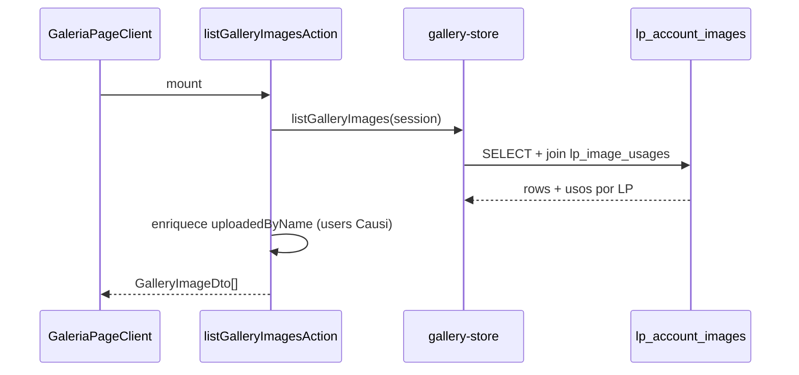
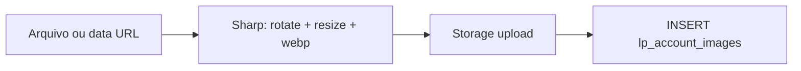
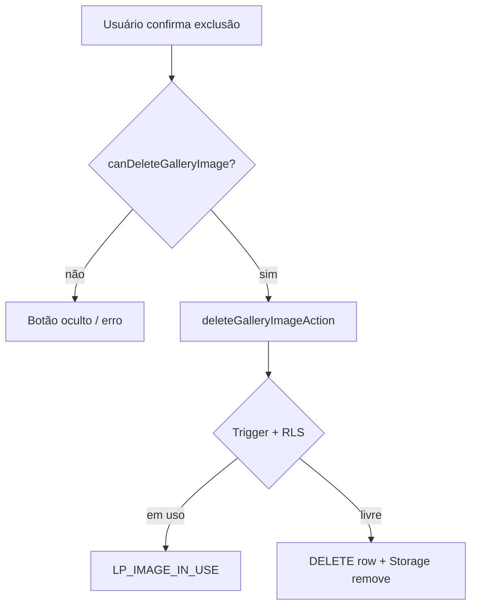

# Galeria de imagens

Repositório centralizado de mídias por conta (`account_id`). As imagens alimentam o editor de landing pages (logo, seções, advogados, SEO) e aparecem na rota `/galeria` para gestão, reutilização e exclusão segura.

## Escopo e premissas

| Premissa | Detalhe |
|----------|---------|
| Multi-tenant | Cada escritório vê apenas imagens da conta ativa (`session.account.id`) |
| Bucket | `gerador-lp-assets` no Projeto B (Supabase LP) |
| Path novo | `{account_id}/gallery/{uuid}.webp` |
| Paths legados | `{office_subdomain}.causi.adv.br/{lp-slug}/...` — leitura pública; **não** entram na galeria nem geram vínculos |
| Formato | WebP otimizado (Sharp), máx. 2400×2400 px, qualidade 85 |
| Acesso à rota | `hasLpAccess()` — plano 9 ativo ou trial (ver [authentication.md](authentication.md)) |

---

## Modelo de dados

### `lp_account_images`

Metadados de cada arquivo enviado pela galeria ou pelo fluxo de save da LP.

| Coluna | Descrição |
|--------|-----------|
| `id` | UUID da imagem (também no nome do arquivo) |
| `account_id` | Conta Causi dona da imagem |
| `uploaded_by_user_id` | UUID de quem fez o upload (`auth.uid()` no Projeto B) |
| `storage_path` | Caminho único no bucket, ex. `42/gallery/a1b2c3.webp` |
| `original_filename` | Nome original do arquivo (opcional) |
| `mime_type` | Default `image/webp` |
| `size_bytes`, `width`, `height` | Metadados após otimização |
| `created_at` | Data do upload |

### `lp_image_usages`

Vínculo entre uma imagem da galeria e um **slot** de uma LP. Atualizado automaticamente ao salvar a LP.

| Coluna | Descrição |
|--------|-----------|
| `image_id` | FK → `lp_account_images` (`ON DELETE RESTRICT`) |
| `landing_page_id` | FK → `landing_pages` (`ON DELETE CASCADE`) |
| `slot` | Identificador do uso, ex. `logo`, `sections.hero`, `lawyers.joao` |

Constraint: `UNIQUE (landing_page_id, slot)` — uma LP tem no máximo uma imagem por slot.

### View `lp_image_usage_summary`

Agregação JSON de usos por imagem. O app consulta as tabelas diretamente com join; a view existe para diagnóstico e relatórios no banco.

---

## Storage

**Arquivo:** `src/lib/landing-pages/gallery-store.ts`

```
gerador-lp-assets/
└── {account_id}/
    └── gallery/
        └── {image_id}.webp
```

URL pública montada por `getPublicMediaUrl()`:

```
{LP_SUPABASE_URL}/storage/v1/object/public/gerador-lp-assets/{storage_path}
```

Helper `isGalleryStorageUrl(url)` detecta URLs que contêm `/gallery/` no bucket do gerador.

---

## Fluxos

### Listar imagens



**Arquivos:**
- `src/app/(app)/galeria/page.tsx` — guard de auth e plano
- `src/app/(app)/galeria/page.client.tsx` — grid, upload, exclusão
- `src/app/actions/gallery.ts` — Server Actions

A listagem ordena por `created_at` descendente e exibe, para cada imagem: thumbnail, nome do arquivo, quem enviou e links para LPs que usam a mídia (`/lp/{slug}`).

### Upload



Entradas aceitas:
- **Página `/galeria`:** file input → `FileReader` (data URL) → `uploadGalleryImageAction`
- **`ImagePickerDialog`:** mesmo fluxo com auto-seleção após upload
- **Save da LP:** `persistLpSchemaMedia` envia data URLs e URLs externas para a galeria antes de gravar o schema

O upload exige JWT com `account_id` e `uploaded_by_user_id = auth.uid()` (RLS). Ver [rls.md](rls.md).

### Vínculo com landing pages

**Arquivo:** `src/lib/landing-pages/image-usages.ts`

Ao concluir `saveLp`, o servidor chama `syncImageUsagesFromSchema`:

1. Extrai slots do schema (`extractImageSlotsFromSchema`)
2. Resolve `image_id` apenas para URLs do bucket galeria
3. Remove todos os usos da LP (`DELETE` por `landing_page_id`)
4. Insere os vínculos atuais

**Slots rastreados:**

| Slot | Origem no schema |
|------|------------------|
| `logo` | `office.logoSrc` |
| `lawyers.{id}` | `office.lawyers[].photo` |
| `sections.{key}` | `office.sectionImages` (hero, dor, sobre, solucao, …) |
| `seo.ogImage` | `schema.seo.ogImage` |
| `seo.favicon` | `schema.seo.favicon` |

URLs legadas ou externas (Unsplash, data URL ainda não persistida) **não** criam linha em `lp_image_usages`.

### Excluir imagem



Proteções em camadas:
1. **UI** — `useLpPermissions().canDeleteImage(uploaderId, inUse)`
2. **RLS** — policy `lp_images_delete` + `lp_can_delete_image()`
3. **Trigger** — `trg_lp_prevent_image_delete` levanta `P0001` com nomes das LPs se ainda houver uso

**Arquivo de erros:** `src/lib/errors.ts` mapeia `LP_IMAGE_IN_USE:` para toast com nomes das páginas.

---

## Integração com o editor

**Arquivo:** `src/components/Builder/image-picker-dialog.tsx`

| Componente | Função |
|------------|--------|
| `ImagePickerDialog` | Modal com grid da galeria + upload inline; `onSelect(url)` ao escolher |
| `LazyImageSlot` | Preview 120px + botão “Escolher/Alterar imagem” embutindo o dialog |

**Uso no editor** (`src/components/Builder/editor.tsx`):

- Logo do escritório → `LazyImageSlot`
- Imagens de seção → `SectionImageInput` → `LazyImageSlot` (opcional melhoria via `/api/imagem`)
- Fotos de advogados → upload direto como data URL no formulário; no **save**, `persistLpSchemaMedia` persiste na galeria

O campo `seo.ogImage` no painel SEO é texto/URL manual — não usa o picker da galeria na UI atual.

---

## Permissões (aplicação)

**Arquivo:** `src/lib/landing-pages/permissions.ts`  
**Hook:** `src/hooks/use-lp-permissions.ts`

| Ação | Quem pode |
|------|-----------|
| Ver galeria | Membro da conta com plano 9 (`hasLpAccess`) |
| Upload | Qualquer membro autenticado da conta |
| Excluir imagem própria | Autor do upload, se **não** estiver em uso |
| Excluir imagem de outro | Owner (`accessLevel >= 100`) ou super admin (`>= 999`), se **não** estiver em uso |
| Excluir imagem em uso | **Ninguém** (UI, RLS e trigger bloqueiam) |

`admin` com `accessLevel` 50 **não** é tratado como owner — segue regra de criador/uploader.

As regras espelham as funções SQL `lp_can_delete_image` e `lp_can_edit_landing_page`. Detalhes das policies em [rls.md](rls.md).

---

## Server Actions

**Arquivo:** `src/app/actions/gallery.ts`

Todas as actions chamam `requireLpSession()` antes de executar.

| Action | Efeito |
|--------|--------|
| `listGalleryImagesAction` | Lista + `uploadedByName` do Projeto A |
| `uploadGalleryImageAction` | Upload + `revalidatePath("/galeria")` |
| `deleteGalleryImageAction` | Remove DB + objeto Storage + `revalidatePath("/galeria")` |

DTO exportado: `GalleryImageDto = GalleryImageItem & { uploadedByName }`.

---

## Navegação

- Sidebar: item **Galeria** → `/galeria` (`src/components/app-sidebar.tsx`)
- Link “Voltar às LPs” na própria página da galeria

---

## Referências

- [rls.md](rls.md) — policies de `lp_account_images`, `lp_image_usages` e Storage
- [landing-pages.md](landing-pages.md) — save da LP e `persistLpSchemaMedia`
- [integrations.md](../integrations.md) — bucket compartilhado com paths legados Lovable
- `supabase/migrations/20260701000000_landing_pages_rls_and_gallery.sql` — DDL e RLS da galeria
