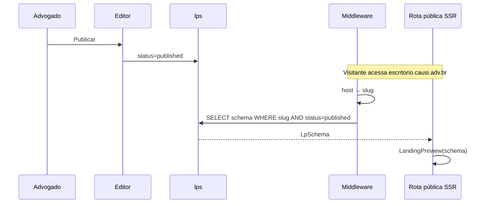

# Landing Pages

Documentação da feature de criação, edição e publicação de landing pages jurídicas.

## Visão geral

O advogado preenche um formulário, a IA gera a copy e o advogado escolhe **variações por seção** no passo Layout. O sistema salva um **snapshot JSON** (`LpSchema`). O editor e o site publicado usam o **mesmo renderer React** (`LandingPreview`). Não há HTML no banco.

**Centro da feature:** a LP é composta por **seções com variações**. Cada seção (Hero, Dor, Solução, etc.) tem variantes de layout independentes. O template (`lib/templates.ts`) é apenas um preset que copia valores iniciais para `schema.layout` — ver [../guides/templates-vs-variants.md](../guides/templates-vs-variants.md).

Cada escritório pode criar **N landing pages** sem limite.

---

## Conceitos fundamentais

### Seções

Blocos fixos da página. Cada seção tem conteúdo (copy gerada pela IA) e uma variação de layout selecionável.

| Seção | Tipo | Obrigatória |
|-------|------|-------------|
| `Hero` | Com variação | Sim (sempre a primeira) |
| `Dor` | Com variação | Sim |
| `Solução` | Com variação | Sim |
| `Sobre` | Com variação | Sim |
| `Equipe` | Com variação | Sim (se houver advogados cadastrados) |
| `Áreas` | Com variação | Opcional (toggle) |
| `Etapas` | Com variação | Opcional (toggle) |
| `FAQ` | Sem variação | Opcional (toggle) |
| `CTA Final` | Sem variação | Opcional (toggle, oculto por padrão) |
| `Footer` | Sem variação | Sim (sempre a última) |
| `LeadPopup` | Sem variação | Configurável |
| `Seções customizadas` | `cards` ou `texto` | Opcional (criadas no editor) |

**Ordem:** Hero e Footer são fixos; as seções do meio têm ordem configurável (`schema.layout.order`).

---

### Variações

Alternativas visuais de layout para uma seção. O mesmo conteúdo (copy) é renderizado de formas distintas. A variação ativa fica registrada em `schema.layout`.

#### Hero — `HeroVariant`

| Variação | Descrição |
|----------|-----------|
| `centered` | Texto centralizado com imagem de fundo (padrão do template Clássico) |
| `split` | Texto à esquerda, imagem à direita (50/50) |
| `video` | Texto à esquerda, vídeo YouTube incorporado à direita |
| `stats` | Texto com métricas em destaque (ícone + número + legenda) |

#### Dor — `DorVariant`

| Variação | Descrição |
|----------|-----------|
| `comImagem` | Imagem de cena + cards de dores na parte inferior |
| `soCards` | Apenas cards de dores, sem imagem (layout mais compacto) |

#### Solução — `SolucaoVariant`

| Variação | Descrição |
|----------|-----------|
| `comImagem` | Imagem de cena + cards da solução |
| `soCards` | Apenas cards da solução |
| `destaque` | Cards alternando entre destaque accent e neutro |

#### Sobre — `SobreVariant`

| Variação | Descrição |
|----------|-----------|
| `fotoLista` | Foto do advogado à esquerda + lista de diferenciais à direita |
| `overlay` | Foto de fundo em fullbleed com texto e foto do advogado sobrepostos |
| `duasColunas` | Foto full-height à esquerda, texto à direita (duas colunas) |

#### Áreas — `AreasVariant`

| Variação | Descrição |
|----------|-----------|
| `grid` | Grade de cards com ícone e título (2 colunas) |
| `lista` | Faixas horizontais expansíveis |

#### Etapas — `EtapasVariant`

| Variação | Descrição |
|----------|-----------|
| `numerado` | Passos numerados em linha horizontal com ícone circular dourado |
| `timeline` | Linha do tempo vertical com guia lateral e pontos de marcação |

#### Equipe — `EquipeVariant`

| Variação | Descrição |
|----------|-----------|
| `splitAlternado` | Foto grande alternando lado a lado com texto (1–3 sócios) |
| `retratoElegante` | Grid de retratos verticais com gradiente e nome na base (4–6 sócios) |

> Se `equipe` não for definida no layout, a variação é escolhida automaticamente: ≤3 advogados → `splitAlternado`; ≥4 → `retratoElegante`.

---

### Tom (tone)

Cada seção tem um tom independente de fundo: `light` (creme/branco) ou `dark` (cor da marca). Configurado em `schema.layout.tones`.

```typescript
type SectionTones = {
  hero: Tone;
  dor: Tone;
  solucao: Tone;
  sobre: Tone;
  equipe: Tone;
  areas: Tone;
  etapas: Tone;
  faq: Tone;
  ctaFinal: Tone;
};
```

Tom e variação são independentes: a mesma variação de layout pode ter fundo claro ou escuro.

---

### Templates

Grupos pré-definidos de variações + paleta de cores. O advogado escolhe um template na criação, mas pode alterar cada seção individualmente no editor após a criação.

**Papel do template:** ponto de partida visual, não um molde fixo. Ele pré-seleciona variações e define a paleta; tudo é editável depois.

#### Templates disponíveis (`lib/templates.ts`)

**Clássico** (`classic-light`) — Azul marinho com dourado. Sóbrio e profissional.

| Seção | Variação | Tom |
|-------|----------|-----|
| Hero | `centered` | light |
| Dor | `comImagem` | light |
| Solução | `soCards` | dark |
| Sobre | `fotoLista` | light |
| Áreas | `grid` | dark |
| Etapas | `numerado` | light |

**Moderno** (`modern-dark`) — Tons escuros com destaque dourado. Elegante e marcante.

| Seção | Variação | Tom |
|-------|----------|-----|
| Hero | `split` | dark |
| Dor | `soCards` | dark |
| Solução | `comImagem` | light |
| Sobre | `overlay` | dark |
| Áreas | `lista` | light |
| Etapas | `timeline` | dark |

**Acolhedor** (`warm-neutral`) — Tons de caramelo e bege. Próximo e humano.

| Seção | Variação | Tom |
|-------|----------|-----|
| Hero | `stats` | light |
| Dor | `comImagem` | light |
| Solução | `destaque` | dark |
| Sobre | `duasColunas` | light |
| Áreas | `grid` | light |
| Etapas | `numerado` | dark |

---

## Identificador e URL pública (slug)

O **slug** é o endereço da LP na internet. Cada landing page publicada fica em:

`https://{slug}.{NEXT_PUBLIC_APP_DOMAIN}` — ex.: `escritorio-silva.causi.adv.br`

### Quando é definido

| Momento | O que acontece |
|---------|----------------|
| **Wizard `/nova`** | Advogado informa o nome do escritório — ainda **não** há slug |
| **`POST /api/gerar-lp`** | Servidor deriva o slug do nome, resolve colisões e **grava** na primeira persistência |
| **Editor `/lp/[slug]`** | Slug já existe; usado na URL do editor e no botão "Ver site" |
| **Publicação** | Mesmo slug; apenas muda `status` para `published` |

O slug **não é editável** pelo advogado. Nasce uma vez na geração e permanece fixo.

### Estratégia de unicidade global

| Passo | Regra |
|-------|-------|
| 1. Base | Nome do escritório → kebab-case, sem acentos (`slugFromOfficeName` em `lib/slug.ts`) |
| 2. Primeira tentativa | Slug base puro — ex.: `escritorio-silva` |
| 3. Colisão | Sufixo numérico incremental: `escritorio-silva-2`, `escritorio-silva-3`, … |
| 4. Limite | Até `LP_SLUG_MAX_SUFFIX` (9999) tentativas; senão erro 409 |

A verificação consulta `landing_pages.slug` **sem filtrar por usuário** (`isLpSlugTaken` em `lib/lpStore.ts`). Constraint no banco: `UNIQUE (slug)`.

---

## Fluxo do usuário

```mermaid
flowchart TD
  A[Galeria /] --> B[/nova — wizard 3 passos]
  B --> C[Escritório Contato Imagens + preset opcional]
  C --> D[POST /api/gerar-copy]
  D --> E[POST /api/gerar-lp]
  E --> F[Editor /lp/slug]
  F --> G[VariantPicker + saveLpAction]
  G --> H[Publicar — status=published]
  H --> I[slug.causi.adv.br]
```

Ver também [../guides/templates-vs-variants.md](../guides/templates-vs-variants.md).

---

## Geração por IA

### Wizard: copy e criação

**Arquivo:** `app/api/gerar-copy/route.ts`

No passo final (Imagens), ao clicar em **Criar e editar**, o wizard chama `POST /api/gerar-copy` e em seguida `POST /api/gerar-lp`. O advogado pode escolher um preset opcional de layout; as cores vêm da logo.

### Persistência final

**Arquivo:** `app/api/gerar-lp/route.ts`

### Pipeline

1. **Slug** — `slugFromOfficeName(name)` + `allocateUniqueLpSlug()` (`lib/slug.ts`); verifica unicidade global antes da IA.
2. **Layout** — Usa `layout` explícito do wizard (copiado do preset escolhido ou default). Sobrescreve `hero: "video"` se houver `videoId`.
3. **Theme** — Paleta enviada pelo wizard (extraída da logo ou padrão).
4. **Copy** — Reutiliza copy pré-gerada (`/api/gerar-copy`) ou chama GPT-4o inline.
5. **Imagens** — Reutiliza imagens do wizard ou Unsplash + `imageBank`.
6. **Schema** — `buildSchema(office, theme, tema, layout, …)` monta o JSON completo.
7. **Persistência** — `saveLp(userId, { slug, name, tema, schema })`.

---

## Editor (`/lp/[slug]`)

**Arquivos:** `app/lp/[slug]/page.tsx`, `LpStudio.tsx`, `Editor.tsx`

### Controles por seção

O editor expõe para cada seção:

| Controle | Componente | Persiste em |
|----------|------------|-------------|
| Variação de layout | `VariantPicker` | `schema.layout.<seção>` |
| Tom claro/escuro | Toggle | `schema.layout.tones.<seção>` |
| Textos (copy) | campos inline | `schema.<seção>.*` |
| Imagem de cena | upload/Unsplash | `schema.office.sectionImages.<seção>` |

### `VariantPicker`

Componente central do editor. Exibe miniaturas esquemáticas (wireframes) de cada variação disponível para a seção ativa. Ao selecionar, atualiza `schema.layout` e o preview ao vivo reflete a mudança imediatamente.

### Preview = publicação

`LandingPreview` recebe `LpSchema` e renderiza todas as seções com as variações registradas em `schema.layout`. O preview no editor **é** o que o visitante verá — mesma árvore de componentes, mesmas variações.

### Outros recursos do editor

| Recurso | Onde |
|---------|------|
| Simples / Avançado | `Editor.tsx` |
| Reordenar seções | drag & drop sobre `schema.layout.order` |
| Ligar/desligar seções | toggle de `schema.layout.hidden` |
| Adicionar seção customizada | cria item em `schema.customSections` |
| Trocar template | reaplica `layout` + `theme` do novo template; mantém copy |
| Paleta de cores | `PalettePicker` → `schema.theme` |
| Tipografia | `schema.office.fonts` (heading + body) |
| Cantos dos cards/botões | `schema.office.cardRadius`, `schema.office.buttons.radius` |
| Popup de lead | configura `schema.office.buttons.popup.questions` |
| Tags de conversão | `schema.office.tags` (GTM, Pixel) |
| Domínio personalizado | `schema.office.domain` |
| Política de privacidade | `schema.office.privacyPolicy` |
| Salvar | `saveLpAction` → `lps.schema` |

---

## Schema JSON (`lib/schema.ts`)

### `Layout` — estado atual das variações

```typescript
type Layout = {
  hero: HeroVariant;       // "centered" | "split" | "video" | "stats"
  dor: DorVariant;         // "comImagem" | "soCards"
  solucao: SolucaoVariant; // "comImagem" | "soCards" | "destaque"
  sobre: SobreVariant;     // "fotoLista" | "overlay" | "duasColunas"
  equipe?: EquipeVariant;  // "splitAlternado" | "retratoElegante" | auto
  areas: AreasVariant;     // "grid" | "lista"
  etapas: EtapasVariant;   // "numerado" | "timeline"
  tones: SectionTones;     // light | dark por seção
  hidden?: Partial<Record<ToggleableSection, boolean>>;
  order?: string[];        // ordem das seções do meio
};
```

### `LpSchema` — o que vai no banco

```typescript
type LpSchema = {
  theme: Theme;              // paleta de cores ativa
  office: Office;            // dados do escritório
  layout: Layout;            // variações e tons por seção (snapshot)
  videoId?: string;          // YouTube (usado pelo hero "video")
  hero: HeroContent;
  dor: DorContent;
  solucao: SolucaoContent;
  areas: AreasContent;
  etapas: EtapasContent;
  faq: FaqContent;
  ctaFinal: CtaFinalContent;
  seo?: SeoMeta;             // gerado pela IA na criação
  customSections?: CustomSection[];
};
```

`schema.layout` é a **fonte da verdade** para as variações ativas. Apenas o schema completo é persistido — nenhum id de preset.

---

## Galeria (`/`)

**Arquivo:** `app/page.tsx`

- Lista LPs via `listLps(session.user.id)`.
- Exibe nome, tema e thumbnail de cada LP.
- Links: Nova página, Contatos, configurações globais.
- Guard: `requireLpAccess`.

---

## Formulário multi-step (`/nova`)

**Arquivos:** `app/(app)/nova/page.tsx`, `forms/LandingPageCreateForm/landing-page-create-form.tsx`, `components/Builder/template-card.tsx`

### Passos

| # | Nome | Campos principais |
|---|------|-------------------|
| 1 | Escritório | Tema jurídico, nome, sobre, diferenciais |
| 2 | Contato | WhatsApp, e-mail, endereço, redes sociais |
| 3 | Imagens | Logo, fotos, vídeo YouTube, paleta, preset opcional de layout |

### Submissão

1. Passo 3: **Criar e editar** → `POST /api/gerar-copy` e `POST /api/gerar-lp` com `layout` do preset escolhido (default `classic-light`).
2. Redirect → `/lp/{slug}?novo=1`.

---

## Publicação e subdomínio (MVP)

### Modelo multi-tenant simples

Uma LP publicada = uma linha em `lps`. Multi-tenancy por **`slug`**, não por deploy separado.

### Fluxo de publicação



1. **Middleware:** `escritorio.causi.adv.br` → `slug = escritorio` (rota pública, sem auth).
2. **Query:** `lps WHERE slug = ? AND status = 'published'`.
3. **Render:** Server Component + `LandingPreview` — `schema.layout` define as variações.
4. **Leads:** `POST /api/lead` na mesma origem do subdomínio.

---

## Persistência

**Arquivo:** `lib/lpStore.ts`

| Função | Operação |
|--------|----------|
| `listLps` | slug, name, tema |
| `getLp` | LP completa + `migrate()` |
| `saveLp` | upsert `(causi_user_id, slug)` |
| `deleteLp` | remove por slug |
| `getLpPublic` | LP por slug sem autenticação (rota pública) |

---

## Componentes de seção (`components/Sections/`)

O renderer despacha para a variação correta dentro de cada componente de seção:

```typescript
// Exemplo: Hero despacha pela variação em schema.layout.hero
function Hero({ schema }) {
  switch (schema.layout.hero) {
    case "centered":  return <HeroCentered ... />;
    case "split":     return <HeroSplit ... />;
    case "video":     return <HeroVideo ... />;
    case "stats":     return <HeroStats ... />;
  }
}
```

Mesmo padrão em `Dor`, `Solucao`, `Sobre`, `Areas`, `Etapas`, `Equipe`.

---

## Gaps conhecidos

| Gap | Nota |
|-----|------|
| "Trocar template" no editor | `TemplatePicker` compacto existe; ação de re-aplicar layout ainda não implementada |
| Sem publicação/subdomínio | Bloqueia leads reais; `status` e middleware ainda não implementados |
| `Editor.tsx` grande | Refatorar após MVP |
| `POST /api/lead` | Popup demo funciona; captura real não implementada |

---

## Referências

- [../guides/templates-vs-variants.md](../guides/templates-vs-variants.md) — template vs `schema.layout` (referência canônica)
- [prd.md](../prd.md) — requisitos RF-04, RF-06
- [database.md](../database.md) — schema `lps`
- [api.md](../api.md) — `POST /api/gerar-lp`
- [server-actions.md](../server-actions.md) — CRUD `lps` via Server Actions
- [features/leads.md](leads.md) — popup e captura
- `lib/schema.ts` — tipos `Layout`, `LpSchema`, variantes
- `lib/templates.ts` — templates e `getTemplate()`
- `components/Builder/variant-picker.tsx` — `VariantPicker` e miniaturas
