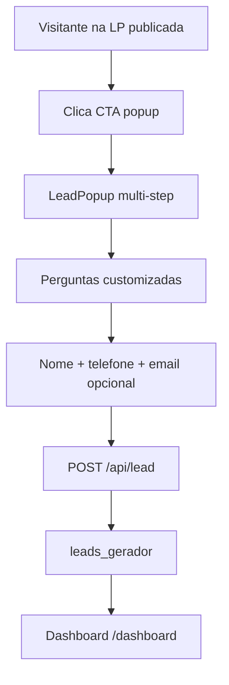

# Leads / Contatos

Documentação da feature de captura, armazenamento e visualização de leads (contatos) gerados pelas landing pages do escritório.

## Visão geral

Leads são visitantes que preenchem o popup de contato em uma landing page publicada do advogado. Todos os leads pertencem ao **escritório específico**, identificado por `causi_user_id`. O advogado visualiza e gerencia contatos no dashboard.

## Definição de lead

| Campo | Descrição |
|-------|-----------|
| Escopo | Todos os leads do escritório (`causi_user_id`) |
| Origem | Popup multi-step na LP publicada |
| Dados mínimos | Nome + telefone |
| Dados opcionais | E-mail, respostas customizadas (`answers`) |

## Fluxo de captura



### Estado atual

| Etapa | Status |
|-------|--------|
| Popup UI (`LeadPopup`) | Implementado |
| Configuração no editor | Implementado |
| Preview demo (`demo=true`) | Implementado — não envia dados |
| API de captura (`POST /api/lead`) | **Não implementado** |
| Dashboard de leitura | Implementado |

## Tabela `leads_gerador`

**Schema:** `supabase/gerador.causi.sql`

```sql
CREATE TABLE public.leads_gerador (
  id              uuid PRIMARY KEY DEFAULT gen_random_uuid(),
  lp_id           uuid REFERENCES public.lps(id),
  causi_user_id   text NOT NULL,
  client_slug     text NOT NULL DEFAULT '',
  name            text,
  phone           text,
  email           text,
  answers         jsonb NOT NULL DEFAULT '{}',
  page_url        text,
  created_at      timestamptz NOT NULL DEFAULT now()
);
```

| Coluna | Uso |
|--------|-----|
| `lp_id` | LP de origem (nullable) |
| `causi_user_id` | Escritório dono — filtro principal no dashboard |
| `client_slug` | Subdomínio da LP publicada |
| `name` | Nome do lead |
| `phone` | Telefone |
| `email` | E-mail (opcional) |
| `answers` | Respostas do popup personalizado (jsonb) |
| `page_url` | URL completa da página de captura |
| `created_at` | Data/hora da captura |

## Popup de lead (`LeadPopup`)

**Arquivo:** `components/sections/LeadPopup.tsx`

### Fluxo multi-step

1. **Perguntas customizadas** — Configuradas no editor (`PopupQuestion[]`).
   - Tipo `text`: campo livre.
   - Tipo `choice`: opções clicáveis.
2. **Passo final fixo** — Nome, telefone e e-mail (opcional).
3. **Agradecimento** — Mensagem de confirmação.

### Configuração no editor

No `Editor`, quando a ação do CTA é `popup`:

- Modal "Personalizar" permite adicionar/remover/reordenar perguntas.
- Cada pergunta tem: `id`, `label`, `type` (text/choice), `options[]`.
- Preview usa `demo=true` — simula o fluxo sem persistir.

### Modo demo vs produção

| Modo | Comportamento |
|------|---------------|
| `demo=true` (preview/editor) | Exibe agradecimento, não envia dados |
| `demo=false` (LP publicada) | Deve chamar `POST /api/lead` — **não implementado** |

## Dashboard de contatos (`/dashboard`)

**Arquivos:** `app/dashboard/page.tsx`, `app/dashboard/DashboardClient.tsx`

### Server-side

```typescript
lpAdmin()
  .from("leads_gerador")
  .select("id,created_at,name,phone,page_url,client_slug")
  .eq("causi_user_id", session.user.id)
  .order("created_at", { ascending: false })
  .limit(2000);
```

> **Gap:** `email` e `answers` existem no banco mas não são buscados nem exibidos.

### Client-side (`DashboardClient`)

| Funcionalidade | Descrição |
|----------------|-----------|
| Listagem | Tabela com data, nome, telefone, página |
| Busca | Filtro por nome ou telefone |
| Filtro por período | Hoje, 7 dias, 30 dias, personalizado |
| Filtro por LP | Baseado em `page_url` |
| Paginação | 20 leads por página |
| Export CSV | Download client-side com BOM UTF-8 |
| WhatsApp | Link direto com saudação personalizada |
| Logout | `LogoutButton` |

### Tipo `Lead` (UI)

```typescript
type Lead = {
  id: string;
  created_at: string;
  nome: string | null;
  telefone: string | null;
  page_url: string | null;
  subdomain: string | null;  // mapeado de client_slug
};
```

### Navegação

- Acesso via link "Contatos" na galeria (`/`).
- **Não está na sidebar** (`AppSidebar`) — apenas link na página principal.

## API proposta: `POST /api/lead`

Endpoint público para captura de leads em LPs publicadas. Ver [api.md](../api.md) para especificação completa.

### Request

```json
{
  "lpId": "uuid-da-lp",
  "clientSlug": "escritorio-silva",
  "name": "João Silva",
  "phone": "11999998888",
  "email": "joao@email.com",
  "answers": {
    "q1": "Direito trabalhista",
    "q2": "Demissão sem justa causa"
  },
  "pageUrl": "https://escritorio-silva.localhost/"
}
```

### Response

```json
{ "ok": true, "id": "uuid-do-lead" }
```

### Regras de negócio

1. Rota **pública** (sem auth de usuário) — acessível de LPs publicadas.
2. Resolver `causi_user_id` a partir de `lpId` ou `clientSlug`.
3. Validar `name` e `phone` como obrigatórios.
4. Sanitizar `answers` (apenas strings).
5. Rate limiting por IP e por LP.
6. Validar origem (CORS / referrer) para evitar spam.

### Integração com `LeadPopup`

```typescript
// Proposta — em LeadPopup quando demo=false
const res = await fetch("/api/lead", {
  method: "POST",
  headers: { "Content-Type": "application/json" },
  body: JSON.stringify({
    lpId,
    clientSlug,
    name,
    phone,
    email,
    answers,
    pageUrl: window.location.href,
  }),
});
```

## Gaps conhecidos

| Gap | Impacto | Ação |
|-----|---------|------|
| `POST /api/lead` ausente | Leads não são capturados em produção | Implementar endpoint |
| `answers` não exibidos | Respostas do popup perdidas na UI | Expandir select e tabela |
| `email` não buscado | Campo ignorado no dashboard | Adicionar ao select e coluna |
| Popup em modo demo sempre no preview | Comportamento correto para editor | Conectar em LP publicada |
| `client_slug` sem escrita | Subdomínio não é gravado | Implementar na publicação |
| Dashboard fora da sidebar | UX inconsistente com PRD (3 abas) | Integrar na navegação |

## Roadmap

1. **Implementar `POST /api/lead`** — captura real no popup.
2. **Publicação de LP** — necessária para o popup funcionar fora do editor.
3. **Expandir dashboard** — exibir `email`, `answers`, subdomínio.
4. **Integrar na sidebar** — link "Contatos" no `AppSidebar`.
5. **Notificações** — e-mail/WhatsApp ao advogado quando novo lead (futuro).

## Referências

- [api.md](../api.md) — especificação de `POST /api/lead`
- [server-actions.md](../server-actions.md) — padrão CRUD e `POST /api/lead` futuro
- [database.md](../database.md) — schema `leads_gerador`
- [features/landing-pages.md](landing-pages.md) — popup e publicação
- [prd.md](../prd.md) — requisitos RF-07
