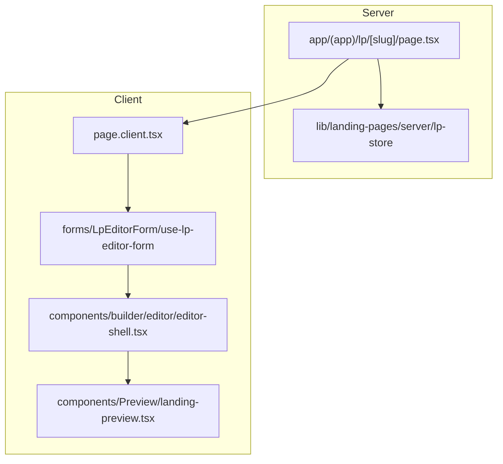

# Arquitetura do editor de Landing Pages

Mapa de camadas e responsabilidades do fluxo create → edit → publish.

## Fluxo de dados



## Onde procurar

| Pergunta | Caminho |
|----------|---------|
| Como a LP é renderizada (visitante + preview)? | `components/Preview/landing-preview.tsx` |
| Onde edito uma LP existente? | `app/(app)/lp/[slug]/` + `components/builder/editor/` |
| Onde crio uma LP nova? | `app/(app)/nova/` + `forms/LandingPageCreateForm/` |
| Estado do formulário do editor? | `forms/LpEditorForm/use-lp-editor-form.ts` |
| Tipos e JSON da LP? | `lib/landing-pages/schema/` |
| Validação Zod compartilhada? | `lib/landing-pages/validation/` |
| Wizard → payload da API? | `lib/landing-pages/shared/create-seed.ts` |
| Salvar / publicar? | `app/actions/lps.ts` + `lib/landing-pages/lp-store.ts` |

## `components/builder/`

```
builder/
├── index.ts                 # exports públicos
├── shared/                  # create + edit
│   ├── fields.tsx
│   ├── palette-picker.tsx
│   ├── variant-picker.tsx
│   └── image-picker-dialog.tsx
├── create/                  # wizard /nova
│   ├── template-card.tsx
│   └── melhorar-texto-button.tsx
├── gallery/
│   └── lp-card.tsx
└── editor/
    ├── editor-shell.tsx     # layout sidebar + preview + save
    ├── editor-section-nav.tsx
    ├── controls/editor-controls.tsx
    ├── panels/              # copy, seo, footer, hero, layout
    └── widgets/             # popup, ícones, advogados, seções custom
```

`Preview/` fica fora de `builder/` — é renderer de domínio, usado também nas rotas públicas.

## `lib/landing-pages/`

| Pasta / arquivo | Conteúdo |
|-----------------|----------|
| `schema/types.ts` | Tipos `Office`, `Layout`, `LpSchema`, variantes |
| `schema/defaults.ts` | `DEFAULT_THEME`, `DEFAULT_LAYOUT` |
| `schema/helpers.ts` | `focalPos`, `waLink`, `themeToCssVars` |
| `schema.ts` | Re-export do módulo `schema/` |
| `validation/contact.ts` | WhatsApp + e-mail (create e save do editor) |
| `validation/zod-primitives.ts` | Schemas Zod reutilizáveis |
| `shared/create-seed.ts` | `createGerarLpPayloadFromWizard`, `buildOfficeFromGerarLpPayload` |
| `server/` | Barrel de módulos server-only (`lp-store`, `unsplash`, …) |
| `lp-store.ts`, `focos.ts`, `templates.ts`, … | Dados e persistência (paths legados re-exportados) |

**Regra:** não importar `lib/landing-pages/server/*` nem módulos com `server-only` em componentes client.

## Formulários

| Form | Schema | Uso |
|------|--------|-----|
| `LandingPageCreateForm` | `forms/LandingPageCreateForm/schema.ts` | Wizard `/nova`; validação por passo |
| `LpEditorForm` | `forms/LpEditorForm/schema.ts` | Editor; validação no save via `lpEditorSaveSchema` |

Validação de contato (WhatsApp 13 dígitos + e-mail) está centralizada em `validation/contact.ts`.

## Preview = publicação

`LandingPreview` recebe `LpSchema` e renderiza as seções com `schema.layout`. O iframe do editor usa o mesmo componente que a rota pública `[escritorio]/[slug]`.

## Responsivo

- Aba **Editar / Prévia** em viewports `< lg`
- `DevicePreview` com viewports desktop / tablet / mobile
- Modais pesados (`PopupBuilder`, `ComparePhotoModal`) carregados com `next/dynamic`
