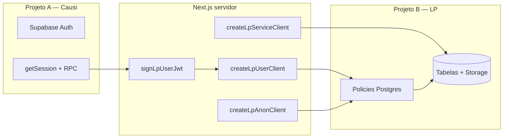

# Row Level Security (RLS)

Regras de isolamento de dados no **Projeto B** (Supabase LP). Toda tabela de negócio do gerador usa RLS; o app nunca confia apenas no filtro em TypeScript — as policies são a fronteira de segurança no Postgres.

Para autenticação do app (plano 9, sessão Causi) ver [authentication.md](authentication.md). Para galeria e vínculos de imagem ver [gallery.md](gallery.md).

---

## Arquitetura

| Cliente Supabase | Quando usar | RLS |
|------------------|-------------|-----|
| `createLpUserClient(session)` | CRUD autenticado (LPs, galeria) | **Respeitado** |
| `createLpAnonClient()` | LP publicada (`getLpPublic`) | Policy `anon` |
| `createLpServiceClient()` / `lpAdmin()` | `user_settings`, checagens cross-conta | **Bypass** (service_role) |

**Arquivos:** `src/lib/supabase/lp-client.ts`, `src/lib/supabase/lp-jwt.ts`

---

## JWT customizado

O Projeto B não reutiliza o cookie de sessão do Causi diretamente. O servidor assina um JWT curto com `LP_SUPABASE_JWT_SECRET` após validar `requireLpSession()` / `requireAuth()`.

### Claims emitidos

| Claim | Valor | Uso no RLS |
|-------|-------|------------|
| `sub` | `session.user.id` (UUID) | `auth.uid()` |
| `role` | `"authenticated"` | Role Postgres |
| `account_id` | `session.account.id` (string) | `lp_jwt_account_id()` |
| `access_level` | `session.role.accessLevel` (string) | `lp_jwt_access_level()` |
| `role_slug` | `session.role.slug` | Emitido; **não** usado pelas policies |

TTL padrão: 3600 segundos.

### Funções helper SQL

Definidas em `supabase/migrations/20260701000000_landing_pages_rls_and_gallery.sql`:

| Função | Lógica |
|--------|--------|
| `lp_jwt_account_id()` | `(auth.jwt() ->> 'account_id')::bigint` |
| `lp_jwt_access_level()` | `COALESCE((jwt ->> 'access_level')::int, 0)` |
| `lp_is_super_admin()` | `access_level >= 999` |
| `lp_is_account_owner()` | `access_level >= 100` |
| `lp_user_in_account(p_account_id)` | `p_account_id = lp_jwt_account_id()` |
| `lp_can_edit_landing_page(p_created_by)` | super_admin **OU** owner **OU** `p_created_by = auth.uid()` |
| `lp_can_delete_image(p_uploaded_by, p_image_id)` | super_admin **OU** owner **OU** (uploader = `auth.uid()` **e** sem linha em `lp_image_usages`) |
| `lp_gallery_storage_prefix()` | `{account_id}/gallery/` |

### Níveis de acesso (app ↔ SQL)

**Arquivo:** `src/lib/landing-pages/permissions.ts`

| `access_level` | Papel | Efeito nas policies |
|----------------|-------|---------------------|
| `>= 999` | Super admin | Policy `*_super_admin` — `FOR ALL` nas tabelas do gerador |
| `>= 100` | Owner da conta | Edita qualquer LP da conta; exclui LPs; exclui imagens de terceiros (se sem uso) |
| `< 100` (ex. admin 50) | Membro | Edita só LPs que criou; exclui só imagens próprias sem uso |
| `0` (claim ausente) | — | Acesso negado pelas policies de escrita |

---

## Tabelas com RLS

### `public.landing_pages`

**Migration:** `20260701000000_landing_pages_rls_and_gallery.sql`

Colunas relevantes: `account_id`, `created_by_user_id`, `office_subdomain`, `slug`, `status`.

| Policy | Comando | Role | Regra |
|--------|---------|------|-------|
| `landing_pages_select_account` | SELECT | `authenticated` | `lp_user_in_account(account_id)` |
| `landing_pages_select_public` | SELECT | `anon` | `status = 'published'` |
| `landing_pages_insert` | INSERT | `authenticated` | Conta no JWT + `created_by_user_id = auth.uid()` + `account_id = lp_jwt_account_id()` |
| `landing_pages_update` | UPDATE | `authenticated` | Conta + `lp_can_edit_landing_page(created_by_user_id)` |
| `landing_pages_delete` | DELETE | `authenticated` | Conta + (`lp_is_account_owner()` OU `lp_is_super_admin()`) |
| `landing_pages_super_admin` | ALL | `authenticated` | `lp_is_super_admin()` |

**App:**
- `listLps`, `saveLp`, `publishLp`, `deleteLp` → `createLpUserClient` + filtro `.eq("account_id", …)` (defesa em profundidade)
- `getLpPublic(office, slug)` → `createLpAnonClient` + `status = 'published'`
- `isOfficeSubdomainTakenByOtherAccount` → `createLpServiceClient` (única leitura cross-conta intencional)

---

### `public.lp_accounts`

Fonte canônica da conta para o gerador (`name` + `office_subdomain`).

| Policy | Comando | Role | Regra |
|--------|---------|------|-------|
| `lp_accounts_select` | SELECT | `authenticated` | `lp_user_in_account(id)` |
| `lp_accounts_insert` | INSERT | `authenticated` | `id = lp_jwt_account_id()` |
| `lp_accounts_update` | UPDATE | `authenticated` | Conta no JWT + `lp_is_account_owner()` |
| `lp_accounts_delete` | DELETE | `authenticated` | owner da conta ou super admin |
| `lp_accounts_super_admin` | ALL | `authenticated` | `lp_is_super_admin()` |

Subdomínio é garantido por `UNIQUE (office_subdomain)` + `CHECK` de formato.

---

### `public.lp_account_images` (galeria)

| Policy | Comando | Role | Regra |
|--------|---------|------|-------|
| `lp_images_select` | SELECT | `authenticated` | `lp_user_in_account(account_id)` |
| `lp_images_insert` | INSERT | `authenticated` | Conta + `uploaded_by_user_id = auth.uid()` + `account_id = lp_jwt_account_id()` |
| `lp_images_update` | UPDATE | `authenticated` | Conta + `lp_can_delete_image` no USING; WITH CHECK exige uploader = `auth.uid()` |
| `lp_images_delete` | DELETE | `authenticated` | Conta + `lp_can_delete_image(uploaded_by_user_id, id)` |
| `lp_images_super_admin` | ALL | `authenticated` | `lp_is_super_admin()` |

**Trigger:** `trg_lp_prevent_image_delete` — antes do DELETE, se existir uso em `lp_image_usages`, levanta `P0001` com mensagem `LP_IMAGE_IN_USE:{nomes das LPs}`.

---

### `public.lp_image_usages`

| Policy | Comando | Role | Regra |
|--------|---------|------|-------|
| `lp_usages_select` | SELECT | `authenticated` | Imagem pertence à conta do JWT |
| `lp_usages_insert` | INSERT | `authenticated` | Imagem na conta **e** LP na conta com `lp_can_edit_landing_page` |
| `lp_usages_delete` | DELETE | `authenticated` | LP na conta com `lp_can_edit_landing_page` |
| `lp_usages_super_admin` | ALL | `authenticated` | `lp_is_super_admin()` |

Não há policy de UPDATE para membros — sincronização faz delete-all + insert em `syncImageUsagesFromSchema`.

FK: `image_id` → `ON DELETE RESTRICT` (imagem em uso não pode ser apagada pelo cascade).

---

### `public.profiles` (Lovable)

**Migration:** `20260629130000_refactor_structure.sql`  
Tabela legada do ecossistema Lovable; o gerador **lê** para `profile_id`, não grava subdomínio.

| Policy | Comando | Role | Regra |
|--------|---------|------|-------|
| `profiles_select_own` | SELECT | `authenticated` | `auth.uid() = id` |
| `profiles_insert_own` | INSERT | `authenticated` | `auth.uid() = id` |
| `profiles_update_own` | UPDATE | `authenticated` | `auth.uid() = id` |

Sem policies para `anon` ou `DELETE`.

---

### `public.leads` (Lovable + gerador)

| Policy | Comando | Role | Regra |
|--------|---------|------|-------|
| `leads_insert_anon` | INSERT | `anon` | `subdomain IS NOT NULL` |
| `leads_select_own` | SELECT | `authenticated` | `subdomain` ∈ subdomínios do `profiles` do usuário |

Sem UPDATE/DELETE. O gerador atual não consulta `leads` diretamente no `src/`; fluxo documentado em [leads.md](leads.md).

---

## Storage — bucket `gerador-lp-assets`

Bucket público (`public: true`), limite 10 MB, tipos de imagem.

**Migrations:** `20260629160000_gerador_lp_storage_bucket.sql` (criação + leitura), `20260701000000_...` (escrita galeria)

| Policy | Comando | Role | Regra |
|--------|---------|------|-------|
| `gerador_lp_assets_public_read` | SELECT | `public` | `bucket_id = 'gerador-lp-assets'` |
| `gerador_lp_assets_insert_gallery` | INSERT | `authenticated` | Bucket + `name LIKE '{account_id}/gallery/%'` |
| `gerador_lp_assets_update_gallery` | UPDATE | `authenticated` | Mesmo prefixo de galeria |
| `gerador_lp_assets_delete_gallery` | DELETE | `authenticated` | super_admin **OU** owner **OU** (path galeria + row em `lp_account_images` com uploader = `auth.uid()` e `lp_can_delete_image`) |

**Implicação:** paths legados (`{office}.causi.adv.br/{slug}/...`, `_sem-subdominio/...`) têm **leitura pública**, mas **não** permitem INSERT/UPDATE/DELETE autenticado — novos uploads vão apenas para `{account_id}/gallery/`.

---

## Tabelas sem RLS

| Tabela | Motivo |
|--------|--------|
| — | Estado atual: tabelas de negócio do gerador usam RLS ativo |

Nunca expor `LP_SUPABASE_SERVICE_ROLE_KEY` ao browser.

---

## Camadas além do RLS

O RLS não substitui validações de produto no servidor:

| Camada | O que valida |
|--------|------------|
| Proxy (`src/lib/supabase/proxy.ts`) | Auth Causi nas rotas do app; subdomínio público sem login |
| `hasLpAccess()` / `requireLpSession()` | Plano `billing.plans.id = 9`, subscription `active` ou `trial` |
| `permissions.ts` / `useLpPermissions` | Espelho UI das regras de edição/exclusão |
| Server Actions | `requireLpSession()` em toda mutação |
| Filtros explícitos | `.eq("account_id", ctx.accountId)` mesmo com RLS ativo |

---

## Matriz por role

| Recurso | `anon` | Membro (`< 100`) | Owner (`≥ 100`) | Super admin (`≥ 999`) |
|---------|--------|------------------|-----------------|------------------------|
| LP publicada | SELECT | SELECT (conta) | SELECT (conta) | ALL |
| LP rascunho | — | SELECT (conta) | SELECT (conta) | ALL |
| Criar LP | — | INSERT (própria) | INSERT | ALL |
| Editar LP | — | UPDATE se criador | UPDATE qualquer da conta | ALL |
| Excluir LP | — | — | DELETE | ALL |
| Galeria SELECT | — | conta | conta | ALL |
| Galeria INSERT | — | sim | sim | ALL |
| Excluir imagem própria (livre) | — | sim | sim | ALL |
| Excluir imagem de outro (livre) | — | — | sim | ALL |
| Storage galeria write | — | prefixo conta | + delete owner | ALL |
| Storage legado write | — | bloqueado | bloqueado | delete só via regras galeria |
| `profiles` | — | próprio registro | próprio | próprio |
| `leads` INSERT | sim | — | — | — |
| `leads` SELECT | — | subdomínios do profile | idem | idem |
| `user_settings` | — | service_role no app | idem | idem |

---

## Erros comuns

**Arquivo:** `src/lib/errors.ts`

| Código / padrão | Significado |
|-----------------|-------------|
| `42501` | Permissão negada pelo RLS |
| `P0001` + `LP_IMAGE_IN_USE:` | Imagem ainda referenciada por LP(s) |
| `23503` | Violação de FK (ex. uso órfão) |

---

## Referências

| Recurso | Caminho |
|---------|---------|
| Migration RLS principal | `supabase/migrations/20260701000000_landing_pages_rls_and_gallery.sql` |
| Profiles + leads | `supabase/migrations/20260629130000_refactor_structure.sql` |
| Bucket Storage | `supabase/migrations/20260629160000_gerador_lp_storage_bucket.sql` |
| Schema de referência | `supabase/migrations/schema.sql` |
| Cliente e JWT | `src/lib/supabase/lp-client.ts`, `lp-jwt.ts` |
| Permissões UI | `src/lib/landing-pages/permissions.ts` |
| Review de implementação | `reviews/rls_lp_e_galeria_fb8a9fb7.md` |
