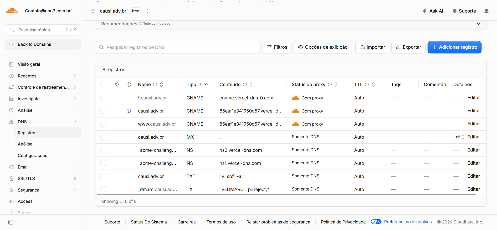
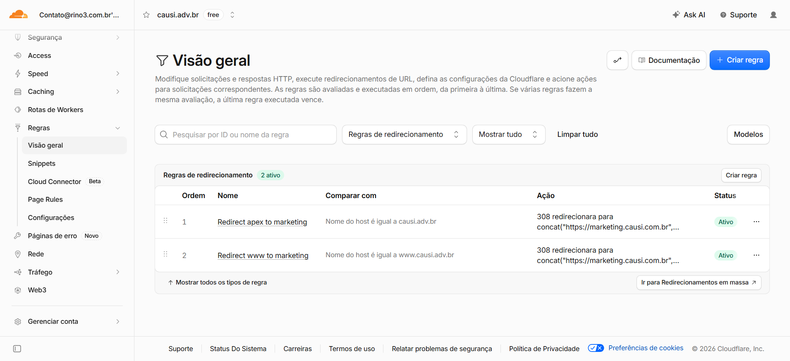
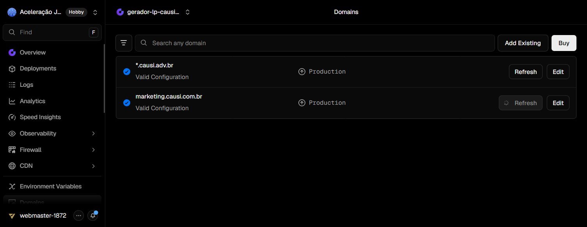

# Deploy: Registro.br + Cloudflare + Vercel (Wildcard Multi-Tenant)

Configuração de domínio, DNS, SSL e redirects do gerador de landing pages Causi: dois domínios no Registro.br, DNS autoritativo na Cloudflare (Redirect Rules no apex/`www` de `causi.adv.br`) e hospedagem na Vercel com certificado wildcard para subdomínios dinâmicos.

---

## Arquitetura

Dois contextos distintos:

| Host | Função |
| --- | --- |
| `marketing.causi.com.br` | SaaS — login, dashboard, CMS, administração |
| `{office}.causi.adv.br` | Sites públicos dos clientes (landing pages) |

O apex `causi.adv.br` e o `www.causi.adv.br` **não** representam um cliente. Eles redirecionam para o marketing na borda da Cloudflare; a Vercel só recebe tráfego de subdomínios de escritório.

```text
marketing.causi.com.br
        │
        ├── Login
        ├── Dashboard
        ├── CMS
        └── Administração

causi.adv.br
        │
        └── 308 → marketing.causi.com.br   (Cloudflare Redirect Rule)

www.causi.adv.br
        │
        └── 308 → marketing.causi.com.br   (Cloudflare Redirect Rule)

cliente.causi.adv.br
        │
        └── Landing Page do cliente         (Vercel / Next.js)
```

URLs:

| URL | Papel |
| --- | --- |
| `https://marketing.causi.com.br` | App principal (dashboard, editor, auth) |
| `https://causi.adv.br` / `https://www.causi.adv.br` | Redirect 308 → `marketing.causi.com.br` (Cloudflare) |
| `https://{lp_accounts.office_subdomain}.causi.adv.br/{landing_pages.slug}` | LP publicada do escritório |

Exemplo de LP:

```
https://aceleracao-juridica.causi.adv.br/previdenciario
```

No app, `lp_accounts.office_subdomain` é a fonte canônica do host público (provisionado a partir de `accounts.slug` na primeira visita; denormalizado em `landing_pages.office_subdomain` para lookup público). O proxy (`src/proxy.ts`) lê o `Host`, extrai o subdomínio e reescreve para a rota multi-tenant.

```
                 Registro.br
                      │
          Nameservers Cloudflare
                      │
        ┌─────────────┴─────────────┐
        │                           │
  causi.com.br                 causi.adv.br
        │                           │
        │                    Cloudflare Rules
        │                    (apex / www → 308)
        │                           │
        │         @ / www / * → CNAME
        │         (valores do painel Vercel)
        │                           │
        └─────────────┬─────────────┘
                      │
                   Vercel
                      │
                 Next.js App
                      │
             Proxy Multi-Tenant
```

Papéis:

| Camada | Responsabilidade |
| --- | --- |
| Registro.br | Registro do domínio; delegação de nameservers |
| Cloudflare | DNS autoritativo, CDN, WAF, cache, proxy, **Redirect Rules** (apex/`www` → marketing) |
| Vercel | Host do Next.js (LPs multi-tenant + app em `marketing`), certificados TLS (incluindo wildcard via ACME) |

Arquitetura alvo (não migrar DNS para a Vercel):

```
Registro.br
    ↓
Cloudflare (DNS + WAF + CDN + Cache + Redirect Rules)
    ↓
Vercel (Hosting — LPs e marketing)
```

---

## 1. Registro.br — Delegar nameservers

Nos dois domínios (`causi.com.br` e `causi.adv.br`), altere os nameservers para os da zona Cloudflare (exibidos em Cloudflare → domínio → Overview).

Exemplo (valores reais vêm da Cloudflare):

```
cortney.ns.cloudflare.com
will.ns.cloudflare.com
```

Após a propagação, o Registro.br não gerencia registros DNS — apenas mantém a delegação.

Checklist:

1. Criar zona Cloudflare para cada domínio.
2. Copiar os dois nameservers da Cloudflare.
3. No Registro.br → domínio → DNS/Nameservers → apontar para a Cloudflare.
4. Aguardar status “Active” na Cloudflare.

**Não** aponte os nameservers do Registro.br para `ns1.vercel-dns.com` / `ns2.vercel-dns.com`. Isso transferiria a zona DNS inteira para a Vercel e removeria a Cloudflare do caminho autoritativo.

---

## 2. Cloudflare — DNS por domínio

Toda configuração DNS fica na Cloudflare. Prefira **DNS only** (nuvem cinza) nos registros que apontam para a Vercel durante validação de domínio e emissão de certificado. Proxy (nuvem laranja) pode ser ligado depois, com SSL Cloudflare em Full (strict) quando houver certificado válido na origem.

### 2.1 Destinos DNS da Vercel

A Vercel usa **Vercel DNS Mapping**: hosts “fixos” (`@`, `www`) costumam apontar para um hostname **único do projeto** (ex.: `85eaf1e341950d57.vercel-dns-017.com`). O wildcard multi-tenant usa outro destino (`cname.vercel-dns-0.com` no cenário sem nameservers Vercel).

| Host | Destino | Status esperado |
| --- | --- | --- |
| `@` (apex) | Hostname do projeto (ex.: `….vercel-dns-017.com`) | Valid após CNAME + DNS only |
| `www` | **O mesmo** hostname do projeto (não o genérico `cname.vercel-dns.com`, se o painel pedir o específico) | Valid após CNAME + DNS only |
| `*` | `cname.vercel-dns-0.com` (ou valor do painel) | Valid = certificado wildcard emitido; tenants OK |
| `_acme-challenge` | NS → `ns1` / `ns2.vercel-dns.com` | Necessário para renovar `*.dominio` |

**Regra:** em Project → Settings → Domains, abra **Learn more** em cada host e copie o tipo/valor exatos. **DNS Change Recommended** / **Invalid Configuration** significam divergência do registro atual.

O DNS tradicional (RFC) não permite CNAME no apex; a Cloudflare implementa isso com [CNAME Flattening](https://developers.cloudflare.com/dns/cname-flattening/).

Fonte: [Wildcard domains without Vercel Nameservers](https://vercel.com/kb/guide/wildcard-domain-without-vercel-nameservers) · [Adding a Custom Domain](https://vercel.com/docs/domains/working-with-domains/add-a-domain).

### 2.2 `causi.com.br` — app / marketing

| Tipo | Nome | Conteúdo | Proxy |
| --- | --- | --- | --- |
| CNAME | `marketing` | valor do painel Vercel | DNS only (validação); depois opcional |
| CNAME | `www` | valor do painel (ou redirect para marketing) | conforme política |

Neste projeto o entrypoint do gerador é `marketing.causi.com.br`.

### 2.3 `causi.adv.br` — multi-tenant (wildcard)

Zona Cloudflare — configuração alinhada ao painel (exemplo deste projeto):

| Tipo | Nome | Conteúdo | Proxy |
| --- | --- | --- | --- |
| CNAME | `@` | `85eaf1e341950d57.vercel-dns-017.com` | **DNS only** até Valid; depois Proxied se usar Redirect Rules |
| CNAME | `www` | `85eaf1e341950d57.vercel-dns-017.com` | **DNS only** até Valid; depois Proxied se usar Redirect Rules |
| CNAME | `*` | `cname.vercel-dns-0.com` | **DNS only** na validação (e preferencialmente em produção multi-tenant) |
| NS | `_acme-challenge` | `ns1.vercel-dns.com.` | — |
| NS | `_acme-challenge` | `ns2.vercel-dns.com.` | — |

```dns
@                  CNAME   85eaf1e341950d57.vercel-dns-017.com.
www                CNAME   85eaf1e341950d57.vercel-dns-017.com.
*                  CNAME   cname.vercel-dns-0.com.
_acme-challenge    NS      ns1.vercel-dns.com.
_acme-challenge    NS      ns2.vercel-dns.com.
```

`@` e `www` compartilham o **mesmo** hostname do projeto. O wildcard permanece em `cname.vercel-dns-0.com` (HTTP-01 / DNS-01 distintos).



Não use registro **A** no apex (`76.76.21.21` ou IPs antigos) se o painel pedir CNAME. Não deixe `www` em `cname.vercel-dns.com` se a Vercel pedir o hostname `….vercel-dns-017.com`.

Com **Proxied** (nuvem laranja) durante a validação, a Vercel frequentemente mantém **Invalid Configuration** / **Proxy Detected** mesmo com o CNAME correto. Deixe `@` e `www` em **DNS only** até o status mudar para **Valid Configuration**; só então ative o proxy se for usar Redirect Rules (seção 3).

Se `*.causi.adv.br` já estiver **Valid Configuration**, o certificado wildcard e a delegação `_acme-challenge` estão ok — subdomínios de escritório devem funcionar independentemente do apex/`www`.

O wildcard `*` cobre qualquer escritório:

```
cliente1.causi.adv.br
cliente2.causi.adv.br
...
```

Verificação rápida:

```bash
nslookup causi.adv.br
nslookup www.causi.adv.br
nslookup qualquer-slug.causi.adv.br
```

Esperado: apex/`www` resolvem via CNAME Flattening para o hostname do projeto; o wildcard atende tenants.

---

## 3. Redirect apex / www → marketing

O apex e o `www` de `causi.adv.br` são portas de entrada da plataforma, não tenants. Há duas abordagens válidas.

### Opção A — Um projeto de LPs + Redirect Rules na Cloudflare (atual neste guia)

Mantenha no **mesmo** projeto Vercel das LPs:

- `causi.adv.br`
- `www.causi.adv.br`
- `*.causi.adv.br`

O redirecionamento 308 para `marketing.causi.com.br` acontece na **borda da Cloudflare**, antes da Vercel.

**Não** configure redirect de domínio na Vercel nesse cenário. A Vercel trata `www` como alias do apex e rejeita um segundo redirect independente com erro do tipo:

> You have redirected another domain (`causi.adv.br`) to this domain. In turn, you cannot redirect this one.

Pré-requisito: `@` e `www` **Valid** na Vercel com DNS only; depois [Proxied](https://developers.cloudflare.com/dns/proxy-status/) (nuvem laranja) para as Redirect Rules aplicarem.

Caminho no dashboard:

```
Rules → Redirect Rules → Create rule
```

(ou **Rules → Overview → Redirect Rules**)



#### Regra 1 — Redirect apex to marketing

| Campo | Valor |
| --- | --- |
| Nome | `Redirect apex to marketing` |
| Match | Custom filter expression |
| Expression | `(http.host eq "causi.adv.br")` |
| Then | Dynamic Redirect |
| Target expression | `concat("https://marketing.causi.com.br", http.request.uri.path)` |
| Status | `308` Permanent Redirect |

#### Regra 2 — Redirect www to marketing

| Campo | Valor |
| --- | --- |
| Nome | `Redirect www to marketing` |
| Match | Custom filter expression |
| Expression | `(http.host eq "www.causi.adv.br")` |
| Then | Dynamic Redirect |
| Target expression | `concat("https://marketing.causi.com.br", http.request.uri.path)` |
| Status | `308` Permanent Redirect |

#### Resultado

```text
causi.adv.br          ──308──► marketing.causi.com.br   (Cloudflare)
www.causi.adv.br      ──308──► marketing.causi.com.br   (Cloudflare)
cliente.causi.adv.br  ───────► Vercel (LP do escritório)
```

Documentação: [Redirects](https://developers.cloudflare.com/rules/url-forwarding/) · [Bulk Redirects (alternativa)](https://developers.cloudflare.com/rules/url-forwarding/bulk-redirects/create-dashboard/).

### Opção B — Separar projetos Vercel (recomendada para SaaS multi-tenant)

Apex e `www` **não** precisam ficar no projeto das landing pages. Separação mais limpa:

| Projeto | Domínios |
| --- | --- |
| Landing Pages | só `*.causi.adv.br` |
| Marketing / app | `marketing.causi.com.br`, `causi.adv.br`, `www.causi.adv.br` |

No projeto Marketing, configure redirect permanente (308) de `causi.adv.br` e `www.causi.adv.br` → `marketing.causi.com.br` no painel Domains da Vercel.

DNS na Cloudflare (hostname do **projeto Marketing**, não o das LPs):

| Tipo | Nome | Conteúdo | Proxy |
| --- | --- | --- | --- |
| CNAME | `@` | hostname do projeto Marketing (painel) | DNS only até Valid |
| CNAME | `www` | mesmo hostname do projeto Marketing | DNS only até Valid |
| CNAME | `*` | `cname.vercel-dns-0.com` (projeto LPs) | DNS only |
| NS | `_acme-challenge` | `ns1` / `ns2.vercel-dns.com` | — |

Vantagens: o projeto de LPs cuida só dos tenants; o institucional cuida do apex/`www`; menos conflito entre wildcard e hosts fixos. Desvantagem: dois projetos para gerenciar e CNAMEs de apex/`www` apontam para o hostname do projeto Marketing (não o das LPs).

Escolha **uma** opção. Não associe apex/`www` aos dois projetos ao mesmo tempo.

---

## 4. Vercel — Domínios do projeto

### Opção A (um projeto)

No projeto Vercel do gerador:

**`causi.com.br` (app):**

- `marketing.causi.com.br`

**`causi.adv.br` (LPs + apex/www):**

- `causi.adv.br`
- `www.causi.adv.br`
- `*.causi.adv.br`

Redirect apex/`www` → marketing nas Redirect Rules da Cloudflare (seção 3A), **sem** redirect de domínio na Vercel.

### Opção B (dois projetos)

**Projeto Landing Pages:** `*.causi.adv.br` apenas.

**Projeto Marketing:** `marketing.causi.com.br`, `causi.adv.br`, `www.causi.adv.br` — com redirect 308 de apex/`www` → `marketing.causi.com.br` no Domains da Vercel.



Para cada host **Invalid** / **DNS Change Recommended**, abra **Learn more** e alinhe o CNAME na Cloudflare ao valor exato (apex e `www` → hostname do **mesmo** projeto ao qual o domínio está attached). Com proxy Cloudflare ativo, espere **Proxy Detected** até voltar a DNS only e validar.

### Não usar “Enable Vercel DNS”

Nesse cenário **não** clique em **Enable Vercel DNS** no apex.

Esse botão prepara a migração do gerenciamento DNS do domínio para a Vercel (nameservers `ns1.vercel-dns.com` / `ns2.vercel-dns.com`). A arquitetura passaria a ser:

```
Registro.br → Vercel DNS → Vercel Hosting
```

Consequências indesejadas:

- Cloudflare deixa de ser autoritativa
- Zonas DNS precisam ser recriadas na Vercel
- Perde-se CDN, WAF, cache e regras centralizadas na Cloudflare

**Enable Vercel DNS** só faz sentido se a decisão for abandonar a Cloudflare como DNS. Para mantê-la, configure na Cloudflare os CNAMEs (incluindo apex) e o NS `_acme-challenge` exatamente como o painel do projeto indicar — sem migrar nameservers do domínio.

Variáveis de ambiente relevantes (produção):

| Variável | Exemplo de produção | Uso |
| --- | --- | --- |
| `APP_URL` | `https://marketing.causi.com.br` | URL do app (redirects, links absolutos) |
| `NEXT_PUBLIC_APP_DOMAIN` | `causi.adv.br` | Host base das LPs públicas |

Ajuste os valores ao ambiente real (`APP_URL` / domínio do app) e mantenha `NEXT_PUBLIC_APP_DOMAIN=causi.adv.br` para URLs `{office}.{domínio}/{slug}`.

---

## 5. Wildcard sem nameservers Vercel (workaround oficial)

Por padrão a Vercel prefere nameservers próprios para emitir/renovar `*.dominio`. Com Cloudflare no apex, o caminho documentado é: [wildcard without Vercel nameservers](https://vercel.com/kb/guide/wildcard-domain-without-vercel-nameservers).

| Host | Destino | Certificado |
| --- | --- | --- |
| `causi.adv.br` (`@`) | CNAME → hostname do projeto (ex.: `….vercel-dns-017.com`) | HTTP-01 |
| `www.causi.adv.br` | CNAME → **mesmo** hostname do projeto | HTTP-01 |
| `*.causi.adv.br` | CNAME → `cname.vercel-dns-0.com` | DNS-01 via `_acme-challenge` |
| `_acme-challenge` | NS → `ns1` / `ns2.vercel-dns.com` | Controle ACME pela Vercel |

Essa delegação NS pode impedir outros provedores de emitir certificados ACME no mesmo domínio — use só se o SSL das LPs for da Vercel.

### Passo 1 — Delegar `_acme-challenge` (Cloudflare)

Na zona de **`causi.adv.br`**:

| Tipo | Nome | Conteúdo |
| --- | --- | --- |
| NS | `_acme-challenge` | `ns1.vercel-dns.com.` |
| NS | `_acme-challenge` | `ns2.vercel-dns.com.` |

A Cloudflare continua autoritativa do domínio. Só `_acme-challenge.causi.adv.br` é resolvido pelos NS da Vercel, que publica os TXT ACME e renova o wildcard.

Se o wildcard fosse em um nível abaixo (ex.: `*.app.exemplo.com`), os NS seriam em `_acme-challenge.app`. Aqui o wildcard é `*.causi.adv.br`, então o nome é só `_acme-challenge`.

### Passo 2 — CNAMEs

| Tipo | Nome | Conteúdo | Proxy |
| --- | --- | --- | --- |
| CNAME | `*` | `cname.vercel-dns-0.com` | DNS only |
| CNAME | `@` | hostname do projeto no painel | DNS only até Valid |
| CNAME | `www` | **mesmo** hostname do `@` | DNS only até Valid |

### Fluxo ACME

```
Let's Encrypt
      │
      ▼
_acme-challenge.causi.adv.br
      │
      ▼
Cloudflare (NS → Vercel)
      │
      ▼
ns1/ns2.vercel-dns.com
      │
      ▼
TXT ACME (Vercel)
      │
      ▼
Certificado *.causi.adv.br
```

`marketing.causi.com.br` e `www` são hostnames comuns (HTTP-01). O workaround DNS-01 aplica-se a `*.causi.adv.br`.

Sem certificado wildcard, o domínio fica Invalid Configuration na Vercel e, com proxy Cloudflare ativo, o visitante pode ver **525 SSL Handshake Failed**.

---

## 6. Multi-tenant no app

1. Request chega com `Host: {office_subdomain}.causi.adv.br`.
2. O proxy extrai o subdomínio e reescreve para `(subdomains)/[escritorio]/[slug]`.
3. `getLpPublic(office_subdomain, slug)` busca LP com `status = published` (filtro em `landing_pages.office_subdomain` + `slug`).
4. Raiz do subdomínio (sem path de LP) redireciona para o app (`APP_URL`).

Escalabilidade: milhares de subdomínios → um projeto Vercel, um wildcard DNS, um certificado `*.causi.adv.br`.

---

## 7. Checklist de go-live

### Registro.br

- [ ] Nameservers de `causi.com.br` → Cloudflare (não Vercel)
- [ ] Nameservers de `causi.adv.br` → Cloudflare (não Vercel)
- [ ] Zonas Active na Cloudflare

### Cloudflare — `causi.com.br`

- [ ] CNAME `marketing` → valor do painel Vercel
- [ ] DNS only durante validação Vercel

### Cloudflare — `causi.adv.br`

- [ ] **Não** clicar em Enable Vercel DNS
- [ ] CNAME `@` → hostname do projeto (ex.: `85eaf1e341950d57.vercel-dns-017.com`)
- [ ] CNAME `www` → **o mesmo** hostname do `@` (não `cname.vercel-dns.com` se o painel pedir o específico)
- [ ] CNAME `*` → `cname.vercel-dns-0.com` (DNS only)
- [ ] NS `_acme-challenge` → `ns1.vercel-dns.com.` e `ns2.vercel-dns.com.`
- [ ] `@` / `www` / `*` em **DNS only** até Valid Configuration
- [ ] Opção A: Proxy em `@`/`www` + Redirect Rules Cloudflare → marketing
- [ ] Opção B: apex/`www` só no projeto Marketing + redirect 308 na Vercel

### Vercel

- [ ] `*.causi.adv.br` Valid (certificado wildcard)
- [ ] Opção A: `causi.adv.br` e `www` Valid no projeto LPs; **sem** redirect Vercel
- [ ] Opção B: `causi.adv.br` e `www` Valid no projeto Marketing com redirect → `marketing.causi.com.br`
- [ ] `marketing.causi.com.br` Valid
- [ ] Env: `APP_URL`, `NEXT_PUBLIC_APP_DOMAIN` e demais secrets de produção

### Validação funcional

- [ ] `https://marketing.causi.com.br` abre o app
- [ ] `https://causi.adv.br` e `https://www.causi.adv.br` → 308 para marketing (path preservado)
- [ ] `https://{office_subdomain}.causi.adv.br/{lp-slug}` abre a LP publicada
- [ ] HTTPS sem 525 / certificate error
- [ ] Renovação ACME: manter os NS de `_acme-challenge` permanentes

---

## 8. Troubleshooting rápido

| Sintoma | Verificação | Ação típica |
| --- | --- | --- |
| `*.causi.adv.br` Valid; apex/`www` Invalid | Destino + proxy | `@` e `www` → hostname do projeto; **DNS only** até Valid |
| `www` ainda em `cname.vercel-dns.com` | Learn more do `www` | Trocar para o mesmo `….vercel-dns-017.com` do apex, se for o que o painel pede |
| DNS Change Recommended | Valor vs painel | Substituir pelo tipo/destino exatos do Domains |
| Apex com registro A | Cloudflare `@` | Remover A; CNAME `@` → hostname do projeto |
| Invalid com CNAME já correto | Proxy laranja | DNS only; aguardar revalidação Vercel |
| Enable Vercel DNS ativado | Nameservers no Registro.br | Manter NS Cloudflare |
| Erro Vercel ao redirecionar www/apex (opção A) | Domains → Redirect | Remover redirect na Vercel; usar Cloudflare |
| Apex/`www` não redirecionam (opção A) | Proxy + Redirect Rules | Nuvem laranja só **depois** de Valid; regras 308 ativas |
| 525 SSL Handshake Failed | Cert / proxy | Wildcard Valid; SSL Full (strict) só com cert válido |
| Host resolve, app errado | Domínio no projeto | Conferir se o domínio está no projeto certo (A vs B) |
| LP 404 | `office_subdomain` + `slug` + `published` | Dados e Host batendo com `lp_accounts.office_subdomain` |

---

## Referências

- [architecture.md](../architecture.md) — publicação e proxy multi-tenant
- [features/landing-pages.md](../features/landing-pages.md) — URL pública e status
- [Vercel KB — Wildcard sem nameservers Vercel](https://vercel.com/kb/guide/wildcard-domain-without-vercel-nameservers)
- [Vercel — Why Domain Nameservers for Wildcard](https://vercel.com/kb/guide/why-use-domain-nameservers-method-wildcard-domains)
- [Vercel — Adding a Custom Domain](https://vercel.com/docs/domains/working-with-domains/add-a-domain)
- [Cloudflare — DNS records](https://developers.cloudflare.com/dns/manage-dns-records/)
- [Cloudflare — CNAME Flattening](https://developers.cloudflare.com/dns/cname-flattening/)
- [Cloudflare — Redirects](https://developers.cloudflare.com/rules/url-forwarding/)
- [Cloudflare — Bulk Redirects (dashboard)](https://developers.cloudflare.com/rules/url-forwarding/bulk-redirects/create-dashboard/)
