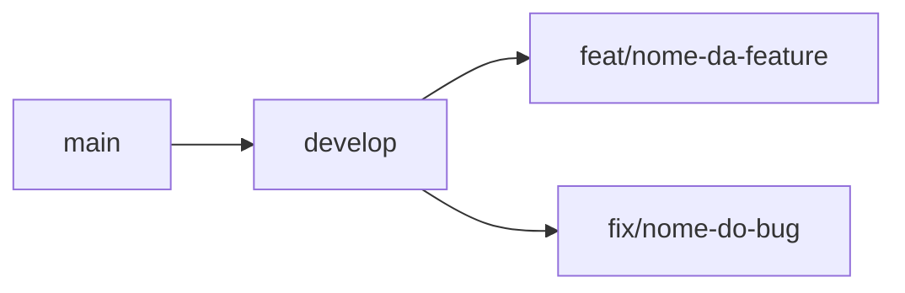

# Git Workflow — Commits, Hooks e Qualidade de Código

Este guia descreve a estratégia de Git Hooks do projeto Causi, os comandos do dia a dia e ferramentas de produtividade.

---

## ⚓ Git Hooks — Biome + Husky

Utilizamos **Husky** para garantir a qualidade do código antes de cada commit e push, integrando-se com o **Biome** e o compilador TypeScript.

### Arquitetura dos Hooks

#### 1. `pre-commit` — Qualidade dos arquivos em stage

**Comando:** `pnpm exec biome check --write --staged --no-errors-on-unmatched`

- **O que faz:** Roda lint e formatação **apenas nos arquivos staged**.
- **Autocorreção:** Corrige automaticamente o que for possível (`--write`).
- **Bloqueio:** Impede o commit se houver erros que não podem ser corrigidos automaticamente.

#### 2. `pre-push` — Integridade do projeto completo

**Comando:** `pnpm typecheck && pnpm build`

- **O que faz:** Realiza o type-check completo (`tsc --noEmit`) e garante que o projeto compila.
- **Por que no push?** Build completo é lento; rodar no commit degradaria a experiência. Erros de integridade entre arquivos (como imports quebrados) são detectados aqui.

### Divisão de Responsabilidades

| Hook | Escopo | Ferramenta | Custo |
|---|---|---|---|
| `pre-commit` | Arquivos staged | Biome `--staged` | Rápido (~1s) |
| `pre-push` | Projeto completo | `tsc` + `build` | Mais lento (~10-30s) |

---

## 🚀 Comandos Principais

### Desenvolvimento

- `pnpm dev` — Inicia o servidor de desenvolvimento.
- `pnpm build` — Cria o build de produção.
- `pnpm start` — Inicia o app em modo produção.

### Qualidade e Tipagem

- `pnpm lint` — Executa o check do Biome (lint + formatação).
- `pnpm format` — Formata o código usando Biome com autocorreção.
- `pnpm typecheck` — Executa o type-check TypeScript sem emitir arquivos.

---

## 💡 Comandos Úteis

### Acompanhamento de Pendências

Para listar todos os **TODOs** e pendências técnicas marcadas no código:

```bash
git grep "TODO:"
```

---

## 🌿 Fluxo de Branches

O projeto segue o modelo `main` ← `develop` ← `feat/*`, `fix/*`.



### Criando uma nova branch

```bash
# Garantir que develop está atualizada
git switch develop
git pull origin develop

# Criar a branch a partir de develop
git switch -c feat/nome-da-funcionalidade develop
```

### Integrando de volta para develop

1. Trabalhe na sua branch localmente, faça commits e teste suas alterações.
2. Envie a branch para o remoto:

```bash
git push -u origin feat/nome-da-funcionalidade
```

3. Atualize com develop antes de mesclar:

```bash
git switch develop
git pull origin develop
git switch feat/nome-da-funcionalidade
git merge develop
# resolver conflitos e testar localmente
```

4. Mescle sem fast-forward (mantém histórico legível):

```bash
git switch develop
git merge --no-ff feat/nome-da-funcionalidade -m "feat: descrição curta"
git push origin develop
```

> Alternativa: abra um Pull Request da sua branch para `develop` e faça merge via GitHub.

### Subindo develop para main (Release)

Sempre via **Pull Request no GitHub** — nunca merge direto em `main`.

1. Crie um PR de `develop` → `main`.
2. Aguarde CI/CD passar e revisores aprovarem.
3. Após merge, sincronize localmente:

```bash
git switch main
git pull origin main

git switch develop
git pull origin develop
git merge main
git push origin develop
```

> Por que PR para `main`? Permite revisão centralizada, validação de CI da Vercel e facilita auditorias e reverção simples em produção.

---

## Migrations Supabase após merge

Se o merge ou PR incluir arquivos novos em `supabase/migrations/`, aplique-os no banco **antes** de considerar a feature concluída no ambiente remoto.

Checklist resumido:

1. `supabase login`
2. `supabase link --project-ref <ref-do-ambiente>`
3. `supabase migration list` — confirmar pendências
4. `supabase db push --dry-run` → `supabase db push`
5. `supabase gen types typescript > src/lib/database.types.ts`

Para conflitos em migrations/schemas, alternância entre `.env` e `.env.test`, e release em produção, consulte o guia completo: [supabase-migrations-and-environments.md](./supabase-migrations-and-environments.md).