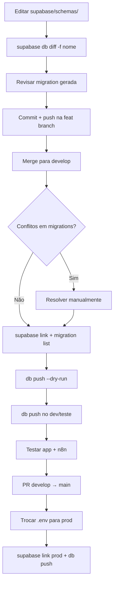

# Migrations, Merge e Ambientes Supabase

Guia operacional para o fluxo completo: **desenvolver schema → merge de branches → aplicar migrations no banco correto**, alternando entre projetos Supabase (dev, teste alternativo, produção).

> Para o workflow declarativo (editar `supabase/schemas/` e gerar diff), consulte [database/overview.md](../database/overview.md).  
> Para branches, commits e hooks Git, consulte [git-workflow.md](./git-workflow.md).

---

## Visão geral



### Dois papéis distintos

| Artefato | Papel |
|----------|--------|
| `supabase/schemas/` | **Fonte de verdade** do schema desejado (declarativo) |
| `supabase/migrations/` | **Histórico versionado** aplicado nos bancos remotos |
| `.env` (ativo) | Credenciais que o **Next.js** usa em runtime local |
| `supabase link` | Credenciais que o **CLI** usa para `db push`, `migration list`, etc. |

O CLI **não lê** `NEXT_PUBLIC_SUPABASE_URL` do `.env` para decidir o target — ele usa o projeto linkado (`supabase/.temp/project-ref`). Por isso **sempre confirme o link** antes de um `db push`.

---

## Ambientes Supabase

| Projeto | Uso típico | Branch Git | Credenciais |
|---------|------------|------------|-------------|
| **causi-dev** | Desenvolvimento diário | `develop`, `feat/*`, `fix/*` | `.env` ou `.env.test` |
| **Projeto de teste alternativo** | Validar migrations em banco limpo ou espelho | qualquer branch local | `.env.test` |
| **causi-prod** | Produção | `main` (via Vercel) | `.env.prod` (local) / Vercel env vars |

> **Regra:** nunca aplique migrations em produção sem antes validar no dev ou banco de teste.

### Onde encontrar o `project-ref`

No dashboard Supabase: **Project Settings → General → Reference ID**  
Ou na URL: `https://supabase.com/dashboard/project/<project-ref>`.

O CLI grava o último projeto linkado em `supabase/.temp/project-ref` (não versionado). Use `supabase migration list` para confirmar qual banco está conectado.

---

## Arquivos de ambiente (`.env`)

Todos os arquivos `.env*` estão no `.gitignore` (exceto `.env.example`). **Nunca commite chaves reais.**

### Convenção recomendada

| Arquivo | Conteúdo |
|---------|----------|
| `.env.example` | Template sem segredos (versionado) |
| `.env` | Ambiente **ativo** no momento — o que `pnpm dev` usa |
| `.env.test` | Backup das credenciais do **projeto de teste alternativo** |
| `.env.prod` | Backup das credenciais de **produção** (uso local restrito) |

Variáveis mínimas para o app:

```env
NEXT_PUBLIC_SUPABASE_URL=https://<project-ref>.supabase.co
NEXT_PUBLIC_SUPABASE_PUBLISHABLE_KEY=<publishable-key>
```

Outras variáveis (n8n, Evolution, OpenAI) seguem o mesmo padrão — cada ambiente pode apontar para webhooks/keys diferentes.

### Alternar ambiente para o app (Next.js)

**Windows (PowerShell):**

```powershell
# Salvar o .env atual antes de trocar (opcional)
Copy-Item .env .env.backup -Force

# Ativar ambiente de teste
Copy-Item .env.test .env -Force

# Ativar produção (cuidado — só para smoke test local pontual)
Copy-Item .env.prod .env -Force
```

**macOS / Linux:**

```bash
cp .env.test .env
# ou
cp .env.prod .env
```

Reinicie o dev server após trocar:

```bash
pnpm dev
```

### Alternar ambiente para o CLI (Supabase)

Trocar `.env` **não** muda o target do CLI. Sempre rode `supabase link`:

```bash
supabase login

# Dev
supabase link --project-ref <dev-project-ref>

# Teste alternativo
supabase link --project-ref <test-project-ref>

# Produção (somente quando for aplicar release)
supabase link --project-ref <prod-project-ref>
```

Confirme:

```bash
cat supabase/.temp/project-ref   # PowerShell: Get-Content supabase/.temp/project-ref
supabase migration list
```

---

## Parte 1 — Criar migrations (antes do merge)

Fluxo declarativo padrão do projeto:

1. Editar arquivos em `supabase/schemas/<schema>/<tipo>/`
2. Parar Supabase local (se estiver rodando): `supabase stop`
3. Gerar migration:

```bash
supabase db diff -f <nome_descritivo>
```

4. Revisar `supabase/migrations/<timestamp>_<nome>.sql`
5. Commit na branch de feature

> **Não use `--linked`** no `db diff` — o diff deve comparar os schema files contra uma shadow database local, não o remoto.

### Quando criar migration manual

Use `supabase migration new <nome>` para:

- DML (`INSERT`, `UPDATE` de dados de configuração)
- Secrets no Vault (`vault.create_secret`)
- Entidades que o diff não captura bem (veja `.agents/rules/declarative-database-schema.md`)

---

## Parte 2 — Merge de branches com migrations

### Fluxo típico (`feat/*` → `develop`)

```bash
git switch develop
git pull origin develop

git switch feat/minha-feature
git merge develop
# resolver conflitos (ver seção abaixo)
pnpm typecheck
pnpm build

git switch develop
git merge --no-ff feat/minha-feature -m "feat: descrição"
git push origin develop
```

Ou via **Pull Request** no GitHub (recomendado).

### Depois do merge: aplicar migrations pendentes

Sempre que o merge trouxer arquivos novos em `supabase/migrations/`:

```bash
# 1. Autenticar e linkar ao banco de DESTINO (dev ou teste primeiro)
supabase login
supabase link --project-ref <dev-project-ref>

# 2. Ver o que falta aplicar
supabase migration list
```

Interpretação de `migration list`:

| Coluna | Significado |
|--------|-------------|
| Local ✓ / Remote — | Migration existe no repo mas **não** foi aplicada no remoto → será executada no próximo `db push` |
| Local ✓ / Remote ✓ | Já aplicada — ignorada |
| Local — / Remote ✓ | Remoto tem migration que não existe localmente — **investigar** (branch desatualizada ou repair incorreto) |

```bash
# 3. Simular
supabase db push --dry-run

# 4. Aplicar
supabase db push

# 5. Atualizar tipos TypeScript
supabase gen types typescript > src/lib/database.types.ts
```

### Checklist pós-push

- [ ] `migration list` — todas as migrations do merge aparecem como aplicadas (Local ✓ / Remote ✓)
- [ ] App sobe com `pnpm dev` apontando para o mesmo projeto
- [ ] RPCs/views novas respondem no SQL Editor ou no app
- [ ] Workflows n8n que dependem de views/RPCs testados (se aplicável)

---

## Parte 3 — Resolução de conflitos

Conflitos após merge costumam aparecer em:

- `supabase/migrations/*.sql`
- `supabase/schemas/**/*.sql`
- `src/lib/database.types.ts`

### Conflitos em `supabase/schemas/`

**Objetivo:** o arquivo final deve representar o **estado desejado** do banco (união lógica das duas branches).

1. Abra os marcadores `<<<<<<<`, `=======`, `>>>>>>>`
2. Mantenha **ambas** as mudanças quando forem complementares (ex.: nova coluna de uma branch + nova tabela da outra)
3. Remova duplicações (mesma coluna definida duas vezes)
4. Respeite a ordem de dependências (tabelas antes de FKs — a organização em pastas já ajuda)

Após resolver schemas, **regenere** a migration se necessário:

```bash
supabase stop
supabase db diff -f reconcile_after_merge
```

Revise o diff gerado — pode ser grande se as branches divergiram muito.

### Conflitos em `supabase/migrations/`

Cada migration é **imutável** após aplicada em algum ambiente. Regras:

| Situação | O que fazer |
|----------|-------------|
| Duas branches criaram migrations com timestamps diferentes | **Manter ambas** — o Git deve preservar os dois arquivos; ordem é pelo timestamp no nome |
| Mesmo timestamp / migration editada nas duas branches | Escolher o SQL correto **ou** renomear uma delas com timestamp posterior via `supabase migration new` e mover o SQL |
| Migration já aplicada no remoto foi editada no merge | **Não editar** — criar nova migration com `db diff` ou `migration new` |
| Conflito dentro de um dump gigante (`remote_schema.sql`) | Preferir resolver no `schemas/` e gerar migration incremental; evite re-merge manual de dumps inteiros |

**Timestamps duplicados:** se duas migrations tiverem o mesmo prefixo `YYYYMMDDHHMMSS`, renomeie uma para um timestamp **posterior** (mantendo ordem cronológica real de dependência).

### Conflitos em `database.types.ts`

Opção mais segura após resolver schema/migrations:

```bash
supabase gen types typescript > src/lib/database.types.ts
```

Aceite a versão regenerada em vez de resolver manualmente linha a linha.

### Validar localmente antes do remoto

Com Docker:

```bash
supabase start
supabase db reset    # aplica TODAS as migrations do zero
```

Se `db reset` passa, a cadeia de migrations é reproduzível.

---

## Parte 4 — Release para produção

### Via Git (código)

1. PR `develop` → `main` no GitHub
2. CI verde + revisão
3. Merge do PR
4. Vercel faz deploy da `main` com env vars de produção (automático)

### Via banco (migrations)

**Somente após** validar no dev/teste:

```bash
# 1. Atualizar main local
git switch main
git pull origin main

# 2. Linkar produção
supabase login
supabase link --project-ref <prod-project-ref>

# 3. Conferir pendências
supabase migration list
supabase db push --dry-run

# 4. Aplicar
supabase db push
```

> Produção na Vercel **não** depende do seu `.env` local — usa variáveis do painel Vercel. O `.env.prod` local serve apenas para testes manuais ou `gen types` contra prod (evite se possível).

### Migrations com dados sensíveis por ambiente

Algumas migrations inserem secrets ou URLs fixas (ex.: Vault + Edge Function URL). Antes do `db push` em outro projeto:

1. Leia a migration — procure `vault.create_secret`, URLs hardcoded
2. Ajuste manualmente **no SQL Editor do ambiente alvo** se a URL/key for específica do projeto
3. Ou marque como aplicada com `migration repair` se o secret já existir

---

## Parte 5 — Cenários especiais

### Banco remoto já tem o schema, mas migration não consta como aplicada

```bash
supabase migration repair --status applied <timestamp>
```

Use **somente** se tiver certeza de que o SQL da migration já foi executado manualmente no remoto.

### `db push` falha com "already exists"

O schema já existe no remoto (SQL Editor, branch anterior, etc.):

1. Compare o erro com o conteúdo da migration
2. Se equivalente: `migration repair --status applied <timestamp>`
3. Se parcial: corrija manualmente no remoto e crie migration incremental

### Histórico de migrations inconsistente após `db pull` manual

Se o banco foi bootstrapado fora do CLI, a tabela `supabase_migrations.schema_migrations` pode estar incompleta. Veja [database/overview.md — Troubleshooting](../database/overview.md#troubleshooting).

### Drift entre `schemas/` e migrations

Se migrations foram escritas à mão sem atualizar `schemas/`:

```bash
supabase stop
supabase db diff -f sanity_check
```

Migration vazia ou mínima = OK. Migration com `DROP` inesperado = sincronize `schemas/` antes de aplicar em prod.

---

## Referência rápida de comandos

| Etapa | Comando |
|-------|---------|
| Login | `supabase login` |
| Linkar projeto | `supabase link --project-ref <ref>` |
| Ver pendências | `supabase migration list` |
| Simular apply | `supabase db push --dry-run` |
| Aplicar | `supabase db push` |
| Reset local (teste cadeia) | `supabase db reset` |
| Gerar types | `supabase gen types typescript > src/lib/database.types.ts` |
| Gerar migration (declarativo) | `supabase db diff -f <nome>` |
| Marcar como aplicada | `supabase migration repair --status applied <timestamp>` |

---

## Documentos relacionados

| Documento | Conteúdo |
|-----------|----------|
| [database/overview.md](../database/overview.md) | Schemas, CLI, workflow declarativo, troubleshooting |
| [git-workflow.md](./git-workflow.md) | Branches, merge, hooks |
| [.agents/rules/declarative-database-schema.md](../../.agents/rules/declarative-database-schema.md) | Caveats do diff declarativo |
| [AGENTS.md](../../AGENTS.md) | Tabela de comandos DB (execução manual pelo dev) |
