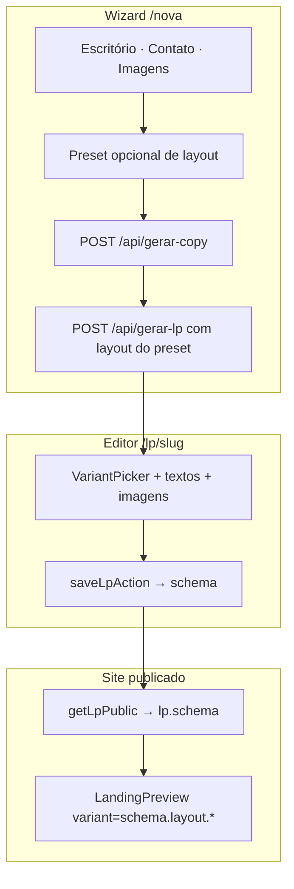

# Templates vs variações de seção

Referência canônica sobre como o gerador decide **qual layout renderizar** e qual o papel dos presets de criação.

## Dois conceitos diferentes

| Conceito | O que é | Onde vive |
|----------|---------|-----------|
| **Preset (template)** | Atalho no wizard: combinação inicial de variações por seção | `lib/landing-pages/templates.ts` — só em memória na criação |
| **Variação de seção** | Escolha individual por seção (`"split"`, `"centered"`, etc.) | `schema.layout.hero`, `schema.layout.dor`, … |

O produto **funciona por variações de seção**. O preset copia valores para `schema.layout` na criação (ou quando o advogado troca preset no editor via `applyTemplate()`). **Nenhum id ou nome de template é persistido** — apenas o schema completo da landing page.

Na criação: **preset define layout** (variantes + tons); **logo define cores** (`schema.theme`).

---

## Fonte da verdade em runtime

O que persiste e é usado na publicação:

```json
{
  "layout": {
    "hero": "split",
    "dor": "comImagem",
    "solucao": "soCards",
    "sobre": "fotoLista",
    "areas": "grid",
    "etapas": "numerado",
    "tones": { "hero": "light", "dor": "light", ... }
  },
  "theme": { "brand": "...", "accent": "...", ... }
}
```

Cada valor de variação é uma **string**, não um nome de preset.

`schema` vive em `landing_pages.schema` (JSONB) e é a **única fonte da verdade** para renderização.

---

## Como o Hero sabe qual layout usar

`LandingPreview` passa `schema.layout.hero` para o componente:

```typescript
<Hero
  content={schema.hero}
  variant={schema.layout.hero}
  tone={schema.layout.tones.hero ?? "light"}
  ...
/>
```

O componente em `components/Sections/hero.tsx` faz o dispatch:

```typescript
switch (props.variant) {
  case "split":   return <HeroSplit {...props} />;
  case "video":   return <HeroVideo {...props} />;
  case "stats":   return <HeroStats {...props} />;
  default:        return <HeroCentered {...props} />;
}
```

Mesmo padrão em `Dor`, `Solucao`, `Sobre`, `Areas`, `Etapas`, `Equipe`.

---

## Presets na criação

| Momento | Uso |
|---------|-----|
| Wizard (passo Imagens) | Opcional: advogado escolhe um dos 3 presets (`TEMPLATES`); default `classic-light` |
| `POST /api/gerar-lp` | Recebe `layout` explícito (copiado do preset); persiste só `schema` |
| Editor | `VariantPicker` por seção; `applyTemplate()` reaplica layout de um preset (sem alterar cores) |

Depois que o advogado altera a Hero no `VariantPicker`, **`schema.layout.hero` passa a ser a fonte da verdade**.

---

## Fluxo: criação → editor → publicação



Exemplo concreto:

1. **Wizard:** advogado escolhe preset "Moderno" → `layout` com `hero: "split"` (ainda não salvo).
2. **Criar e editar:** `POST /api/gerar-lp` monta o schema e persiste no banco.
3. **Editor:** advogado troca para `"stats"` → `schema.layout.hero = "stats"` ao salvar.
4. **Publicação:** `Hero` recebe `variant="stats"` → renderiza `HeroStats`.

---

## Tipos de variação (`lib/schema.ts`)

| Seção | Type | Valores |
|-------|------|---------|
| Hero | `HeroVariant` | `centered`, `split`, `video`, `stats` |
| Dor | `DorVariant` | `comImagem`, `soCards` |
| Solução | `SolucaoVariant` | `comImagem`, `soCards`, `destaque` |
| Sobre | `SobreVariant` | `overlay`, `duasColunas`, `fotoLista` |
| Áreas | `AreasVariant` | `grid`, `lista` |
| Etapas | `EtapasVariant` | `numerado`, `timeline` |
| Equipe | `EquipeVariant` | `splitAlternado`, `retratoElegante` |

Tom (`light` / `dark`) por seção: `schema.layout.tones.<seção>` — independente da variação.

---

## Onde cada peça vive no código

| Responsabilidade | Arquivo |
|------------------|---------|
| Tipos `Layout`, `LpSchema`, variantes | `lib/landing-pages/schema.ts` |
| Presets (layout inicial; theme só para prévias estáticas) | `lib/landing-pages/templates.ts` |
| Seleção de preset no wizard | `components/Builder/template-card.tsx` |
| Renderer completo | `components/Preview/landing-preview.tsx` |
| Dispatch por variação (ex.: Hero) | `components/Sections/hero.tsx` |
| Picker no editor (wireframes) | `components/Builder/variant-picker.tsx` |
| Copy + imagens (wizard) | `app/api/gerar-copy/route.ts` |
| Persistência final | `app/api/gerar-lp/route.ts` |

---

## Checklist: adicionar nova variação

1. **`lib/landing-pages/schema.ts`** — incluir o id no union type (`HeroVariant`, etc.) e em `DEFAULT_LAYOUT` se for padrão.
2. **`components/Sections/<seção>.tsx`** — componente visual + `case` no `switch`.
3. **`components/Builder/variant-picker.tsx`** — wireframe (thumb) para o editor.
4. **`lib/landing-pages/templates.ts`** — só se algum preset usar a nova variação.
5. **Documentação** — atualizar tabela de variações em [landing-pages.md](../features/landing-pages.md).

---

## Referências

- [landing-pages.md](../features/landing-pages.md) — feature completa
- [architecture.md](../architecture.md) — fluxos do sistema
- [api.md](../api.md) — `POST /api/gerar-copy` e `POST /api/gerar-lp`
