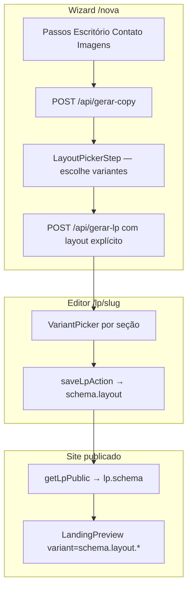

# Templates vs variações de seção

Referência canônica sobre como o gerador decide **qual layout renderizar** e qual o papel dos templates.

## Dois conceitos diferentes

| Conceito | O que é | Onde vive |
|----------|---------|-----------|
| **Template** | Pacote pronto: paleta + combinação inicial de variações | `lib/templates.ts` |
| **Variação de seção** | Escolha individual por seção (`"split"`, `"centered"`, etc.) | `schema.layout.hero`, `schema.layout.dor`, … |

O produto **funciona por variações de seção**. O template é um **atalho** que copia valores para `schema.layout` na criação (ou quando o advogado troca o template no editor).

---

## Fonte da verdade em runtime

**O renderer não lê `template_id` para decidir o layout de cada seção.**

O que persiste e é usado na publicação:

```json
{
  "layout": {
    "hero": "split",
    "dor": "comImagem",
    "solucao": "soCards",
    "sobre": "fotoLista",
    "areas": "grid",
    "etapas": "numerado",
    "tones": { "hero": "light", "dor": "light", ... }
  }
}
```

Cada valor é uma **string de variação**, não uma posição (1ª, 2ª) nem um nome de template.

`schema.layout` vive em `landing_pages.schema` (JSONB) e é a **única fonte da verdade** para renderização.

---

## Como o Hero sabe qual layout usar

`LandingPreview` passa `schema.layout.hero` para o componente:

```typescript
<Hero
  content={schema.hero}
  variant={schema.layout.hero}
  tone={schema.layout.tones.hero ?? "light"}
  ...
/>
```

O componente em `components/Sections/hero.tsx` faz o dispatch:

```typescript
switch (props.variant) {
  case "split":   return <HeroSplit {...props} />;
  case "video":   return <HeroVideo {...props} />;
  case "stats":   return <HeroStats {...props} />;
  default:        return <HeroCentered {...props} />;
}
```

Mesmo padrão em `Dor`, `Solucao`, `Sobre`, `Areas`, `Etapas`, `Equipe`.

---

## Para que serve `template_id`?

Metadado/atalho — **não** controla render por seção após personalização:

| Momento | Uso |
|---------|-----|
| Criação (wizard) | Valor inicial de `layout` pode partir de `TEMPLATES[0]` antes do picker |
| `POST /api/gerar-lp` | Grava `templateId` junto com o schema; fallback de layout se não vier `layout` explícito |
| Galeria | Thumbnail/nome do preset (`buildLpListPreview`) |
| Editor (futuro) | `applyTemplate()` reaplicaria `layout` + `theme` de um preset |

Depois que o advogado altera a Hero no `VariantPicker` ou no wizard de layout, **`schema.layout.hero` passa a ser a fonte da verdade**. O `templateId` pode ficar desatualizado (ex.: ainda `"classic-light"` enquanto a Hero já é `"split"`).

---

## Fluxo: criação → editor → publicação



Exemplo concreto:

1. **Wizard:** advogado escolhe Hero `"split"` → `schema.layout.hero = "split"` (ainda não salvo).
2. **Confirmar:** `POST /api/gerar-lp` monta o schema e persiste no banco.
3. **Editor:** advogado troca para `"stats"` → `schema.layout.hero = "stats"` ao salvar.
4. **Publicação:** `Hero` recebe `variant="stats"` → renderiza `HeroStats`.

---

## Tipos de variação (`lib/schema.ts`)

| Seção | Type | Valores |
|-------|------|---------|
| Hero | `HeroVariant` | `centered`, `split`, `video`, `stats` |
| Dor | `DorVariant` | `comImagem`, `soCards` |
| Solução | `SolucaoVariant` | `comImagem`, `soCards`, `destaque` |
| Sobre | `SobreVariant` | `overlay`, `duasColunas`, `fotoLista` |
| Áreas | `AreasVariant` | `grid`, `lista` |
| Etapas | `EtapasVariant` | `numerado`, `timeline` |
| Equipe | `EquipeVariant` | `splitAlternado`, `retratoElegante` |

Tom (`light` / `dark`) por seção: `schema.layout.tones.<seção>` — independente da variação.

---

## Onde cada peça vive no código

| Responsabilidade | Arquivo |
|------------------|---------|
| Tipos `Layout`, `LpSchema`, variantes | `lib/schema.ts` |
| Presets (template → layout + theme) | `lib/templates.ts` |
| Renderer completo | `components/Preview/landing-preview.tsx` |
| Dispatch por variação (ex.: Hero) | `components/Sections/hero.tsx` |
| Picker no wizard (preview grande) | `components/Builder/layout-picker-step.tsx` |
| Picker no editor (wireframes) | `components/Builder/variant-picker.tsx` |
| Copy sem salvar (wizard step 3) | `app/api/gerar-copy/route.ts` |
| Persistência final | `app/api/gerar-lp/route.ts` |

---

## Checklist: adicionar nova variação

1. **`lib/schema.ts`** — incluir o id no union type (`HeroVariant`, etc.) e em `DEFAULT_LAYOUT` se for padrão.
2. **`components/Sections/<seção>.tsx`** — componente visual + `case` no `switch`.
3. **`components/Builder/variant-picker.tsx`** — wireframe (thumb) para o editor.
4. **`components/Builder/layout-picker-step.tsx`** — incluir na lista do wizard (se aplicável).
5. **`lib/templates.ts`** — só se algum preset usar a nova variação.
6. **Documentação** — atualizar tabela de variações em [landing-pages.md](landing-pages.md).

---

## Referências

- [landing-pages.md](landing-pages.md) — feature completa
- [architecture.md](../architecture.md) — fluxos do sistema
- [api.md](../api.md) — `POST /api/gerar-copy` e `POST /api/gerar-lp`
