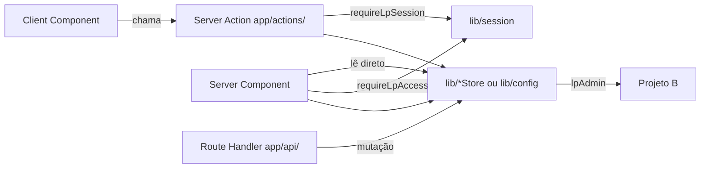

# Server Actions e CRUD no Projeto B

Guia de como ler e gravar dados no **segundo banco** (Supabase Gerador LP — Projeto B) a partir do Next.js, usando **Server Actions**, Route Handlers ou Server Components.

## Contexto: dois bancos

| Projeto | Env | Uso neste app |
|---------|-----|---------------|
| **A — Causi** | `NEXT_PUBLIC_SUPABASE_*` | Auth, sessão, plano (RPC) |
| **B — Gerador LP** | `LP_SUPABASE_URL`, `LP_SUPABASE_SERVICE_ROLE_KEY` | LPs, leads, configurações |

O Projeto B **não** recebe o JWT do usuário. Toda escrita passa por `lpAdmin()` (`service_role`) no servidor, com escopo manual por `causi_user_id = session.user.id` (UUID do `auth.users` do Projeto A).



## Quando usar cada camada

| Cenário | Onde implementar | Auth |
|---------|------------------|------|
| **Mutação** chamada pelo browser (salvar, excluir) | Server Action em `app/actions/` | `requireLpSession` |
| **Leitura** em página server (galeria, editor, dashboard) | Server Component + `lib/lpStore` / `lpAdmin` | `requireLpAccess` na página |
| **Leitura** chamada pelo client (modal de config) | Server Action `getXxxAction` | `requireLpSession` |
| **Job com IA** + persistência | Route Handler `app/api/` | `requireLpSession` |
| **Endpoint público** (lead na LP publicada) | Route Handler sem auth de usuário | Validação própria (rate limit, origem) |

**Regra:** o browser **nunca** importa `lpAdmin()` nem `LP_SUPABASE_SERVICE_ROLE_KEY`.

## Camadas do código

```
app/actions/*.ts     → entrada (auth, validação, revalidatePath, ActionResult)
lib/lpStore.ts       → CRUD de lps (queries Supabase)
lib/config.ts        → CRUD de user_settings
lib/supabase/admin.ts → lpAdmin() — cliente service_role
```

### 1. Cliente admin

```typescript
// lib/supabase/admin.ts
import "server-only";

export function lpAdmin() {
  return createClient(
    process.env.LP_SUPABASE_URL!,
    process.env.LP_SUPABASE_SERVICE_ROLE_KEY!,
    { auth: { autoRefreshToken: false, persistSession: false } },
  );
}
```

Arquivos que tocam o Projeto B devem usar `import "server-only"` ou estar em Server Actions / Route Handlers / RSC.

### 2. Guard de escrita

```typescript
// lib/session/require-session.ts
export async function requireLpSession(): Promise<Session> {
  const session = await getSession();
  if (!session) throw new Error("UNAUTHENTICATED");
  if (!hasLpAccess(session)) throw new Error("FORBIDDEN");
  return session;
}
```

Server Actions **lançam** erros estáveis e convertem em `{ ok: false, error: string }` — não usam `redirect()`.

### 3. Escopo por usuário

Toda query no Projeto B deve filtrar por:

```typescript
const userId = (await requireLpSession()).user.id;
// ...
.eq("causi_user_id", userId)
```

Nunca confiar em `causi_user_id` vindo do cliente sem validar contra a sessão.

### 4. Tipo de retorno padrão

```typescript
export type ActionResult = { ok: true } | { ok: false; error: string };
```

Conversão de erros em `app/actions/lps.ts`:

```typescript
function toMessage(err: unknown, fallback: string): string {
  if (err instanceof Error) {
    if (err.message === "UNAUTHENTICATED") return "Não autenticado.";
    if (err.message === "FORBIDDEN") return "Sem acesso ao gerador de páginas.";
    return err.message;
  }
  return fallback;
}
```

---

## CRUD existente por tabela

### `public.lps`

| Operação | Camada | Arquivo |
|----------|--------|---------|
| **List** | `listLps(userId)` | `lib/lpStore.ts` |
| **Read** | `getLp(userId, slug)` | `lib/lpStore.ts` |
| **Create/Update** | `saveLp(userId, lp)` — upsert | `lib/lpStore.ts` |
| **Delete** | `deleteLp(userId, slug)` | `lib/lpStore.ts` |
| **Action (save)** | `saveLpAction(lp)` | `app/actions/lps.ts` |
| **Action (delete)** | `deleteLpAction(slug)` | `app/actions/lps.ts` |
| **Create (IA)** | `saveLp` dentro de `POST /api/gerar-lp` | `app/api/gerar-lp/route.ts` |

Leitura na galeria (`app/page.tsx`) e no editor (`app/lp/[slug]/page.tsx`) chama `listLps` / `getLp` direto na RSC, após `requireLpAccess()`.

**Upsert:**

```typescript
await db().from("lps").upsert(
  {
    causi_user_id: userId,
    slug: safe,
    name: lp.name ?? "",
    tema: lp.tema ?? "",
    schema: lp.schema,
    updated_at: new Date().toISOString(),
  },
  { onConflict: "causi_user_id,slug" },
);
```

### `public.user_settings`

| Operação | Camada | Arquivo |
|----------|--------|---------|
| **Read** | `getConfig()` | `lib/config.ts` |
| **Read (client)** | `getConfigAction()` | `app/actions/config.ts` |
| **Update** | `saveConfig(c)` — upsert | `lib/config.ts` |
| **Action (save)** | `saveConfigAction(c)` | `app/actions/config.ts` |

### `public.leads_gerador`

| Operação | Camada | Arquivo |
|----------|--------|---------|
| **List** | query direta na RSC | `app/dashboard/page.tsx` |
| **Create** | — | **Não implementado** (`POST /api/lead` planejado) |

```typescript
// app/dashboard/page.tsx — leitura server-side
lpAdmin()
  .from("leads_gerador")
  .select("id,created_at,name,phone,page_url,client_slug")
  .eq("causi_user_id", session.user.id)
  .order("created_at", { ascending: false })
  .limit(2000);
```

### `public.users` (espelho local)

Não há CRUD implementado. A tabela existe no schema com FK de `user_settings`. Se a FK estiver ativa em produção, considere um `ensureUser(userId, email)` antes do primeiro upsert (ver [Gap: provisionamento](#gap-provisionamento-de-usuário)).

---

## Como chamar do cliente

```typescript
"use client";

import { saveLpAction } from "@/app/actions/lps";

async function handleSave(lp: StoredLp) {
  const result = await saveLpAction(lp);
  if (!result.ok) {
    alert(result.error);
    return;
  }
  // sucesso — cache da galeria já revalidado na action
}
```

Server Actions são importadas diretamente; o Next.js serializa a chamada RPC.

---

## Como criar uma nova operação CRUD

### Passo a passo

1. **Função de persistência** em `lib/` (ex.: `lib/leadStore.ts`) usando `lpAdmin()`.
2. **Sempre** receber `userId: string` como primeiro argumento — não chamar `getSession` dentro do store.
3. **Server Action** em `app/actions/` com `"use server"`, `requireLpSession`, validação de input.
4. **`revalidatePath`** nas rotas afetadas após mutação.
5. **Leitura em página:** RSC com `requireLpAccess` + função do `lib/`.

### Template: Server Action de escrita

```typescript
"use server";

import { revalidatePath } from "next/cache";
import { requireLpSession } from "@/lib/session/require-session";
import { myStoreCreate } from "@/lib/myStore";

export type ActionResult = { ok: true } | { ok: false; error: string };

export async function createThingAction(payload: MyPayload): Promise<ActionResult> {
  let userId: string;
  try {
    userId = (await requireLpSession()).user.id;
  } catch (err) {
    return { ok: false, error: "Não autenticado." };
  }

  if (!payload?.requiredField) {
    return { ok: false, error: "Campo obrigatório ausente." };
  }

  try {
    await myStoreCreate(userId, payload);
    revalidatePath("/"); // ajuste as rotas necessárias
    return { ok: true };
  } catch (err) {
    return {
      ok: false,
      error: err instanceof Error ? err.message : "Erro ao salvar.",
    };
  }
}
```

### Template: função no `lib/`

```typescript
import "server-only";
import { lpAdmin } from "./supabase/admin";

export async function myStoreCreate(
  userId: string,
  payload: MyPayload,
): Promise<void> {
  const { error } = await lpAdmin()
    .from("my_table")
    .insert({
      causi_user_id: userId,
      // ...campos
    });

  if (error) throw new Error(error.message);
}

export async function myStoreList(userId: string) {
  const { data, error } = await lpAdmin()
    .from("my_table")
    .select("*")
    .eq("causi_user_id", userId);

  if (error) throw new Error(error.message);
  return data ?? [];
}
```

### Template: leitura em Server Component

```typescript
import { requireLpAccess } from "@/lib/session/require-session";
import { myStoreList } from "@/lib/myStore";

export default async function MyPage() {
  const session = await requireLpAccess();
  const items = await myStoreList(session.user.id);
  return <MyClient items={items} />;
}
```

---

## `revalidatePath`

Após mutações que afetam listagens:

```typescript
import { revalidatePath } from "next/cache";

revalidatePath("/");           // galeria de LPs
revalidatePath("/dashboard");  // leads
revalidatePath(`/lp/${slug}`); // editor específico (se necessário)
```

`saveLpAction` e `deleteLpAction` revalidam `/` hoje.

---

## Route Handler vs Server Action

Use **Server Action** quando:
- O caller é um Client Component do app autenticado (botão Salvar, Excluir, Config).
- Não precisa de streaming ou upload multipart especial.

Use **Route Handler** (`app/api/`) quando:
- O caller é `fetch` de formulário externo (lead público).
- Integração com serviços de terceiros (OpenAI, Unsplash) na mesma request.
- Precisa de controle fino de status HTTP (401/403/503).

`POST /api/gerar-lp` segue o mesmo padrão de persistência (`saveLp`) mas entra por Route Handler por causa da IA.

---

## Gap: provisionamento de usuário

`user_settings.causi_user_id` referencia `public.users(causi_user_id)`. O código atual **não** insere em `public.users` antes de gravar. Se a FK estiver ativa:

```typescript
// lib/userStore.ts — proposta
export async function ensureUser(userId: string, email: string): Promise<void> {
  await lpAdmin().from("users").upsert(
    {
      causi_user_id: userId,
      email,
      last_synced_at: new Date().toISOString(),
    },
    { onConflict: "causi_user_id" },
  );
}
```

Chamar `ensureUser` no início de `saveLp`, `saveConfig` ou na primeira Server Action após login.

---

## Checklist de segurança

- [ ] Arquivo com `lpAdmin` tem `server-only` ou está em contexto server
- [ ] `requireLpSession` em toda Server Action de escrita
- [ ] `.eq("causi_user_id", userId)` em select/update/delete
- [ ] Input do cliente validado antes do upsert
- [ ] `service_role` nunca em variável `NEXT_PUBLIC_*`
- [ ] Rotas públicas não expõem dados de outros escritórios

---

## Referências no código

| Arquivo | Papel |
|---------|-------|
| `lib/supabase/admin.ts` | Cliente Projeto B |
| `lib/lpStore.ts` | CRUD `lps` |
| `lib/config.ts` | CRUD `user_settings` |
| `app/actions/lps.ts` | Actions save/delete LP |
| `app/actions/config.ts` | Actions get/save config |
| `app/api/gerar-lp/route.ts` | Create LP via IA |
| `app/dashboard/page.tsx` | Read leads (RSC) |
| `app/page.tsx` | Read list LPs (RSC) |

## Documentação relacionada

- [api.md](api.md) — assinaturas das actions e route handlers
- [database.md](database.md) — tabelas do Projeto B
- [architecture.md](architecture.md) — dual-DB e `service_role`
- [features/authentication.md](features/authentication.md) — `requireLpSession` vs `requireLpAccess`
