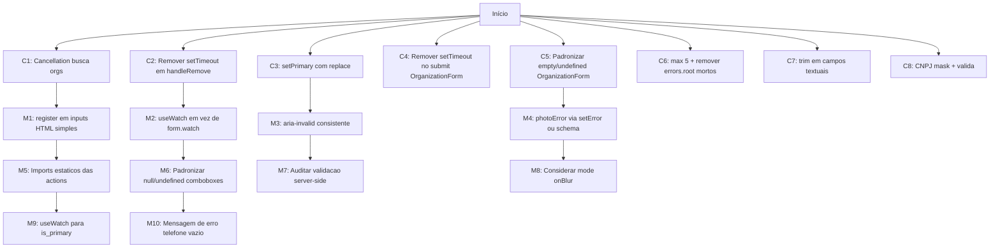

## Escopo

- [src/forms/PersonForm/person-form.tsx](src/forms/PersonForm/person-form.tsx)
- [src/forms/PersonForm/schema.ts](src/forms/PersonForm/schema.ts)
- [src/forms/OrganizationForm/organization-form.tsx](src/forms/OrganizationForm/organization-form.tsx)
- [src/forms/OrganizationForm/schema.ts](src/forms/OrganizationForm/schema.ts)

---

## 1. Diagnóstico

### 1.1 Correções (bugs ou inconsistências reais)

#### C1 — PersonForm: race condition residual na busca de organizações

[person-form.tsx](src/forms/PersonForm/person-form.tsx) linhas 128–142. O `EntityCombobox` já aplica debounce (default 500ms em [entity-combobox.tsx](src/components/ui-patterns/entity-combobox.tsx) linhas 121–145) antes de chamar `setOrgSearch`, então **não é necessário adicionar debounce extra**. Mas o `useEffect` ainda sofre de race condition residual (resposta de query anterior chegando após a mais recente) e não cancela ao desmontar.

```128:142:src/forms/PersonForm/person-form.tsx
  // biome-ignore lint/correctness/useExhaustiveDependencies: ...
  useEffect(() => {
    const supabase = createClient();
    setOrgsLoading(true);
    supabase
      .from("organizations")
      .select("id, name")
      .eq("account_id", session.account.id)
      .ilike("name", `%${orgSearch}%`)
      .limit(20)
      .then(({ data }) => {
        setOrgs(data ?? []);
        setOrgsLoading(false);
      });
  }, [orgSearch]);
```

**O que fazer:** adicionar flag `cancelled = false` no effect e checar antes dos `setOrgs`/`setOrgsLoading`, descartando respostas de queries obsoletas (mesmo padrão já usado no `useEffect` de carregamento via `personId`).

---

#### C2 — PersonForm: `setTimeout(0)` em `handleRemovePhone` / `handleRemoveEmail`

[person-form.tsx](src/forms/PersonForm/person-form.tsx) linhas 330–356. Workaround para "esperar" o `useFieldArray` atualizar. `useFieldArray` atualiza síncrono, então o setTimeout é desnecessário e introduz uma janela onde o estado fica inconsistente (form pode ser submetido entre o `removePhone` e o `updatePhone`).

```330:342:src/forms/PersonForm/person-form.tsx
  function handleRemovePhone(index: number) {
    const currentPhones = form.getValues("phones");
    const isPrimary = currentPhones[index]?.is_primary ?? false;
    removePhone(index);
    if (isPrimary && currentPhones.length > 1) {
      setTimeout(() => {
        const remaining = form.getValues("phones");
        if (remaining.length > 0) {
          updatePhone(0, { ...remaining[0], is_primary: true });
        }
      }, 0);
    }
  }
```

**O que fazer:** calcular o array final fora do RHF e chamar `replace(filtered)` numa única operação — sem `setTimeout`.

---

#### C3 — PersonForm: `setPrimary`* produz N re-renders

[person-form.tsx](src/forms/PersonForm/person-form.tsx) linhas 316–328. Itera com `forEach` chamando `updatePhone(i, ...)` por item, gerando N atualizações sequenciais e forçando re-validação em cascata.

```316:321:src/forms/PersonForm/person-form.tsx
  function setPrimaryPhone(index: number) {
    const currentPhones = form.getValues("phones");
    currentPhones.forEach((phone, i) => {
      updatePhone(i, { ...phone, is_primary: i === index });
    });
  }
```

**O que fazer:** usar `replace(currentPhones.map((p, i) => ({ ...p, is_primary: i === index })))` — uma única atualização atômica.

---

#### C4 — OrganizationForm: `setTimeout(0)` no submit sem motivo

[organization-form.tsx](src/forms/OrganizationForm/organization-form.tsx) linhas 98–101.

```98:101:src/forms/OrganizationForm/organization-form.tsx
      setTimeout(() => {
        onPendingChange?.(false);
        onSuccess?.();
      }, 0);
```

Não há motivo aparente para postergar. Cria flicker e dificulta cancelamento.

**O que fazer:** chamar `onPendingChange?.(false)` e `onSuccess?.()` síncrono.

---

#### C5 — OrganizationForm: mistura `""` e `undefined` em `state`/`city`

[organization-form.tsx](src/forms/OrganizationForm/organization-form.tsx) linhas 38–40, 162–164, 182. `defaultValues` usa `""`, mas `onChange(val ?? undefined)` e `setValue("city", undefined)` mudam para `undefined`. Schema é `z.string().optional()` — aceita ambos, mas isso pode disparar warnings de "uncontrolled to controlled" (Issue #2 da skill) e deixa o estado imprevisível para o consumidor da action.

**O que fazer:** padronizar. Sugestão: manter `""` (defaults atuais) e trocar `?? undefined` por `?? ""` e `setValue("city", "")`. Ou, alternativamente, mover `defaultValues` para `undefined` e usar `.optional()` consistentemente.

---

#### C6 — PersonForm: limites de phones/emails e `errors.root` mortos

Dois problemas relacionados em [person-form.tsx](src/forms/PersonForm/person-form.tsx) e [schema.ts](src/forms/PersonForm/schema.ts):

**(a) `errors.phones?.root` / `errors.emails?.root` nunca disparam** (linhas 749–751 e 829–831 do form). O schema atual define `phones: z.array(phoneSchema)` sem regra de array — código morto. Sobre o aviso de telefone/e-mail principal: a lógica de `handleRemovePhone`/`handleRemoveEmail` já garante que sempre haja um primário ao remover o atual primário com itens restantes (após C2), então não há necessidade de validação Zod para isso.

**(b) Limite de 5 não está reforçado no schema.** A UI já desabilita o botão "Adicionar" em `phones.length >= 5` / `emails.length >= 5`, mas o schema aceita arrays maiores. Reforçar no Zod é defesa em profundidade — protege contra dados injetados via DevTools/API e mantém o servidor seguro caso reuse o mesmo schema.

**O que fazer:**
- Adicionar `.max(5, "Máximo de 5 telefones")` ao `phones` e `.max(5, "Máximo de 5 e-mails")` ao `emails` em [schema.ts](src/forms/PersonForm/schema.ts).
- Remover os blocos `{form.formState.errors.phones?.root && ...}` (linhas 749–751) e `{form.formState.errors.emails?.root && ...}` (linhas 829–831) — agora obsoletos.
- Considerar usar `errors.phones?.message` em vez de `?.root` para exibir o erro de `.max(...)` se desejado (Zod coloca o erro do array no path raiz dele).

---

#### C7 — Falta `.trim()` em campos textuais

[schema.ts](src/forms/OrganizationForm/schema.ts) linha 4: `name: z.string().min(1, "O nome é obrigatório")` — sem `.trim()`. Usuário pode criar organização chamada `"   "` (apenas espaços), passando o `min(1)`.

Em [schema.ts](src/forms/PersonForm/schema.ts) o `name` tem `.trim().min(1, ...)` correto, mas os demais campos textuais (`occupation`, `address`, `additional_info`, sociais) não — o que pode resultar em strings só com espaços salvas no banco.

**O que fazer:**

- [schema.ts](src/forms/OrganizationForm/schema.ts):
  - `name`: `z.string().trim().min(1, "O nome é obrigatório")`
  - `cnpj`, `state`, `city`, `address`, `additional_info`: avaliar `z.string().trim().optional()` ou `.transform(v => v?.trim() || undefined)`
- [schema.ts](src/forms/PersonForm/schema.ts) (`personFormSchema`):
  - Aplicar `.trim()` nos campos textuais opcionais: `occupation`, `address`, `additional_info`, `instagram`, `facebook`, `linkedin`, `x`, `youtube`. Padrão sugerido: `z.string().trim().optional()`.
  - `phoneSchema.label` e `emailSchema.label`: idem.

Cuidado: Zod v4 mantém `.trim()` antes do `.min(...)`, mas o `defaultValues: ""` continua válido (`"".trim()` = `""`, `.optional()` aceita `""` se não houver `.min(1)`).

---

#### C8 — OrganizationForm: máscara e validação de CNPJ ausentes

[organization-form.tsx](src/forms/OrganizationForm/organization-form.tsx) linhas 133–148: o input de CNPJ é um `<Input>` cru, sem máscara visual nem validação. Schema atual ([schema.ts](src/forms/OrganizationForm/schema.ts) linha 5): `cnpj: z.string().optional()`. Aceita qualquer string.

**Requisitos definidos pelo usuário:**

- Máscara visual: `00.000.000/0001-00`
- Validar **somente os 14 dígitos** (sem máscara, regra padrão de DV)
- Persistir no banco **somente os 14 dígitos** (sem pontuação)
- Usar `react-input-mask@3.0.0-alpha.2` (já em [package.json](package.json) linha 53; ainda não usado em nenhum form do projeto)

**Plano de implementação:**

1. Criar `src/lib/validators/cnpj.ts` com:
   - `stripCnpjMask(value: string): string` — remove tudo que não é dígito
   - `isValidCnpj(digits: string): boolean` — valida 14 dígitos + DV (algoritmo padrão da Receita Federal, rejeita todos iguais)
2. Em [schema.ts](src/forms/OrganizationForm/schema.ts):
   ```ts
   cnpj: z
     .string()
     .optional()
     .transform((v) => (v ? stripCnpjMask(v) : ""))
     .refine((v) => v === "" || isValidCnpj(v), { message: "CNPJ inválido" }),
   ```
   Saída do schema fica padronizada como string de 14 dígitos ou `""`.
3. Criar wrapper `src/components/ui-patterns/cnpj-input.tsx` envolvendo `react-input-mask` + `<Input>` shadcn (mask `99.999.999/9999-99`), exposto como controlled component compatível com `Controller`. Verificar compat de `react-input-mask@3.0.0-alpha.2` com React 19 (alpha — testar em desenvolvimento). Se incompatível, considerar implementar máscara manual com `onChange` formatador (sem dependência adicional).
4. Em [organization-form.tsx](src/forms/OrganizationForm/organization-form.tsx) trocar o `<Input>` do CNPJ pelo `<CnpjInput>`. O valor exibido é mascarado; o `field.value` mantém a forma digitada (com máscara). O schema faz a transformação para apenas dígitos no submit.
5. Em [organization-form.tsx](src/forms/OrganizationForm/organization-form.tsx) `handleSubmit`, ao popular o `FormData`, usar o valor já transformado pelo schema (apenas dígitos) — `values.cnpj` virá com os 14 dígitos após o resolver.
6. **Modo edição:** ao receber `org.cnpj` (14 dígitos do banco), aplicar `formatCnpj(digits)` antes do `form.reset({ cnpj: ... })` para o input mostrar mascarado. Adicionar `formatCnpj` em `src/lib/validators/cnpj.ts`.
7. Auditar a action de criação/edição de organização para garantir re-validação no servidor (o `.transform`/`.refine` do schema funciona em ambos os lados).

---

### 1.2 Melhorias (funcionais, mas refinarias)

#### M1 — PersonForm: usar `register` em inputs HTML simples

A skill recomenda `Controller` apenas para componentes que não expõem `ref` ou que precisam de controle fino. Os campos `name`, `occupation`, `address`, `additional_info`, `facebook`, `instagram`, `linkedin`, `x`, `youtube` são `Input`/`Textarea` shadcn baseados em `<input>`/`<textarea>` HTML. Trocá-los por `{...register(fieldName)}` reduz overhead e simplifica o código.

#### M2 — PersonForm/OrganizationForm: substituir `form.watch("state")` por `useWatch`

[person-form.tsx](src/forms/PersonForm/person-form.tsx) linha 1062 e [organization-form.tsx](src/forms/OrganizationForm/organization-form.tsx) linha 180. `form.watch(...)` chamado dentro do render do form re-renderiza o form inteiro a cada mudança. `useWatch({ control, name: "state" })` isola o re-render. Como já estamos dentro de `Controller` da `city`, mover o watch para um sub-componente (`<CityField />`) ou usar `useController({ name: "city" })` + `useWatch` interno é o ideal.

#### M3 — `aria-invalid` inconsistente

Em [person-form.tsx](src/forms/PersonForm/person-form.tsx), os Inputs de `address`, `occupation`, `additional_info` não recebem `aria-invalid={fieldState.invalid}`, ao contrário do `name`. Em [organization-form.tsx](src/forms/OrganizationForm/organization-form.tsx), `address` e `additional_info` também não. A skill (seção Accessibility) pede `aria-invalid` + `aria-describedby` em todos os inputs com erro associado.

#### M4 — PersonForm: `photoErrorMessage` fora do RHF

[person-form.tsx](src/forms/PersonForm/person-form.tsx) linhas 81–83, 254–262, 462–464. Mantém erro de foto em `useState` separado, fora do `formState.errors`. Quebra o single source of truth: se a foto estiver inválida, `form.formState.isValid` ignora.

**Opções:**

- (a) Validar `photoFile` no schema (ex.: `photo: z.instanceof(File).refine(...).optional()`) e usar `Controller` para o input file.
- (b) Usar `setError("photo", { type: "manual", message })` para canalizar o erro pelo RHF.

A (b) é cirúrgica; a (a) é mais correta arquitetonicamente.

#### M5 — PersonForm: imports dinâmicos das server actions

[person-form.tsx](src/forms/PersonForm/person-form.tsx) linhas 155–156 e 539–541 usam `import("../../app/(app)/(pessoas)/pessoas/actions")`. Server Actions já são tree-shaken; o `import()` dinâmico aqui não traz benefício e prejudica type-safety + DX (autocomplete, "go to definition").

**O que fazer:** importar `getPersonDetailsAction` e `persistPersonPhotoAction` no topo. Se houver razão real (ciclo de imports), documentar e/ou injetar via props.

#### M6 — PersonForm: `field.value ?? null` em StateCombobox/CityCombobox

[person-form.tsx](src/forms/PersonForm/person-form.tsx) linhas 1042–1044, 1063–1064. Mistura `null` (entrada do componente) e `undefined` (saída para o RHF). Como o schema é `string().optional()` (sem `.nullable()`), padronize para um único tipo — ou ajuste o schema para `.nullish()`.

#### M7 — Validação server-side com o mesmo schema

A skill enfatiza: "Validate on both client AND server. Same Zod schema = single source of truth". As server actions consumidas via `onSubmitAction(formData)` precisam re-parsear o `FormData` com `personFormSchema` / `organizationFormSchema` (após reidratar `phones`/`emails` do JSON). Se ainda não fazem, é um furo de segurança.

**O que fazer:** auditar `getPersonDetailsAction`, `persistPersonPhotoAction`, action de criar/editar pessoa, e a action de organização. Garantir `schema.parse(...)` no servidor.

#### M8 — `mode` de validação

Ambos os forms usam `mode: 'onSubmit'` (default). Para `name`, `email`, `phone` onde o feedback rápido melhora UX, `mode: 'onBlur'` traria validação ao sair do campo sem custo significativo de re-render.

#### M9 — PersonForm: `is_primary` lido de `field` (snapshot do useFieldArray)

[person-form.tsx](src/forms/PersonForm/person-form.tsx) linhas 700–715 e 782–797. `field.is_primary` vem do snapshot inicial de `useFieldArray.fields`. Após `update(...)`, o `fields` é recriado com novos `id`s (re-render do bloco), o que normalmente atualiza, mas é frágil. Mais robusto: usar `useWatch({ control, name: \`phones.${index}.is_primary })`.

#### M10 — Mensagem de erro de telefone vazio

[schema.ts](src/forms/PersonForm/schema.ts) linha 8: `min(1, "O telefone é inválido")`. Quando o usuário adiciona telefone e ainda não digitou, vê "O telefone é inválido". UX melhor: `"Informe o telefone"`.

---

## 2. Plano de ação

Ordenado por impacto (correções primeiro, depois melhorias). Cada item é cirúrgico e independente — pode ser aplicado isoladamente.




### Fase 1 — Correções

1. **C1** [person-form.tsx](src/forms/PersonForm/person-form.tsx) `useEffect` da busca de orgs:
   - Adicionar flag `let cancelled = false` no início do effect, retornar cleanup `() => { cancelled = true }` e checar `if (!cancelled)` antes dos `setOrgs`/`setOrgsLoading`
   - **Não** adicionar debounce — já existe via `EntityCombobox.debounce` (default 500ms)
2. **C2** [person-form.tsx](src/forms/PersonForm/person-form.tsx) `handleRemovePhone`/`handleRemoveEmail`:
   - Remover `setTimeout`. Calcular `nextArray` filtrado e usar `replace(nextArray)` do `useFieldArray`, garantindo `is_primary` no índice 0 quando o primário foi removido
3. **C3** [person-form.tsx](src/forms/PersonForm/person-form.tsx) `setPrimaryPhone`/`setPrimaryEmail`:
   - Trocar `forEach + updatePhone` por `replace(arr.map((p, i) => ({ ...p, is_primary: i === index })))`
4. **C4** [organization-form.tsx](src/forms/OrganizationForm/organization-form.tsx) `handleSubmit`:
   - Remover `setTimeout(0)` envolvendo `onPendingChange(false)` e `onSuccess()`
5. **C5** [organization-form.tsx](src/forms/OrganizationForm/organization-form.tsx) `state`/`city`:
   - Trocar `?? undefined` por `?? ""` (consistente com `defaultValues`)
   - `form.setValue("city", "")` em vez de `undefined`
6. **C6** [schema.ts](src/forms/PersonForm/schema.ts) e [person-form.tsx](src/forms/PersonForm/person-form.tsx):
   - Adicionar `.max(5, "Máximo de 5 telefones")` em `phones` e `.max(5, "Máximo de 5 e-mails")` em `emails` no schema
   - Remover blocos `errors.phones?.root` (linhas 749–751) e `errors.emails?.root` (linhas 829–831) do form
7. **C7** Aplicar `.trim()`:
   - [schema.ts](src/forms/OrganizationForm/schema.ts): `name` ganha `.trim()` antes do `.min(1, ...)`; demais campos textuais opcionais idem
   - [schema.ts](src/forms/PersonForm/schema.ts): aplicar `.trim()` em `occupation`, `address`, `additional_info`, `instagram`, `facebook`, `linkedin`, `x`, `youtube`, `phoneSchema.label`, `emailSchema.label`
8. **C8** Máscara e validação de CNPJ:
   - Criar [src/lib/validators/cnpj.ts](src/lib/validators/cnpj.ts) com `stripCnpjMask`, `formatCnpj`, `isValidCnpj`
   - Atualizar `cnpj` em [schema.ts](src/forms/OrganizationForm/schema.ts) com `.transform(stripCnpjMask).refine(v => v === "" || isValidCnpj(v), { message: "CNPJ inválido" })`
   - Criar componente [src/components/ui-patterns/cnpj-input.tsx](src/components/ui-patterns/cnpj-input.tsx) usando `react-input-mask` (testar compat com React 19 — fallback: máscara manual)
   - Trocar `<Input>` do CNPJ em [organization-form.tsx](src/forms/OrganizationForm/organization-form.tsx) pelo `<CnpjInput>`
   - No modo edição, aplicar `formatCnpj(org.cnpj)` antes do `form.reset(...)` para exibir mascarado
   - Auditar a server action para confirmar que persiste apenas os 14 dígitos

### Fase 2 — Melhorias

1. **M1** [person-form.tsx](src/forms/PersonForm/person-form.tsx): substituir `Controller` por `register` em `name`, `occupation`, `address`, `additional_info`, `facebook`, `instagram`, `linkedin`, `x`, `youtube`. Manter `Controller` apenas onde há componente custom (`StateCombobox`, `CityCombobox`, `EntityCombobox`, `InputGroupPhoneInput`).
2. **M2** Extrair sub-componente `<CityField />` em ambos os forms; usar `useWatch({ control, name: "state" })` em vez de `form.watch("state")`.
3. **M3** Adicionar `aria-invalid={fieldState.invalid}` nos `Input`/`Textarea` que ainda não têm: `address`, `occupation`, `additional_info` em [person-form.tsx](src/forms/PersonForm/person-form.tsx); `address`, `additional_info` em [organization-form.tsx](src/forms/OrganizationForm/organization-form.tsx).
4. **M4** [person-form.tsx](src/forms/PersonForm/person-form.tsx): trocar `photoErrorMessage` (state) por `form.setError("photo", { type: "manual", message })` + ler de `form.formState.errors.photo`. Permite que `formState.isValid` reflita corretamente.
5. **M5** [person-form.tsx](src/forms/PersonForm/person-form.tsx): mover `import("../../app/(app)/(pessoas)/pessoas/actions")` para imports estáticos no topo do arquivo.
6. **M6** [person-form.tsx](src/forms/PersonForm/person-form.tsx) StateCombobox/CityCombobox: padronizar (sugestão: schema `.nullish()` + `value={field.value ?? null}` + `onChange(val)`, sem coerções).
7. **M7** Auditar e ajustar (fora do escopo destes arquivos):
  - Action de criar/editar pessoa
    - Action `getPersonDetailsAction`, `persistPersonPhotoAction`
    - Action de criar/editar organização
    Confirmar que cada uma re-parseia com `personFormSchema`/`organizationFormSchema` (após reidratar `phones`/`emails` do JSON). Se faltar, adicionar.
8. **M8** Avaliar trocar `mode` para `'onBlur'` em ambos os forms.
9. **M9** [person-form.tsx](src/forms/PersonForm/person-form.tsx): trocar leitura de `field.is_primary` (snapshot do `useFieldArray.fields`) por `useWatch({ control, name: \`phones.${index}.is_primary })`dentro de cada Controller (extrair sub-componente```).`
10. **M10** [schema.ts](src/forms/PersonForm/schema.ts): mensagem do `min(1, ...)` em `phone` para `"Informe o telefone"`.

### Fase 3 — Validação

- Rodar `pnpm lint` e `pnpm build`
- Testar manualmente:
  - Criar pessoa com 0/1/5 telefones e e-mails
  - Editar pessoa, alternar primary, remover primary
  - Buscar organizações digitando rápido
  - Criar/editar organização sem `state` definido

