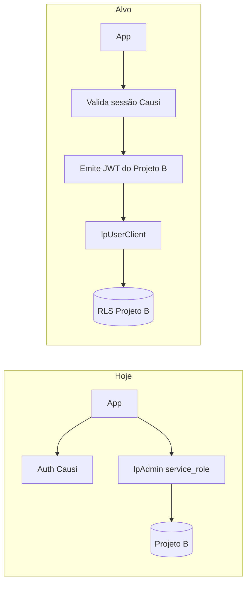

# RLS de Landing Pages, Galeria de Imagens e UX

## Contexto atual

- **Projeto A (Causi):** auth, contas, roles (`owner`, `admin`, `user`, `super_admin`), funções RLS como `is_user_in_account_or_shared`.
- **Projeto B (`database-lp` / [`supabase/migrations/`](supabase/migrations/)):** tabela [`landing_pages`](database-lp/schema.sql) escopada por `causi_user_id` (text), **sem RLS**, acesso via [`lpAdmin()`](src/lib/supabase/admin.ts) (`service_role`), que **ignora qualquer policy**.
- Imagens vão direto ao Storage [`gerador-lp-assets`](supabase/migrations/20260629160000_gerador_lp_storage_bucket.sql) por path `{subdomínio}/{slug}/...` sem catálogo nem controle de propriedade.



**Premissa confirmada:** acesso total a LPs e galeria para **`owner` da conta ativa** e **`super_admin`** do Causi. Demais membros seguem regras restritivas abaixo. Role `admin` (nível 50) **não** ganha CRUD total de LP — comporta-se como membro comum, salvo permissões futuras explícitas.

---

## Fase 1 — Schema (nova migration em `supabase/migrations/`)

Arquivo sugerido: `20260701000000_landing_pages_rls_and_gallery.sql` (+ atualizar [`database-lp/schema.sql`](database-lp/schema.sql) como referência).

### 1.1 `landing_pages` — escopo por conta

Adicionar colunas:

| Coluna | Tipo | Uso |
|--------|------|-----|
| `account_id` | `bigint NOT NULL` | Conta Causi ativa no momento da criação |
| `created_by_user_id` | `uuid NOT NULL` | Criador (`auth.uid()` / `causi_user_id` legado) |

- Índice: `(account_id, updated_at DESC)`
- Manter `slug` **globalmente único** (rota pública [`getLpPublic`](src/lib/landing-pages/lp-store.ts) usa só slug)
- Backfill: `created_by_user_id = causi_user_id::uuid` onde válido; `account_id` via script one-shot no deploy (consulta Causi por `causi_user_id` → `users.account_id` ou conta do cookie `causi_act`)

### 1.2 Galeria — novas tabelas

**`lp_account_images`**

- `id uuid PK`, `account_id bigint`, `uploaded_by_user_id uuid`
- `storage_path text UNIQUE`, `original_filename`, `mime_type`, `size_bytes`, `width`, `height`, `created_at`
- Path no bucket: `{account_id}/gallery/{image_id}.webp`

**`lp_image_usages`**

- `image_id → lp_account_images`, `landing_page_id → landing_pages`
- `slot text` (ex.: `logo`, `sections.hero`, `lawyers.{id}`, `seo.ogImage`)
- `UNIQUE (landing_page_id, slot)` — impede duplicata no mesmo slot
- `ON DELETE RESTRICT` em `image_id` — bloqueia exclusão de imagem em uso

View auxiliar **`lp_image_usage_summary`** (opcional): agrega LPs que usam cada imagem para a listagem da galeria.

### 1.3 Storage

- Novos paths centralizados em `{account_id}/gallery/`
- Manter paths legados em leitura pública (LPs já publicadas)
- Policies em `storage.objects` para `gerador-lp-assets` (INSERT/UPDATE/DELETE autenticado; SELECT público)

---

## Fase 2 — Funções helper e RLS (SQL)

Criar em `supabase/migrations/` (ou pasta `database-lp/functions/` se adotarem padrão declarativo):

```sql
-- Claims injetados no JWT emitido pelo servidor
lp_jwt_account_id()      -- (auth.jwt() ->> 'account_id')::bigint
lp_jwt_access_level()    -- int
lp_is_super_admin()      -- access_level >= 999
lp_is_account_owner()    -- access_level >= 100 na conta do JWT
lp_user_in_account(row_account_id) -- row.account_id = lp_jwt_account_id()
```

### Policies `landing_pages`

| Operação | Regra |
|----------|-------|
| **SELECT** | `lp_user_in_account(account_id)` |
| **SELECT (anon)** | `status = 'published'` (rota pública) |
| **INSERT** | membro da conta + `created_by_user_id = auth.uid()` + `account_id = lp_jwt_account_id()` |
| **UPDATE** | membro da conta **e** (`lp_is_account_owner()` OR `lp_is_super_admin()` OR `created_by_user_id = auth.uid()`) |
| **DELETE** | membro da conta **e** (`lp_is_account_owner()` OR `lp_is_super_admin()`) |

Despublicar = **UPDATE** `status = 'draft'` (permitido a quem pode editar a LP). Exclusão física só owner/super_admin.

Policy extra **super_admin bypass**: `lp_is_super_admin()` em todas as operações.

### Policies `lp_account_images`

| Operação | Regra |
|----------|-------|
| **SELECT** | membro da conta |
| **INSERT** | membro da conta + `uploaded_by_user_id = auth.uid()` |
| **DELETE** | owner/super_admin **OU** (`uploaded_by_user_id = auth.uid()` **e** sem linhas em `lp_image_usages`) |
| **UPDATE** | metadados: mesmo critério do DELETE (troca de arquivo via upsert no path) |

Trigger ou constraint: **bloquear DELETE** se existir uso (`lp_image_usages`) — mensagem clara via `RAISE EXCEPTION` com código customizado.

### Policies Storage `gerador-lp-assets`

- **SELECT** `public` — URLs públicas das LPs
- **INSERT/UPDATE/DELETE** `authenticated` — path prefix `{account_id}/gallery/` e validação via join com `lp_account_images` ou função que confere ownership/admin

`service_role` permanece apenas para: leitura pública server-side, jobs de migração, e fallback temporário durante rollout.

---

## Fase 3 — Ponte de autenticação (app)

Hoje [`lp-store.ts`](src/lib/landing-pages/lp-store.ts) usa só `lpAdmin()`. Para RLS funcionar:

1. Adicionar env: `LP_SUPABASE_ANON_KEY`, `LP_SUPABASE_JWT_SECRET` ([`.env.example`](.env.example))
2. Novo [`src/lib/supabase/lp-client.ts`](src/lib/supabase/lp-client.ts):
   - `createLpUserClient(session)` — após `requireLpSession()` / `getSession()`, assina JWT com `{ sub, role: 'authenticated', account_id, access_level }` usando o secret do Projeto B
   - `createLpAnonClient()` — leitura pública de LPs publicadas
3. Refatorar [`lp-store.ts`](src/lib/landing-pages/lp-store.ts), [`config.ts`](src/lib/landing-pages/config.ts), [`media-storage.ts`](src/lib/landing-pages/media-storage.ts):
   - `listLps(accountId)` em vez de `listLps(userId)`
   - `saveLp(session, lp)` — seta `account_id` + `created_by` no insert; no update, RLS valida ownership
   - `deleteLp` — só owner/super_admin (UI também esconde botão)
   - Sincronizar `lp_image_usages` ao salvar `schema` (parse URLs do bucket → slots)
4. Atualizar [`src/app/(app)/page.tsx`](src/app/(app)/page.tsx): `listLps(session.account.id)`
5. Manter validação de plano LP (`LP_PLAN_ID = 9`) em [`access.ts`](src/lib/session/access.ts) **antes** de chamar o client — RLS não substitui billing

Adicionar `slug` ao [`SessionRole`](src/lib/session/types.ts) (já vem da RPC, só não é exposto) para mensagens de UI e JWT.

---

## Fase 4 — Toasts para erros de RLS

Expandir [`src/lib/errors.ts`](src/lib/errors.ts) e [`src/lib/toast.ts`](src/lib/toast.ts):

```typescript
// Mapear PostgrestError
42501 → "Você não tem permissão para esta ação."
P0001 (trigger exclusão em uso) → "Esta imagem está em uso em: {LPs}."
23503 (FK) → "Não é possível remover: a imagem ainda está vinculada a uma landing page."
```

Helper `mapLpDbError(error): { title, description }` usado em:
- [`src/app/actions/lps.ts`](src/app/actions/lps.ts)
- [`src/app/actions/media.ts`](src/app/actions/media.ts)
- Novas actions da galeria
- [`lp-card.tsx`](src/components/Builder/lp-card.tsx) — trocar toast genérico por mensagem mapeada

Casos específicos:

| Situação | Toast |
|----------|-------|
| Membro tenta excluir LP | "Somente o proprietário da conta pode excluir landing pages." |
| Membro tenta editar LP de outro | "Você só pode editar landing pages que você criou." |
| Membro tenta excluir imagem do owner | "Você não pode remover imagens enviadas pelo proprietário da conta." |
| Imagem em uso | "Esta imagem está sendo usada em: {nomes das LPs}." |

---

## Fase 5 — Galeria de imagens (UI + API)

### Server

- `src/app/actions/gallery.ts` — `listGalleryImages`, `uploadGalleryImage`, `deleteGalleryImage`, `getGalleryImageUsages`
- Upload: Sharp (reuso de [`media-storage.ts`](src/lib/landing-pages/media-storage.ts)) → Storage → insert `lp_account_images`
- Listagem: join com `users` do Causi **via session** (nome/foto do uploader enriquecido no servidor, não no Projeto B)

### UI — nova rota ou drawer

- Entrada: botão **"Galeria de imagens"** na home ou no editor (ação explícita)
- Grid com thumbnail, nome do arquivo, **enviado por** (nome do usuário), **usado em** (chips com nomes das LPs ou "Não utilizada")
- Ações: upload, excluir (com regras), preview
- Ao excluir: `ConfirmDialog` + checagem de uso antes da chamada

### Substituir em landing pages

No editor, fluxo **"Escolher da galeria"** ou **"Enviar nova"**:
- Selecionar imagem existente → atualiza slot no schema + `lp_image_usages`
- Não dispara upload automático ao abrir o painel

---

## Fase 6 — Imagens sob demanda (sem gasto automático)

Hoje o editor expõe uploads em vários pontos ([`SectionImageInput`](src/components/Builder/editor.tsx), logo, fotos de advogados) e faz upload imediato via [`uploadLpMediaAction`](src/app/actions/media.ts).

Mudanças:

1. **Remover** painel "Imagens" do fluxo padrão do modo simples como etapa obrigatória — manter card no bento, mas conteúdo só após clique (já parcialmente assim com `simplePanel === "imagens"`)
2. Cada slot de imagem: estado colapsado com placeholder + botão **"Alterar imagem"** → abre picker (galeria + upload)
3. **Desativar** `pushToStorage` automático em [`use-lp-form.ts`](src/components/Builder/use-lp-form.ts) no `onChange` de arquivo; upload só após confirmação no picker
4. **Wizard `/nova`:** não enviar imagens ao Storage na criação; usar placeholders/Unsplash até o usuário optar por personalizar no editor
5. [`persistLpSchemaMedia`](src/lib/landing-pages/media-storage.ts) no save: processar apenas URLs já escolhidas (galeria ou data URL confirmada), não varrer uploads silenciosos

### Controle de armazenamento

- Quota por conta (futuro): contar `size_bytes` em `lp_account_images` vs limite do plano
- Reuso via galeria reduz duplicatas no bucket

---

## Fase 7 — Ajustes de UI por permissão

| Elemento | Quem vê |
|----------|---------|
| Botão excluir LP ([`lp-card.tsx`](src/components/Builder/lp-card.tsx)) | owner + super_admin |
| Botão despublicar | quem pode editar a LP |
| Editar LP de outro membro | somente leitura na galeria / abrir editor bloqueado com toast |
| Badge "Criado por {nome}" na listagem | todos os membros da conta |

Hook `useLpPermissions(session, lp)` derivado de `session.role.accessLevel` e `lp.created_by_user_id`.

---

## Ordem de implementação recomendada

1. Migration schema + funções + RLS + storage policies
2. Ponte JWT + refactor `lp-store` (listagem por conta)
3. Mapeamento de erros + toasts
4. Galeria (backend + UI)
5. Editor lazy + picker integrado
6. Backfill `account_id` / migração de paths legados (script separado, melhor esforço)
7. Remover dependência de `service_role` nas operações autenticadas (deixar só anon/public + migração)

## Riscos e mitigação

| Risco | Mitigação |
|-------|-----------|
| JWT do Projeto B diverge do Auth Causi | Servidor **sempre** valida sessão Causi antes de emitir JWT LP |
| LPs legadas sem `account_id` | Migration backfill + fallback temporário no servidor |
| Paths antigos no Storage | Leitura pública mantida; novos uploads só via galeria |
| `super_admin` em conta compartilhada | JWT usa `session.account.id` do cookie `causi_act` |

## Arquivos principais a criar/alterar

- **SQL:** `supabase/migrations/20260701000000_*.sql`, `database-lp/schema.sql`
- **Supabase client:** `src/lib/supabase/lp-client.ts`, `src/lib/env.ts`
- **Dados:** `src/lib/landing-pages/lp-store.ts`, `media-storage.ts`, novo `gallery-store.ts`
- **Actions:** `src/app/actions/lps.ts`, `media.ts`, `gallery.ts`
- **Erros:** `src/lib/errors.ts`, `src/lib/toast.ts`
- **UI:** `src/components/Builder/editor.tsx`, `use-lp-form.ts`, novo `image-gallery.tsx`, `lp-card.tsx`
- **Sessão:** `src/lib/session/types.ts` (expor `role.slug` / `accessLevel`)
