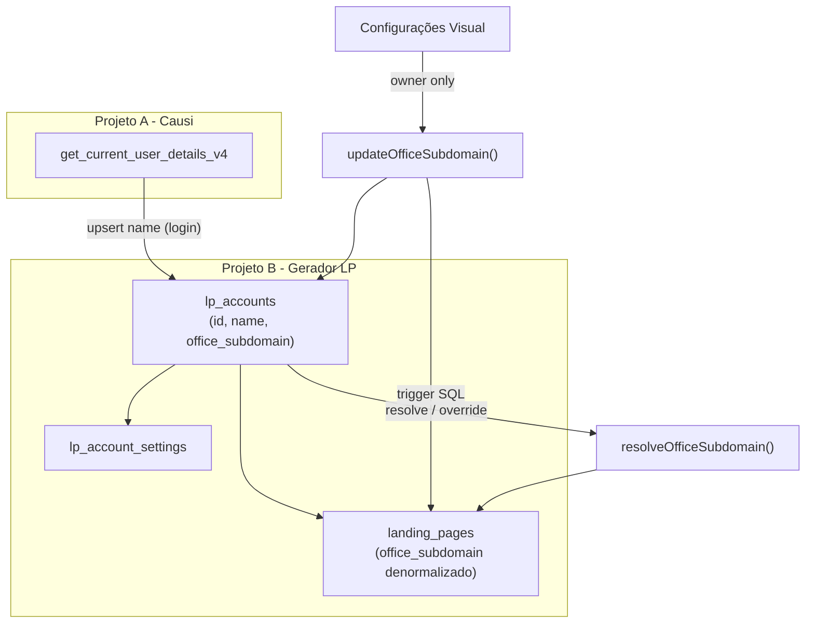
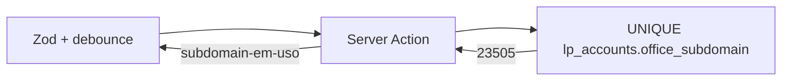

# Subdomínio configurável por conta

## Diagnóstico do estado atual

Hoje o subdomínio é **derivado em runtime** e **denormalizado** em cada linha de `landing_pages.office_subdomain`:

```97:135:src/lib/landing-pages/lp-store.ts
export async function resolveOfficeSubdomain(session: Session): Promise<string> {
  // lê a primeira LP da conta; se não existir ou for backfill acct-*, slugifica account.name
  // grava em todas as LPs da conta
}
```

Problemas:
- **Sem fonte canônica no banco** — a resolução depende de existir LP ou de dados em memória da sessão Causi
- **Sem `UNIQUE` em `office_subdomain`** — unicidade só via query ad hoc com `service_role` em [`isOfficeSubdomainTakenByOtherAccount`](src/lib/landing-pages/lp-store.ts)
- **`lp_account_settings` já é account-centric**, mas não guarda subdomínio; `user_settings` foi removida na migration [`20260706130000`](supabase/migrations/20260706130000_lp_account_settings.sql)

O PRD e [`docs/database.md`](docs/database.md) confirmam: nome do escritório vem do Causi (`account_name` via RPC), subdomínio é slug derivado, único globalmente.

---

## Arquitetura proposta



### Tabela central: `public.lp_accounts`

Nova migration (ex.: `20260708160000_lp_accounts.sql`):

| Coluna | Tipo | Descrição |
|--------|------|-----------|
| `id` | `bigint` PK | `account_id` do Causi |
| `name` | `text NOT NULL` | `account_name` — espelho, atualizado no login |
| `office_subdomain` | `text UNIQUE` | subdomínio canônico; `NULL` até primeiro provisionamento |
| `synced_at` | `timestamptz` | última sync do nome via RPC |
| `updated_at` | `timestamptz` | última alteração de subdomínio |

**Constraints Postgres:**
- `UNIQUE (office_subdomain)` — garantia final de unicidade
- `CHECK` de formato: `^[a-z0-9]([a-z0-9-]{1,61}[a-z0-9])?$` (3–63 chars, kebab-case)
- Trigger `BEFORE UPDATE` em `office_subdomain` → propaga para `landing_pages` da mesma conta (mantém denormalização para `getLpPublic`)

**Backfill da migration:**
```sql
INSERT INTO lp_accounts (id, name, office_subdomain, synced_at)
SELECT DISTINCT account_id,
       'Conta ' || account_id,  -- placeholder até primeiro login
       NULLIF(office_subdomain, 'acct-' || account_id::text),
       now()
FROM landing_pages
ON CONFLICT (id) DO NOTHING;
-- Regra: valores acct-{id} viram NULL (reprovisionar no próximo acesso)
```

**RLS** (mesmo padrão de [`lp_account_settings`](supabase/migrations/20260706130000_lp_account_settings.sql)):
- SELECT: `lp_user_in_account(id)`
- UPDATE `office_subdomain`: **apenas owner** (`lp_is_account_owner()`) + `id = lp_jwt_account_id()`
- INSERT: no provisionamento automático via policy que exige `lp_user_in_account` + JWT match
- Super admin: `FOR ALL` como nas demais tabelas

**FKs opcionais** (recomendado para integridade):
- `lp_account_settings.account_id → lp_accounts.id`
- `landing_pages.account_id → lp_accounts.id`

---

## Regras de negócio

### 1. Sync da conta no login (persistência, não in-memory)

Novo módulo [`src/lib/landing-pages/account-store.ts`](src/lib/landing-pages/account-store.ts):

```ts
ensureLpAccount(session) // upsert id + name from RPC; NÃO sobrescreve office_subdomain
```

Chamado em:
- [`getSession()`](src/lib/session/get-session.ts) após RPC bem-sucedida (fire-and-forget com `after()` ou await leve — conta é 1 row)
- Garante que toda request autenticada tem espelho persistido

### 2. Resolução do subdomínio (primeira vs. demais visitas)

Refatorar [`resolveOfficeSubdomain`](src/lib/landing-pages/lp-store.ts):

```
1. ensureLpAccount(session)
2. Ler lp_accounts.office_subdomain
3. Se valor válido (não NULL, não acct-*) → retornar
4. Senão → base = slugFromOfficeName(session.account.name)  // já existe em slug.ts
5. allocateUniqueLpSlug(base, isTaken)  // unicidade via lp_accounts, não landing_pages
6. UPDATE lp_accounts SET office_subdomain = valor
7. Trigger propaga para landing_pages (ou UPDATE explícito se trigger não couber)
```

`slugFromOfficeName` já faz: NFD → remove acentos → `toLowerCase` → non-alnum → `-` → trim hífens.

### 3. Alteração manual (configurações)

**UI** — card novo em [`visual-config-form.tsx`](src/forms/GlobalConfigForm/sections/visual-config-form.tsx) (página `/configuracoes`):

- Campo `officeSubdomain` com preview: `{valor}.causi.adv.br/{slug-exemplo}`
- Hint com sugestão derivada do nome Causi (somente leitura)
- Aviso: alterar quebra URLs publicadas
- Validação assíncrona debounced (disponibilidade)

**Validação compartilhada** — novo [`src/lib/landing-pages/subdomain.ts`](src/lib/landing-pages/subdomain.ts):

| Regra | Onde |
|-------|------|
| 3–63 caracteres | Zod + CHECK SQL |
| `[a-z0-9-]` apenas, sem `--`, não começa/termina com `-` | Zod + CHECK SQL |
| Não pode ser segmento reservado (`RESERVED_SEGMENTS` de [`public-routing.ts`](src/lib/landing-pages/public-routing.ts)) | Zod + server |
| Único globalmente | debounce frontend → server action → `UNIQUE` |
| Não pode ser prefixo `acct-` | Zod (backfill legado) |

**Server action** dedicada (não misturar com `saveConfig` de fontes/contato):

```ts
// src/app/actions/subdomain.ts
checkSubdomainAvailability(subdomain) → { available: boolean }
updateOfficeSubdomain(subdomain) → owner only; atualiza lp_accounts; trigger propaga LPs
```

**Backend:** `isOfficeSubdomainTaken` passa a consultar `lp_accounts` (service_role para cross-account check, como hoje).

### 4. Camadas de garantia de unicidade



- **Frontend:** Zod no schema + `useDebouncedCallback` chamando `checkSubdomainAvailabilityAction`
- **Backend:** normaliza input com `slugFromOfficeName` antes de validar; rejeita se normalizado ≠ input (força formato canônico)
- **Postgres:** `UNIQUE` + `CHECK`; erro `23505` mapeado para mensagem amigável

---

## Arquivos principais a alterar

| Área | Arquivos |
|------|----------|
| Migration | `supabase/migrations/20260708160000_lp_accounts.sql` |
| Store | `src/lib/landing-pages/account-store.ts` (novo), `lp-store.ts` (refatorar resolve) |
| Validação | `src/lib/landing-pages/subdomain.ts` (novo) |
| Config | `global-config.ts`, `config.ts`, `schema.ts` (tipos + Zod), `visual-config-form.tsx` |
| Actions | `src/app/actions/subdomain.ts` (novo) |
| Session | `get-session.ts` (chamar `ensureLpAccount`) |
| Docs | `docs/database.md`, `docs/features/landing-pages.md`, `docs/features/rls.md` |

**Não alterar:** `profiles.subdomain` (Lovable) — fora de escopo; leads dashboard não usa hoje.

---

## Fluxo do usuário

1. **Primeiro acesso via Causi:** login → `ensureLpAccount` grava `id` + `name` → ao criar primeira LP, `resolveOfficeSubdomain` slugifica `account.name` (ex.: "Escritório Silva" → `escritorio-silva`) e persiste em `lp_accounts`
2. **Acessos seguintes:** `resolveOfficeSubdomain` lê `lp_accounts.office_subdomain` — override do banco sempre vence o nome Causi
3. **Owner altera em Configurações:** valida → salva em `lp_accounts` → trigger atualiza todas as LPs → URLs públicas passam a usar novo host

---

## Critérios de aceite

- [ ] Owner vê e edita subdomínio em `/configuracoes`
- [ ] Membro não-owner vê subdomínio mas não edita (campo disabled + policy RLS)
- [ ] Primeira visita sem subdomínio: auto-provisiona slug do nome Causi
- [ ] Visitas seguintes: usa valor de `lp_accounts`, ignorando mudanças de nome no Causi
- [ ] Colisão detectada no frontend (debounce), backend e banco (`UNIQUE`)
- [ ] LP pública continua resolvendo via `landing_pages.office_subdomain` (sincronizado)
- [ ] Backfill `acct-{id}` reprovisionado no próximo resolve

---

## Riscos e mitigações

| Risco | Mitigação |
|-------|-----------|
| URLs publicadas quebram ao trocar subdomínio | Aviso explícito na UI; sem redirect automático no MVP |
| `profiles.subdomain` (Lovable) divergir | Documentar gap; sync futuro se leads dashboard voltar a usar `profiles` |
| Nome Causi mudar após override | Comportamento correto: override persiste; hint mostra sugestão atualizada sem sobrescrever |
