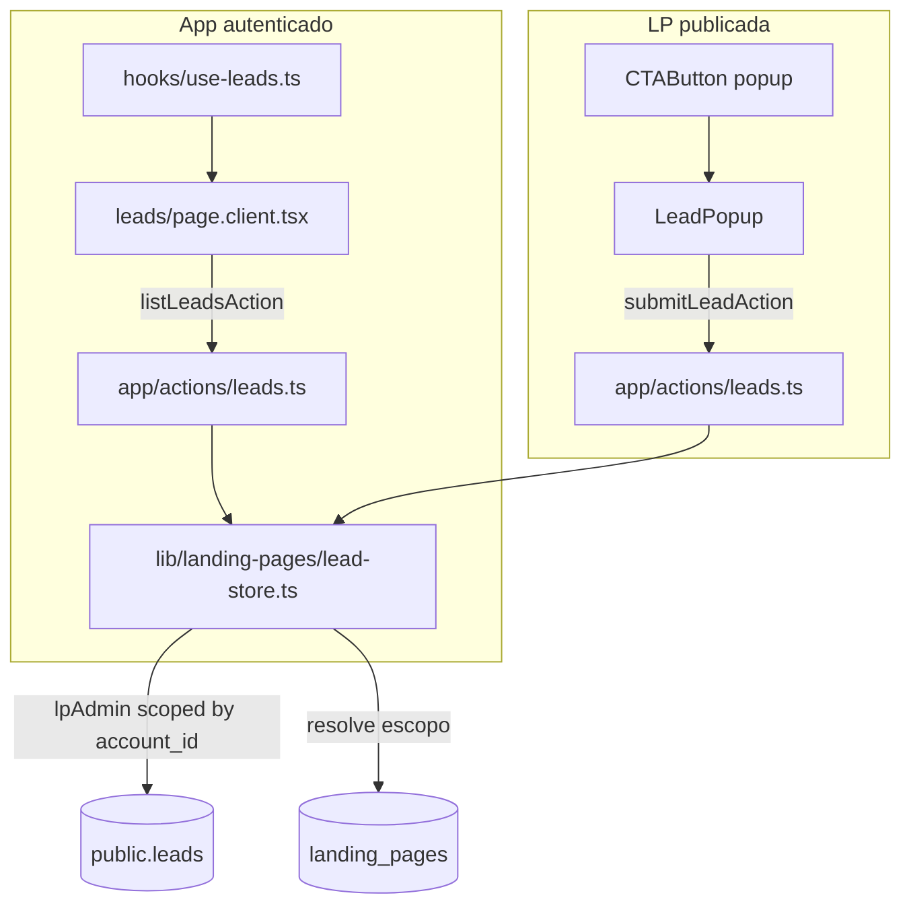

# Leads: captura, persistência e dashboard

## Contexto atual

| Área | Estado |
|------|--------|
| [`src/app/(app)/leads/page.tsx`](src/app/(app)/leads/page.tsx) | Query direta com `lpAdmin()`, imports quebrados (`requireLpAccess`, `DashboardClient`), filtro via join com `profiles` (legado Lovable) |
| [`src/app/(app)/leads/page.client.tsx`](src/app/(app)/leads/page.client.tsx) | UI funcional mas fora do padrão (sem `Container`/`Header`, `MIcon`, `LogoutButton` inexistente) |
| [`src/components/Sections/lead-popup.tsx`](src/components/Sections/lead-popup.tsx) | `onClick={() => setSent(true)}` — **não persiste** |
| [`src/components/Preview/landing-preview.tsx`](src/components/Preview/landing-preview.tsx) | Não passa contexto da LP (subdomínio, slug, URL) ao popup |
| Banco | `public.leads` sem colunas `email`/`answers`; `public.profiles` existe mas é **legado Lovable — fora de escopo** |

## Premissa: ignorar `public.profiles`

`profiles` é tabela legada do ecossistema Lovable (mapeamento `auth.uid()` → subdomínio). **Não é relevante para o gerador de LPs** e não será lida nem escrita nesta feature.

| O que usamos | O que ignoramos |
|--------------|-----------------|
| `public.leads` — persistência de contatos | `public.profiles` — sem SELECT, INSERT ou UPDATE |
| `landing_pages.account_id` + `office_subdomain` — escopo por conta | `landing_pages.profile_id` — FK legada, não usada no fluxo de leads |
| `lpAdmin()` no servidor com escopo manual por conta | RLS de `leads` que referencia `profiles` (bypass via service role) |

O campo `subdomain` em `leads` continua sendo preenchido com `office_subdomain` da LP — é apenas um identificador textual na linha do lead, sem vínculo com a tabela `profiles`.

## Arquitetura alvo



---

## 1. Migration — estender `public.leads`

Novo arquivo em `supabase/migrations/`:

```sql
ALTER TABLE public.leads
  ADD COLUMN IF NOT EXISTS email text,
  ADD COLUMN IF NOT EXISTS answers jsonb NOT NULL DEFAULT '{}'::jsonb;
```

Atualizar [`supabase/migrations/schema.sql`](supabase/migrations/schema.sql) (referência) com as novas colunas.

Opcional (recomendado para filtro mais robusto): adicionar `landing_page_id uuid REFERENCES landing_pages(id)` — evita depender só de parsing de `page_url`. Se adotado, gravar no `createLead` e filtrar diretamente por slug/id. **Não inclui `profiles`.**

---

## 2. Camada de persistência — `lead-store.ts`

Criar [`src/lib/landing-pages/lead-store.ts`](src/lib/landing-pages/lead-store.ts) (`server-only`):

**Tipos**

```typescript
export type LeadRow = {
  id: number;
  created_at: string;
  nome: string | null;
  telefone: string | null;
  email: string | null;
  answers: Record<string, string>;
  page_url: string | null;
  subdomain: string | null;
  landing_page_id?: string | null; // se migration opcional for adotada
};

export type LeadListFilters = {
  landingPageSlug?: string;
};
```

**Funções**

| Função | Responsabilidade |
|--------|------------------|
| `listLeads(session, filters?)` | Resolve subdomínios/slugs das LPs da `session.account.id` via `landing_pages`; busca `leads` cujo `subdomain` ∈ `office_subdomain` da conta; filtra por LP via `landing_page_id` ou slug em `page_url` |
| `createLead(input)` | Valida LP publicada (`office_subdomain` + `slug`), insere em `leads` via `lpAdmin()` |
| `deleteLead(session, leadId)` | Verifica que o lead pertence à conta ativa (via subdomínios da conta) antes de deletar |

**Escopo por conta** (substitui join com `profiles` e filtro por `causi_user_id`):

```typescript
const ctx = sessionToLpContext(session);

const { data: lps } = await db
  .from("landing_pages")
  .select("id, office_subdomain, slug, name")
  .eq("account_id", ctx.accountId);

const subdomains = [...new Set(lps.map((lp) => lp.office_subdomain))];

const { data: leads } = await db
  .from("leads")
  .select("id, created_at, nome, telefone, email, answers, page_url, subdomain")
  .in("subdomain", subdomains)
  .order("created_at", { ascending: false })
  .limit(2000);
```

Nenhuma query em `profiles`.

---

## 3. Server Actions — `app/actions/leads.ts`

Criar [`src/app/actions/leads.ts`](src/app/actions/leads.ts) seguindo padrão de [`src/app/actions/gallery.ts`](src/app/actions/gallery.ts):

| Action | Auth | Uso |
|--------|------|-----|
| `listLeadsAction(filters?)` | `requireLpSession()` | Dashboard — retorna `{ ok, leads, landingPages }` |
| `deleteLeadAction(leadId)` | `requireLpSession()` | Exclusão na tabela |
| `submitLeadAction(payload)` | **Público** (sem sessão) | Captura no popup; valida LP publicada + campos obrigatórios |

**Payload de captura** (`submitLeadAction`):

```typescript
{
  officeSubdomain: string;
  lpSlug: string;
  nome: string;
  telefone: string;
  email?: string;
  answers?: Record<string, string>;
  pageUrl: string;
}
```

Validações: `nome` e `telefone` obrigatórios; `answers` sanitizado (apenas strings); LP deve existir com `status = 'published'` e pertencer ao `office_subdomain` informado; `subdomain` gravado = `office_subdomain` (campo textual, sem FK para `profiles`).

**Normalização de `answers` na captura** (para o sheet exibir labels legíveis):

```typescript
// Entrada do popup: Record<questionId, answer>
// Saída gravada: Record<questionLabel, answer>
function normalizeAnswers(
  raw: Record<string, string>,
  questions: PopupQuestion[],
): Record<string, string> {
  const byId = new Map(questions.map((q) => [q.id, q.label.trim() || "Pergunta"]));
  return Object.fromEntries(
    Object.entries(raw)
      .filter(([, v]) => v.trim())
      .map(([id, v]) => [byId.get(id) ?? id, v]),
  );
}
```

Resolver `questions` a partir do `schema` da LP publicada no `createLead`.

---

## 4. Hook — `use-leads.ts`

Criar [`src/hooks/use-leads.ts`](src/hooks/use-leads.ts):

- Chama `listLeadsAction` no mount e ao mudar filtro de LP
- Expõe `{ leads, landingPages, loading, error, reload, setLpFilter }`
- Usa `useLpPermissions()` / `useSession()` apenas para permissões de UI (ex.: habilitar delete)

Padrão espelhado do `load()` em [`src/app/(app)/galeria/page.client.tsx`](src/app/(app)/galeria/page.client.tsx).

---

## 5. Refatorar `/leads` — UI (especificação detalhada)

### Server page — [`src/app/(app)/leads/page.tsx`](src/app/(app)/leads/page.tsx)

Alinhar com [`src/app/(app)/galeria/page.tsx`](src/app/(app)/galeria/page.tsx):

```typescript
const session = await requireAuth();
if (!hasLpAccess(session)) return <AccessDenied />;
return <LeadsPageClient />;
```

Remover queries diretas ao banco e qualquer referência a `profiles`.

---

### Estrutura de componentes

| Arquivo | Responsabilidade |
|---------|------------------|
| [`src/app/(app)/leads/page.client.tsx`](src/app/(app)/leads/page.client.tsx) | Página: layout, filtros, tabela, estado do sheet |
| [`src/components/leads/lead-answers-sheet.tsx`](src/components/leads/lead-answers-sheet.tsx) | Sheet lateral com respostas customizadas |
| [`src/lib/leads/format.ts`](src/lib/leads/format.ts) | Helpers puros: `waLink`, `fmtData`, `hasCustomAnswers` |

---

### Layout da página (`LeadsPageClient`)

Espelhar [`src/app/(app)/galeria/page.client.tsx`](src/app/(app)/galeria/page.client.tsx):

```
Container (vertical, overflow hidden)
├── Header
│   ├── HeaderContent → HeaderHeading → h1 "Contatos" + Badge (total)
│   └── HeaderActions
│       ├── Button outline → "Baixar CSV" (Download icon)
│       └── Button outline asChild → Link "Voltar às LPs" (href="/")
├── Barra de filtros (p-4 sm:p-6, border-b)
│   ├── Input busca (Search icon)
│   ├── Select filtro por LP ("Todas as páginas" + opções de landingPages)
│   └── Toggle período (Hoje / Semana / Mês / Todos) + input date opcional
└── Área scrollável (flex-1 overflow-y-auto p-4 sm:p-6)
    ├── Loading → texto "Carregando…"
    ├── Empty → ícone Group + mensagem
    └── Table (listagem principal)
```

Ícones de ação/filtro: `@material-symbols-svg/react`. Ícone WhatsApp: `@thesvg/react` (já usado no projeto em integrações/pixels).

Remover: `LogoutButton`, header manual, `MIcon`, layout `max-w-5xl` isolado, accordion mobile (tabela com scroll horizontal em telas pequenas).

---

### Tabela — colunas

| Coluna | Largura | Conteúdo |
|--------|---------|----------|
| **Nome** | flex | Nome em **negrito** (`font-medium text-foreground`) |
| **Telefone** | auto | Ver spec abaixo |
| **E-mail** | hidden md:table-cell | Texto ou `—` |
| **Página** | hidden lg:table-cell | Nome/slug da LP de origem |
| **Data** | hidden sm:table-cell | `fmtData(created_at)` em `text-muted-foreground` |
| **Ações** | w-24 text-right | Botão condicional do sheet |

Cabeçalho: `TableHeader` com `hover:bg-transparent` (padrão galeria). Linhas: `TableRow` com hover sutil.

Ordenação clicável em **Nome** e **Data** (setas Material). Paginação abaixo da tabela (20 itens/página).

---

### Célula Telefone + WhatsApp

Quando `telefone` existe, renderizar `Button` outline `size="sm"` com link externo `wa.me`:

```tsx
import { Whatsapp } from "@thesvg/react";
import Link from "next/link";
import { Button } from "@/components/ui/button";

function LeadPhoneCell({ telefone, nome }: { telefone: string; nome: string | null }) {
  const href = waLink(telefone, nome); // helper em lib/leads/format.ts

  return (
    <Button asChild variant="outline" size="sm" className="gap-1.5">
      <Link href={href} target="_blank" rel="noopener noreferrer">
        {telefone}
        <Whatsapp className="size-4" />
      </Link>
    </Button>
  );
}
```

`waLink`: normaliza dígitos, prefixa `55` se necessário, mensagem `"Olá {nome}, recebi seu contato pelo meu site."` (reutilizar lógica atual de `page.client.tsx`).

Sem telefone: `—` em `text-muted-foreground`.

---

### Célula E-mail

- Valor em `text-sm` ou `—` se vazio
- Sem link mailto nesta versão (manter simples)

---

### Botão condicional — respostas customizadas

Exibir **somente** quando `answers` tiver ao menos uma entrada com valor não vazio (`hasCustomAnswers(answers)`).

```tsx
<Button
  type="button"
  variant="ghost"
  size="sm"
  onClick={() => setSelectedLead(lead)}
>
  <Description className="size-4" />
  <span className="sr-only">Ver respostas</span>
</Button>
```

Label visível opcional em `sm+`: "Respostas". Ícone `Description` de `@material-symbols-svg/react`.

---

### Sheet de respostas — `LeadAnswersSheet`

Componente controlado (`open`, `onOpenChange`, `lead`):

```tsx
<Sheet open={open} onOpenChange={onOpenChange}>
  <SheetContent side="right" className="sm:max-w-md">
    <SheetHeader>
      <SheetTitle>{lead.nome ?? "Contato"}</SheetTitle>
      <SheetDescription>
        Respostas do formulário · {fmtData(lead.created_at)}
      </SheetDescription>
    </SheetHeader>

    {/* Tabela zebrada campo-valor */}
    <div className="overflow-hidden rounded-lg border">
      {rows.map((row, i) => (
        <div
          key={row.label}
          className={cn(
            "grid grid-cols-[minmax(0,40%)_1fr] gap-3 px-4 py-3 text-sm",
            i % 2 === 0 ? "bg-muted/40" : "bg-background",
          )}
        >
          <span className="font-medium text-muted-foreground">{row.label}</span>
          <span className="text-foreground whitespace-pre-wrap">{row.value}</span>
        </div>
      ))}
    </div>
  </SheetContent>
</Sheet>
```

**Linhas exibidas no sheet** (ordem):

1. Todas as respostas customizadas de `answers` (campo = label da pergunta, valor = resposta)
2. Metadados fixos no rodapé da lista: **Página** (`page_url` ou nome da LP), **Telefone**, **E-mail**

**Labels das perguntas:** na captura (`submitLeadAction` / `createLead`), normalizar `answers` para chaves legíveis usando `PopupQuestion.label` do schema da LP — ex.: `{ "Qual sua idade?": "Maior que 23" }` em vez de UUID. O sheet só renderiza pares campo-valor sem lógica extra.

Se não houver respostas customizadas, o botão da tabela não aparece e o sheet não abre.

---

### Filtros e ações globais

| Feature | Comportamento |
|---------|---------------|
| Busca | Nome ou telefone (substring; dígitos para DDD) |
| Filtro LP | `Select` com `landingPages` da action; valor `__all__` ou `slug` |
| Período | Chips Hoje/Semana/Mês/Todos + date picker (prioridade ao dia específico) |
| Export CSV | Client-side; colunas Data, Nome, Telefone, E-mail, Página, Respostas (JSON stringificado) |
| Delete | Fora do escopo desta spec de UI (action existe no backend, não obrigatório na v1 da tabela) |

Dados carregados via `useLeads()` → `listLeadsAction` (sem props do server component).

---

### Estado vazio

Padrão `Empty` (como home):

- Ícone `Group` (`@material-symbols-svg/react`)
- Título: "Nenhum contato ainda" / "Nenhum contato com esses filtros"
- Descrição contextual conforme `leads.length` e filtros ativos

---

### Navegação

Adicionar item em [`src/components/app-sidebar.tsx`](src/components/app-sidebar.tsx):

```typescript
{ href: "/contatos", icon: Group, label: "Contatos", routes: ["/contatos"] }
```

---

## 6. Captura no formulário da LP

### [`src/components/Preview/landing-preview.tsx`](src/components/Preview/landing-preview.tsx)

Nova prop opcional `leadContext` (somente LP publicada):

```typescript
leadContext?: {
  officeSubdomain: string;
  lpSlug: string;
};
```

Passar para `LeadPopup` junto com `demo={false}`.

### [`src/app/(subdomains)/[escritorio]/[slug]/page.tsx`](src/app/(subdomains)/[escritorio]/[slug]/page.tsx)

```tsx
<LandingPreview
  schema={lp.schema}
  demo={false}
  leadContext={{ officeSubdomain: lp.officeSubdomain, lpSlug: lp.slug }}
/>
```

### [`src/components/Sections/lead-popup.tsx`](src/components/Sections/lead-popup.tsx)

- Receber `leadContext` e `demo`
- No "Enviar" (quando `!demo`):
  1. Validar campos obrigatórios client-side
  2. Chamar `submitLeadAction({ ... })`
  3. Loading state no botão; erro inline se falhar
  4. `setSent(true)` apenas após `{ ok: true }`
- Manter comportamento demo (`demo=true`) sem persistência

---

## 7. Arquivos tocados (resumo)

| Arquivo | Ação |
|---------|------|
| `supabase/migrations/YYYYMMDD_leads_email_answers.sql` | Criar |
| `supabase/migrations/schema.sql` | Atualizar referência |
| `src/lib/landing-pages/lead-store.ts` | Criar |
| `src/app/actions/leads.ts` | Criar |
| `src/hooks/use-leads.ts` | Criar |
| `src/app/(app)/leads/page.tsx` | Simplificar (auth gate only) |
| `src/app/(app)/leads/page.client.tsx` | Refatorar UI completa (tabela + filtros) |
| `src/components/leads/lead-answers-sheet.tsx` | Sheet com tabela zebrada campo-valor |
| `src/lib/leads/format.ts` | Helpers `waLink`, `fmtData`, `hasCustomAnswers` |
| `src/components/Sections/lead-popup.tsx` | Conectar captura |
| `src/components/Preview/landing-preview.tsx` | Prop `leadContext` |
| `src/app/(subdomains)/[escritorio]/[slug]/page.tsx` | Passar contexto |
| `src/components/app-sidebar.tsx` | Link Contatos |

**Fora de escopo:** `lp-store.ts` (sem sync de profiles), `account-store.ts`, tabela `profiles`.

---

## Critérios de sucesso

1. LP publicada com `action: "popup"` grava lead em `public.leads` com `subdomain` (= `office_subdomain`), `page_url`, `email` e `answers`
2. Nenhuma leitura ou escrita em `public.profiles` no fluxo de leads
3. `/leads` lista apenas leads da **conta ativa**, filtráveis por LP
4. Nenhuma query Supabase direta em `page.tsx` ou componentes client
5. UI consistente com galeria (`Container`, `Header`, `Table`, ícones Material)
6. Cada linha: nome em negrito, telefone com botão `wa.me` + ícone `Whatsapp` (`@thesvg/react`), e-mail, botão condicional abre sheet com respostas em tabela zebrada
7. Preview/editor (`demo=true`) continua sem gravar dados