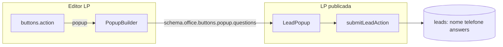

# Refatoração do CTA e captura de leads

## Contexto e premissas

- **Passo final fixo:** sempre `nome` + `telefone` (rápido, sem fricção para campanhas).
- **E-mail e demais dados:** apenas via perguntas personalizadas, gravados em `answers` (jsonb).
- **Migration:** você já removeu `email` de [`supabase/migrations/20260709160000_leads_email_answers.sql`](supabase/migrations/20260709160000_leads_email_answers.sql) e [`supabase/migrations/schema.sql`](supabase/migrations/schema.sql) já reflete `answers` sem `email`.
- **Formulário de criação** ([`src/forms/LandingPageCreateForm`](src/forms/LandingPageCreateForm)): o passo "Contato" configura **dados do escritório no rodapé** (WhatsApp + e-mail institucional), não o popup de lead. **Fora do escopo** desta refatoração — não misturar com captura de lead.
- **Editor** ([`src/components/Builder/editor`](src/components/Builder/editor)): é onde o CTA/popup é configurado hoje.



---

## Fase 1 — Remover e-mail fixo de lead (cirúrgico)

Alinhar código ao schema atual (sem coluna `email`).

| Arquivo | Alteração |
|---------|-----------|
| [`src/lib/landing-pages/lead-store.ts`](src/lib/landing-pages/lead-store.ts) | Remover `email` de `LeadRow`, `CreateLeadInput`, `select`, `insert` e mapeamento |
| [`src/app/actions/leads.ts`](src/app/actions/leads.ts) | Remover `email` de `SubmitLeadPayload` |
| [`src/components/Sections/lead-popup.tsx`](src/components/Sections/lead-popup.tsx) | Remover prop `emailConfig`, estado `lead.email`, input e validação de e-mail |
| [`src/components/Preview/landing-preview.tsx`](src/components/Preview/landing-preview.tsx) | Parar de passar `emailConfig` |
| [`src/hooks/use-lp-editor-form.ts`](src/hooks/use-lp-editor-form.ts) | Remover `setPopupEmail`; em `setPopupQuestions`, não preservar `popup.email` |
| [`src/components/Builder/editor/widgets/popup-builder.tsx`](src/components/Builder/editor/widgets/popup-builder.tsx) | Remover bloco "Campo de e-mail" (linhas 184–242) |
| [`src/lib/landing-pages/schema.ts`](src/lib/landing-pages/schema.ts) + [`schema/types.ts`](src/lib/landing-pages/schema/types.ts) | Remover `popup.email?: { enabled; required }` |
| [`src/forms/LpEditorForm/schema.ts`](src/forms/LpEditorForm/schema.ts) | Remover validação Zod de `popup.email` |
| [`src/app/(app)/leads/page.client.tsx`](src/app/(app)/leads/page.client.tsx) | Remover coluna e coluna CSV "E-mail" |
| [`src/components/leads/lead-answers-sheet.tsx`](src/components/leads/lead-answers-sheet.tsx) | Remover bloco que lê `lead.email` |
| Migration comment | Atualizar comentário em `20260709160000_leads_email_answers.sql` (só `answers`) |

**Migração de schemas salvos:** criar helper `normalizePopupConfig()` (novo arquivo, ex. [`src/lib/landing-pages/popup/normalize.ts`](src/lib/landing-pages/popup/normalize.ts)) chamado ao abrir LP no editor (`lpEditorDefaultValues` / seed) e antes de `createLead`:
- Se `popup.email?.enabled`, inserir pergunta `{ type: "email", label: "E-mail", required: email.required }` **somente se** não existir pergunta com label similar.
- Remover `popup.email` do objeto persistido.

---

## Fase 2 — Novo modelo de perguntas personalizadas

### 2.1 Contrato de tipos (schema serializável)

Substituir o `PopupQuestion` atual (`text` | `choice`) por união discriminada em [`src/lib/landing-pages/schema.ts`](src/lib/landing-pages/schema.ts):

```typescript
type PopupQuestionBase = {
  id: string;
  label: string;
  required?: boolean; // default true no passo da pergunta
};

type PopupQuestion =
  | (PopupQuestionBase & { type: "text" })
  | (PopupQuestionBase & { type: "number" })
  | (PopupQuestionBase & { type: "phone" })
  | (PopupQuestionBase & { type: "email" })
  | (PopupQuestionBase & { type: "url" })
  | (PopupQuestionBase & {
      type: "currency";
      currency: "BRL" | "USD" | "EUR";
    })
  | (PopupQuestionBase & {
      type: "choice";
      options: string[];
      allowMultiple?: boolean; // multi-escolha
    })
  | (PopupQuestionBase & { type: "cep" }); // preenche país/UF/cidade via API
```

**Armazenamento em `answers`:** manter `Record<string, string>` por simplicidade:
- Escalar: string formatada (telefone mascarado, moeda com locale, etc.)
- Multi-escolha: valores unidos por `"; "` (legível no dashboard/CSV)
- CEP: JSON stringificado `{ cep, logradouro, bairro, cidade, uf, pais }` — `normalizeLeadAnswers` formata para exibição legível no sheet

**Compatibilidade:** perguntas legadas `type: "text" | "choice"` continuam válidas; Zod usa `z.discriminatedUnion` com fallback para unknown → `text`.

### 2.2 Validação e máscaras (frontend only)

Novo módulo [`src/lib/landing-pages/popup/validation.ts`](src/lib/landing-pages/popup/validation.ts):

| Tipo | Validação | Máscara / input |
|------|-----------|-----------------|
| `text` | não vazio se `required` | textarea/input livre |
| `number` | `Number.isFinite` | `inputMode="decimal"` |
| `phone` | ≥10 dígitos | reutilizar [`maskPhone`](src/lib/landing-pages/phone.ts) + [`InputMask`](src/components/ui/input-mask.tsx) |
| `email` | regex simples / `z.string().email()` | `type="email"` |
| `url` | `https://` obrigatório | `inputMode="url"` |
| `currency` | parse via [`parseDecimalCurrencyInput`](src/lib/formatters.ts) | máscara centavos + [`formatDecimalCurrency`](src/lib/formatters.ts) |
| `choice` | opção selecionada | botões; multi = toggle múltiplo |
| `cep` | [`isValidCep`](src/lib/validators/brazilian-documents.ts) | [`formatCep`](src/lib/validators/brazilian-documents.ts) |

### 2.3 Renderização no popup público

Refatorar [`src/components/Sections/lead-popup.tsx`](src/components/Sections/lead-popup.tsx):
- Extrair [`src/components/Sections/popup-question-field.tsx`](src/components/Sections/popup-question-field.tsx) — um componente por `type`, props: `question`, `value`, `onChange`, `error`
- Fluxo multi-step **permanece linear** (uma pergunta por etapa + passo final nome/telefone)
- Botão "Avançar" valida o campo atual antes de `next()`
- Multi-escolha: exige ao menos 1 opção se `required`

### 2.4 Editor — PopupBuilder simplificado

Refatorar [`src/components/Builder/editor/widgets/popup-builder.tsx`](src/components/Builder/editor/widgets/popup-builder.tsx):

**Remover:** toggle de e-mail fixo (Fase 1).

**Adicionar por pergunta:**
- Select "Tipo de resposta" com os tipos acima
- Campos condicionais:
  - `choice` → opções + toggle "Permitir várias respostas"
  - `currency` → select BRL / USD / EUR
  - demais → só label + obrigatório/opcional
- Hint no rodapé: *"Nome e telefone são sempre o último passo. Use os tipos acima para coletar e-mail, valor, localização, etc."*

Atualizar texto em [`editor-shell.tsx`](src/components/Builder/editor/editor-shell.tsx) (bloco popup ~1472–1487) para refletir o novo modelo.

### 2.5 Backend e dashboard

- [`lead-store.ts`](src/lib/landing-pages/lead-store.ts) — `normalizeLeadAnswers` enriquecido para formatar `cep` (JSON → "CEP · Cidade/UF") e multi-escolha
- [`lead-answers-sheet.tsx`](src/components/leads/lead-answers-sheet.tsx) — passa a exibir e-mail **somente** se vier em `answers`
- Busca em [`page.client.tsx`](src/app/(app)/leads/page.client.tsx) — opcionalmente incluir valores de `answers` no filtro de texto

---

## Fase 3 — CEP geográfico (ViaCEP)

Novo [`src/lib/landing-pages/popup/viacep.ts`](src/lib/landing-pages/popup/viacep.ts):
- `fetchAddressByCep(cep: string)` → `{ logradouro, bairro, localidade, uf }`
- Client-side no `LeadPopup` ao completar 8 dígitos
- UI: campo CEP + preview readonly de cidade/UF/país ("Brasil")
- Tratar `erro: true` da API com mensagem amigável

**Fora do escopo inicial:** branching condicional (pergunta B só se escolheu opção X em A) — exigiria grafo de fluxo, não lista linear. Multi-escolha cobre o caso mais comum; branching fica como evolução futura se necessário.

---

## O que NÃO muda

- E-mail do **escritório** no rodapé (`office.email`) e no wizard de criação — continua obrigatório no passo Contato para exibição institucional.
- Ações de CTA `whatsapp` e `link` no editor — permanecem como estão.
- RLS e escopo por `account_id` / `subdomain` — inalterados.

---

## Ordem de implementação recomendada

1. **Fase 1** — desbloqueia produção (schema DB já sem `email`)
2. **Fase 2.1–2.2** — tipos + validação (base)
3. **Fase 2.3–2.4** — UI popup + builder
4. **Fase 2.5** — dashboard/answers
5. **Fase 3** — CEP

Cada fase pode ser um PR separado para revisão incremental.

---

## Verificação manual

- LP com popup vazio: abre direto em nome + telefone; submit grava lead sem `answers`
- LP com pergunta `email` customizada: valor aparece no sheet "Respostas", não em coluna dedicada
- LP legada com `popup.email.enabled`: ao abrir no editor, migra para pergunta `email` e salva sem `popup.email`
- Tipos `phone`, `currency`, `url`: validação bloqueia avanço com mensagem clara
- CEP válido: preenche cidade/UF; CEP inválido: erro sem quebrar fluxo
- Export CSV: sem coluna E-mail; respostas no campo JSON "Respostas"
