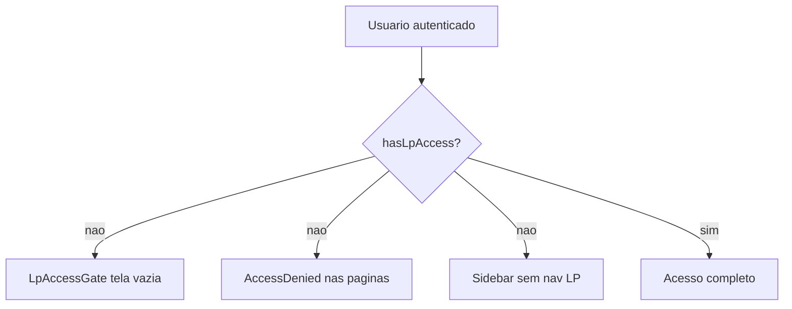
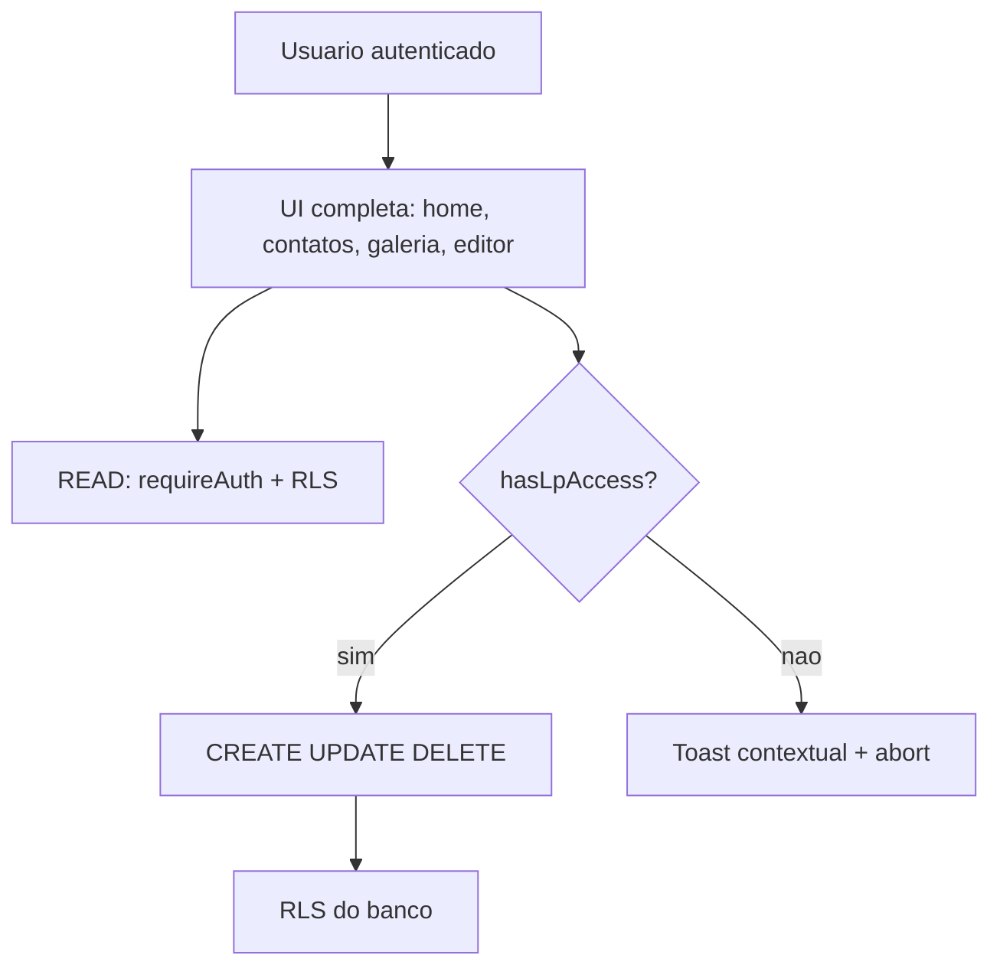

# Acesso a Landing Pages por feature de plano

## Problema atual

O app trata `hasLpAccess` como **plano ID 9 apenas** ([`src/lib/session/access.ts`](src/lib/session/access.ts)) e bloqueia a experiência inteira:



Isso impede **leitura** de LPs, contatos e galeria para planos como Profissional/Avançado que terão `landing_pages: true` no Causi.

## Regra de negócio (nova)

Escrita liberada quando a assinatura está **`active` ou `trial`** E:

1. `session.plan.id === 9` (`LP_PLAN_ID`), **OU**
2. `session.features.landing_pages === true` (vindo de `billing.plans.features` via RPC `get_current_user_details_v4`)

Leitura: **sempre** para usuário autenticado (limitada por RLS no banco).

Toasts ao bloquear escrita:

| Plano (slug) | Mensagem sugerida |
|---|---|
| `essential` | "Você precisa de um plano maior para criar ou editar landing pages." |
| `classroom_premium` (Educacional) | Idem |
| Demais sem feature | "Seu plano atual não inclui landing pages. Faça upgrade no painel do Causi." |

## Arquitetura alvo



## 1. Centralizar regra de acesso

**Arquivo:** [`src/lib/session/access.ts`](src/lib/session/access.ts)

- Extrair helper `isSubscriptionActive(session)` → `status === "active" || status === "trial"`.
- Atualizar `hasLpAccess(session)`:

```typescript
export function hasLpAccess(session: Session | null): boolean {
  if (!session || !isSubscriptionActive(session)) return false;
  if (session.plan?.id === LP_PLAN_ID) return true;
  return session.features.landing_pages === true;
}
```

- Adicionar `getLpUpgradeMessage(session: Session | null): string` com mensagens por `session.plan?.slug` (`essential`, `classroom_premium`, fallback genérico).
- Exportar em [`src/lib/session/index.ts`](src/lib/session/index.ts).

**Arquivo:** [`src/lib/toast.ts`](src/lib/toast.ts)

- Adicionar `showLpUpgradeToast(session?: Session | null)` que usa `getLpUpgradeMessage`.
- Manter `showAccessDeniedToast` como alias fino ou redirecionar chamadas de escrita LP para o novo helper.

## 2. Remover bloqueio de rotas / layout

| Arquivo | Mudança |
|---|---|
| [`src/app/(app)/layout.tsx`](src/app/(app)/layout.tsx) | Remover `LpAccessGate`; children renderizam direto |
| [`src/components/lp-access-gate.tsx`](src/components/lp-access-gate.tsx) | Remover arquivo (fica órfão) |
| [`src/components/app-sidebar.tsx`](src/components/app-sidebar.tsx) | Sempre exibir `navItems` (remover `hasLpAccess ? navItems : []`) |

## 3. Liberar leitura nas páginas (Server Components)

Remover `if (!hasLpAccess) return <AccessDenied />` e sempre carregar dados:

| Página | Antes | Depois |
|---|---|---|
| [`src/app/(app)/page.tsx`](src/app/(app)/page.tsx) | `listLps` só com acesso | `listLps(session)` sempre |
| [`src/app/(app)/contatos/page.tsx`](src/app/(app)/contatos/page.tsx) | AccessDenied | `<ContatosPageClient />` direto |
| [`src/app/(app)/galeria/page.tsx`](src/app/(app)/galeria/page.tsx) | AccessDenied | `<GalleryPageClient />` direto |
| [`src/app/(app)/nova/page.tsx`](src/app/(app)/nova/page.tsx) | AccessDenied | Carregar dados do form sempre |
| [`src/app/(app)/lp/[slug]/page.tsx`](src/app/(app)/lp/[slug]/page.tsx) | AccessDenied por plano | Manter apenas guard de **ownership** (`canEditLp`) |

`AccessDenied` permanece para casos de **permissão RLS/ownership**, não de plano.

## 4. Separar READ vs WRITE no servidor

**Manter `requireLpSession()`** para mutações (já usa `hasLpAccess` — passará a refletir a nova regra automaticamente).

**Trocar para `requireAuth()`** nas actions de listagem:

- [`src/app/actions/leads.ts`](src/app/actions/leads.ts) → `listLeadsAction` usa `requireAuth`; `deleteLeadAction` mantém `requireLpSession`.
- [`src/app/actions/gallery.ts`](src/app/actions/gallery.ts) → `listGalleryImagesAction` usa `requireAuth`; upload/delete mantêm `requireLpSession`.

Padronizar mensagem `FORBIDDEN` em `toMessage` de leads para `ACCESS_DENIED_ERROR` (consistência com `lps.ts` e `isAccessDeniedError`).

Route handlers e demais actions (`lps`, `config`, `subdomain`, `media`, APIs de geração) **não mudam de guard** — já são escrita.

## 5. Bloquear escrita no cliente (toast proativo)

Criar hook fino [`src/hooks/use-lp-write-access.ts`](src/hooks/use-lp-write-access.ts):

```typescript
export function useLpWriteAccess() {
  const canWrite = useLpAccess();
  const session = useSession();
  const guardWrite = (fn?: () => void) => {
    if (!canWrite) { showLpUpgradeToast(session); return false; }
    fn?.(); return true;
  };
  return { canWrite, guardWrite };
}
```

Aplicar `guardWrite` nos pontos de mutação:

- [`src/app/(app)/page.client.tsx`](src/app/(app)/page.client.tsx) — botões "Criar landing page" / "Criar minha primeira página" (interceptar click antes do `Link` ou usar `onClick` + `router.push` condicional).
- [`src/components/Builder/gallery/lp-card.tsx`](src/components/Builder/gallery/lp-card.tsx) — trocar `showAccessDeniedToast()` por `showLpUpgradeToast(session)`.
- [`src/app/(app)/galeria/page.client.tsx`](src/app/(app)/galeria/page.client.tsx) — upload, delete, delete orphaned.
- [`src/forms/LandingPageCreateForm/landing-page-create-form.tsx`](src/forms/LandingPageCreateForm/landing-page-create-form.tsx) — início do fluxo de geração + erros 403.
- [`src/components/Builder/editor/editor-shell.tsx`](src/components/Builder/editor/editor-shell.tsx) — save/publish/unpublish.
- [`src/forms/GlobalConfigForm/shared/use-global-config-form.ts`](src/forms/GlobalConfigForm/shared/use-global-config-form.ts) — save de config global.

Onde já existe `isAccessDeniedError` no callback de server action, complementar com `showLpUpgradeToast(session)` em vez do toast genérico.

## 6. Verificação manual

1. Usuário **Essencial** (`landing_pages: false`): vê home/contatos/galeria; criar/editar/excluir mostra toast "plano maior"; listagens carregam.
2. Usuário **Profissional** (`landing_pages: true`, active): CRUD completo.
3. Usuário **plano ID 9** (active/trial): CRUD completo.
4. Sidebar sempre mostra Página inicial, Galeria, Contatos.
5. `pnpm lint` sem erros nos arquivos alterados.

## Premissas

- `session.features` já é populado pela RPC existente (`plan_features` em [`get-session.ts`](src/lib/session/get-session.ts)) — sem mudança de banco neste repo.
- A feature `landing_pages` nos planos do Causi será configurada no app pai (`app.causi.com.br`); este gerador apenas consome o snapshot da sessão.
- Trial conta como assinatura ativa para escrita (confirmado).

## Fora de escopo

- Atualizar `docs/` (não solicitado).
- Migration/seed do Causi para adicionar `landing_pages` nos planos (responsabilidade do app pai).
