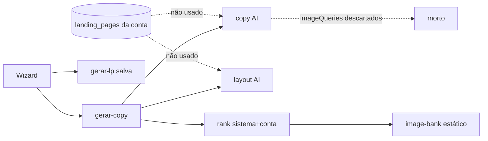
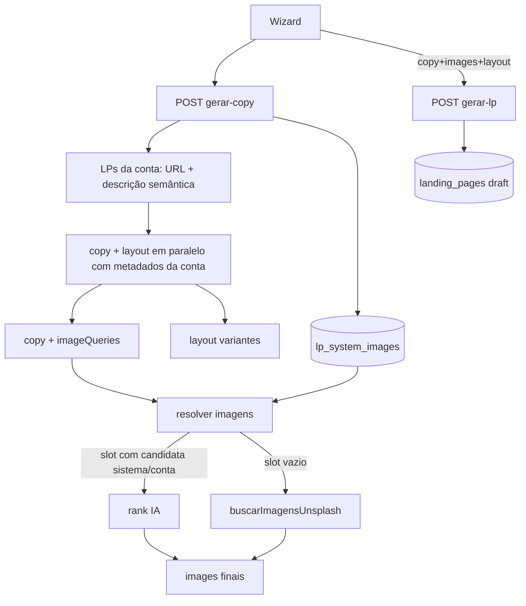

# Corrigir criação de LP pela IA

## Premissas (confirmadas)

- Contexto de LPs existentes: **todas da conta** (draft + published), nunca de outras contas.
- **Orçamento de contexto:** enviar à LLM **somente** URL pública + conteúdo semântico descritivo (tema / SEO title+description). Proibido no prompt: `schema` completo, variants, copy de seções, FAQ, etc.
- Imagens: **preferir `lp_system_images`** quando houver candidata para o slot; **Unsplash API ao vivo** preenche o restante via `imageQueries` gerados pela IA.
- Galeria da conta (`lp_account_images`) continua elegível no ranking (assets do escritório), mas não substitui Unsplash como fallback semântico — o `image-bank` estático deixa de ser o caminho feliz.
- O wizard em 2 chamadas (`gerar-copy` → `gerar-lp`) permanece; a orquestração correta vive em `gerar-copy` (e no branch de regeneração de `gerar-lp` quando copy/images/layout não vêm no payload).

## Problema atual



Hoje a IA decide variantes e copy **sem** exemplos da conta; gera `imageQueries` e os **ignora**; gaps de imagem caem em URLs Unsplash hardcodadas.

## Arquitetura alvo



## Implementação

### 1. Extrator de contexto das LPs da conta (orçamento de tokens)

Novo helper em `src/lib/landing-pages/` (ex.: `lp-account-generation-context.ts`):

**Regra dura:** o prompt **nunca** recebe schema completo, variants, tons, headlines, FAQ ou copy de seções. Só metadados leves por LP.

Por cada LP da conta (draft + published):

| Campo enviado à LLM | Fonte |
|---|---|
| URL pública | [`publicLpUrl`](src/lib/landing-pages/lp-url.ts)(`office_subdomain`, `slug`) |
| Descrição semântica | `tema` + título/descrição SEO (`schema.seo` / [`resolveSeo`](src/lib/landing-pages/seo.ts) / preview OG) — 1–2 frases curtas |
| Status / nome | `status`, `name` (só rótulo, 1 token cada) |

Formato alvo de cada exemplo (ordem de grandeza ~1 linha):

```
- url: https://{sub}.dominio/{slug} | tema: … | resumo: … | status: draft|published
```

Seleção / filtro anti-overload:

- Priorizar LPs com `tema` semelhante ao formulário; completar com as mais recentes.
- Teto duro (~12–16 exemplos **ou** ~2–3k chars no bloco de exemplos — o que vier primeiro).
- Select SQL mínimo (`slug`, `office_subdomain`, `name`, `tema`, `status`, `schema->seo` se possível); se precisar de `schema`, extrair **só** SEO/title/description e descartar o resto antes de formatar o prompt.
- Reusar[`buildLpListPreview`](src/lib/landing-pages/lp-preview.ts) / `publicLpUrl` onde couber — já produzem host + title + description semântica.

Função `formatAccountLpExamplesForPrompt(examples)` → bloco curto injetável.

### 2. Grounding de copy e layout

Em [`lp-generate-copy.ts`](src/lib/landing-pages/lp-generate-copy.ts) e [`lp-generate-layout.ts`](src/lib/landing-pages/lp-generate-layout.ts):

- Aceitar `accountExamples?: string` (lista de URL + resumo semântico).
- Instruir a IA a usar esses itens como **mapa do portfólio do escritório** (áreas já cobertas, tom institucional do SEO) — **não** como texto a copiar; se o bloco estiver vazio, comportamento atual (só fatos do formulário).
- Manter `imageQueries` no output da copy — passam a ser consumidos.

### 3. Resolução unificada de imagens

Novo helper (ex.: `resolve-section-images.ts`) usado por [`gerar-copy/route.ts`](src/app/api/gerar-copy/route.ts) e pelo branch sem `p.images` em [`gerar-lp/route.ts`](src/app/api/gerar-lp/route.ts):

1. Carregar candidatos: `listSystemGalleryImages` (+ `listAccountImagesForRanking` se tags de seção).
2. Para cada slot (`hero` | `dor` | `sobre` | `solucao`):
   - Se houver ≥1 candidata para aquela seção → `pickSystemImagesWithAiRanking` (ou rank só nos slots com candidatas).
   - Se slot ficar vazio → usar `imageQueries[slot]` com [`buscarImagensUnsplash`](src/lib/landing-pages/unsplash.ts).
3. Só se Unsplash falhar/sem chave → último recurso `imagensDoTema` (image-bank), como rede de segurança.

`gerar-copy` deixa de descartar `copyResult.imageQueries`.

### 4. Orchestration nas routes

[`gerar-copy/route.ts`](src/app/api/gerar-copy/route.ts):

```
1. loadAccountGenerationContext(session)
2. Promise.all(copy+queries, layout)  // ambos com exemplos
3. resolveSectionImages({ catalog, imageQueries, tema, ... })
4. return { copy, images, layout }
```

[`gerar-lp/route.ts`](src/app/api/gerar-lp/route.ts): no path sem pré-gerados, reutilizar o mesmo helper (sem duplicar lógica). Com pré-gerados do wizard, só salva (como hoje). Override de vídeo no hero permanece.

Wizard em [`landing-page-create-form.tsx`](src/forms/LandingPageCreateForm/landing-page-create-form.tsx): **sem mudança de UX** — continua `gerar-copy` → `gerar-lp`.

### 5. Documentação

Atualizar a seção “Criação da LP” em [`docs/features/landing-pages.md`](docs/features/landing-pages.md) para o estado atual:

- contexto da conta = somente URL pública + descrição semântica (tema/SEO), com teto de tamanho — sem schema/copy no prompt
- prioridade de imagens: sistema/conta por seção → Unsplash live via `imageQueries` → image-bank só como fallback
- remover a afirmação “No fluxo de criação, o app não executa chamadas da API Unsplash.”

## Critérios de sucesso

- Conta com LPs: prompts incluem só URL + resumo semântico (sem layout/copy de seções); bloco de exemplos respeita o teto de chars.
- Conta sem LPs: geração ainda funciona (só formulário).
- Seção com `lp_system_images`: URL do sistema (ou conta) no slot quando o ranker escolhe.
- Seção sem candidata: URL Unsplash live baseada em `imageQueries` (com `UNSPLASH_ACCESS_KEY`).
- `imageQueries` não são mais descartados no caminho de criação.
- Wizard continua criando draft e redirecionando para `/lp/[slug]`.

## Fora de escopo

- Mudanças no editor (`/api/imagem`, melhorar-imagem/texto).
- RAG cross-tenant / LPs de outras contas.
- Refatorar o wizard para 1 única chamada de API (opcional depois).
- Vision/OCR nas imagens do catálogo.